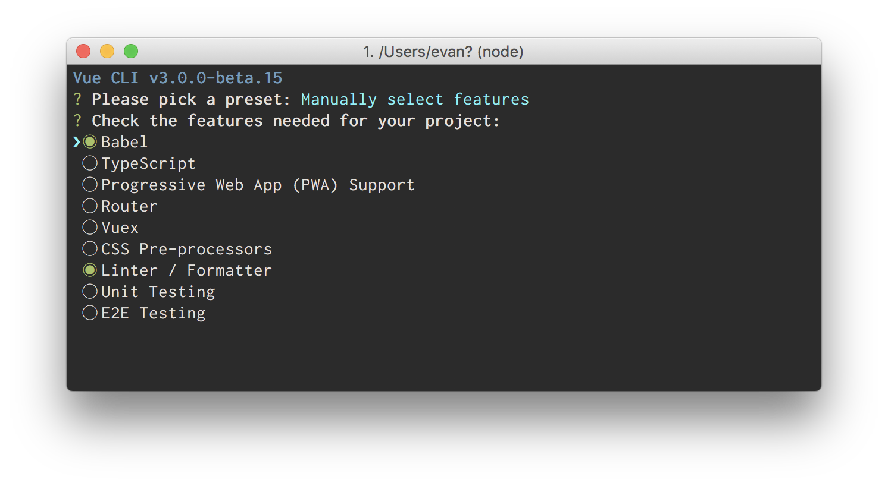
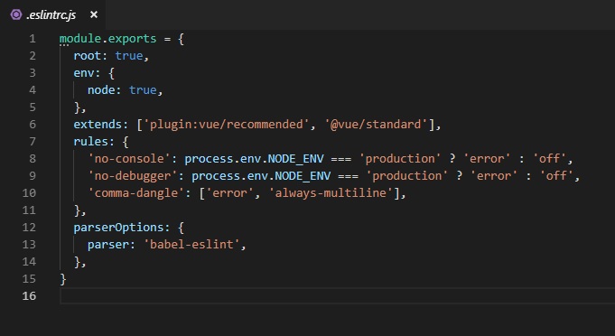
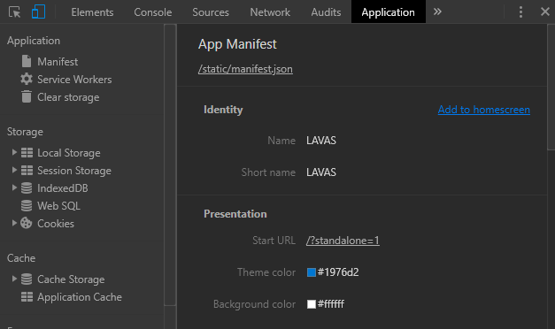
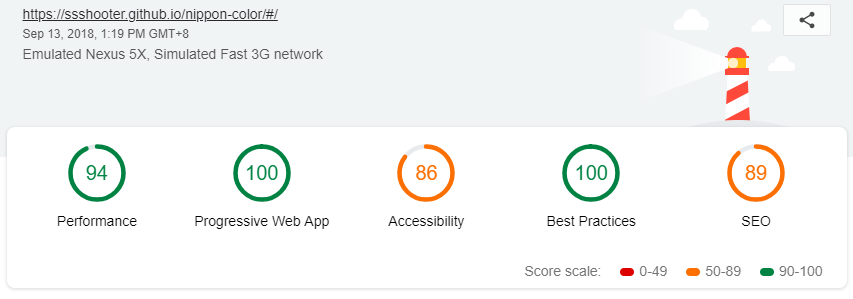

PWA（Progressive Web Apps）虽然是网页应用，但是可以带来媲美原生的用户体验，其中包含离线可用，后台推送等功能。PWA 不是一个新名词，早在 2015 年已经提出这个思想，但是直到 iOS12 的发布，PWA 终于可以在 iOS 中添加到主屏，只有安卓和 iOS 都能使用 PWA 的基本功能，它才算是真的开始走近大众。想了解 PWA，可以看看百度的 [LAVAS](https://lavas.baidu.com/pwa) 官网，在国内网站中 LAVAS 官网会有比较完整的 PWA 资料。

本文可以提前让大家熟悉 PWA 搭建，文中提到的配置来自一个 Redesign 的 [nipponcolors](http://nipponcolors.com/)，最近才做好的，使用的各种库都是现在（2018.09.14）最新的，可用的，另外本文不讨论应用功能，单纯讲讲 PWA 的搭建。

仓库地址：https://github.com/ssshooter/nippon-color
网页地址：https://ssshooter.github.io/nippon-color/#/

## 搭建

### 使用 [Vue-cli3](https://cli.vuejs.org/guide/creating-a-project.html#vue-create)

Vue-cli3 与 2 的区别挺大的，3 默认搭建工程并非像 2 一样拉取模板，而是自己选择需要的 feature 生成项目。



要生成 PWA 项目请勾上 `PWA Support`

### Vue-cli3 的一个关于 HMR 的已知问题

[Issue 地址](https://github.com/vuejs/vue-cli/issues/1559)
假设大家都知道 HMR（热模块更新）是什么了，vue-cli3 的某些版本可能会有这么一个问题，HMR 无法使用，控制台就一直显示 waiting 连接，文件一改直接显示连接断开。解决方案有二：

1. 如果你的依赖使用 cnpm 安装，尝试删掉 `node_modules` 后使用 npm 下载。
2. 在 `vue.config.js` 作以下配置
   ```
   chainWebpack: config => {
       config.resolve.symlinks(true)
       return config
   },
   ```

## 值得注意的配置

### eslint 配置

在这里首先推荐一下尾逗号，加上尾逗号的好处只有一个，但真的十分重要，那就是 diff 会非常好看。然后 [eslint-plugin-vue](https://eslint.vuejs.org/) 插件是一些预设规则组合，分 base，essential，strongly-recommended，recommended 四级，请自由选择，没有最好的搭配，只要用得舒服就好，团队合作还是非常推荐定好 eslint 规则，使用尽量详细的同一套规则，在代码合并时感觉会非常爽快。



设置 eslint 后建议配置开发服务器的 overlay 选项，在 eslint 报错时会覆盖在页面上，时刻提醒你写代码得有信条。

```
  devServer: {
    overlay: {
      warnings: true,
      errors: true,
    },
  },
```

## 资源优化

### 图片

vue-cli3 搭建的工程没有自带图片优化插件，所以请自行安装。有更好的图片压缩插件求推荐啦，这里使用的是 `imagemin-webpack-plugin`，基本配置如下：

```
var ImageminPlugin = require('imagemin-webpack-plugin').default
// Or if using ES2015:
// import ImageminPlugin from 'imagemin-webpack-plugin'

module.exports = {
  plugins: [
    // Make sure that the plugin is after any plugins that add images
    new ImageminPlugin({
      disable: process.env.NODE_ENV !== 'production', // Disable during development
      pngquant: {
        quality: '95-100'
      }
    })
  ]
}
```

### 字体

对于中文站点，字体问题可是个大问题，因为中文字体实在太太太太大了，随随便便一个都 10m 了，等待这东西下载真的給用户体验带来致命打击，但是！但是！有这么一个程序！

#### [font-spider-plus](https://github.com/allanguys/font-spider-plus)

之前一直知道 font-spider，它的功能是获取使用到的字体，然后分析出使用了改字体的字符，最后把字符抽离出来。这大大减少了中文字体的体积，但是缺不能用于 js 渲染的网页，后来才找到 font-spider-plus，虽然要手动操作一下（最简单的方法：发布网页之后用 fsp 把用到的字爬出来），但是得到的优化真的很大哦！

## 响应式设计

PWA 给了我们一个很简单的跨平台方法，不只有移动端可以添加到首屏，PC 端也同样可以，所以响应式设计对 PWA 可以说是必须的。
PC 端的添加方法在 F12 里，至于更加方便的方法...好像是要改 flag 才能用，那么也谈不上多方便了，所以不介绍了，等到此项技术更加成熟，想必这个按钮就会出现在显眼的位置 😂



## PWA 专属问题

建议使用 LightHouse 给你的 PWA 评分，报告中还会带有修改建议，十分实用。



### manifest.json

PWA 添加至桌面的功能实现依赖于 `manifest.json`。这个文件结构很简单，填写对应字段即可，可在[这里](https://lavas.baidu.com/pwa/engage-retain-users/add-to-home-screen/introduction)了解详情。

### Service Worker 刷新

针对 PWA 功能来说，项目成功生成就已经配置好离线缓存功能，对 Service Worker 不熟悉的同学来说可以说很方便了。但是对于推送功能和 Service Worker 的更多细节仍然需要深入研究才能流畅使用这个新兴玩意。
（以下称 Service Worker 为 SW）
有一个问题特别值得注意，那就是 SW 的更新问题。SW 控制项目环境的缓存，但是 SW 更新后怎么刷新缓存就不那么容易理解了。SW 更新后，会进入 waiting 状态，旧的 SW 依旧正常运行，所以新的 SW 无法激活，你需要关闭整个浏览器才能把旧的 SW 关闭，再次打开网页就能看到新的 SW 运作了。
有一个方便一点的方法，配置

```
    workboxOptions: {
      skipWaiting: true,
      clientsClaim: true,
    },
```

之后，第一个选项如其字面意思，会跳过 Waiting 状态，而 clientsClaim 可以让 SW 进入 activated 状态后立即控制页面（但是实际上，SW 即使立刻控制页面并输出新数据，SPA 也要刷新才能渲染为最新版本，但这也总比关闭浏览器好多了）。
详细原理请查阅[谷歌官方资料](https://developers.google.com/web/fundamentals/primers/service-workers/lifecycle)（需要梯子）。

#### 最后，给你一个佛系刷新方法

> Service Worker 的特殊之处除了由浏览器触发更新之外，还应用了特殊的缓存策略： 如果该文件已 24 小时没有更新，当 Update 触发时会强制更新。这意味着最坏情况下 Service Worker 会每天更新一次。

### Preload


这个是 Lighthouse 提醒我的。对于一些必要的资源，可以使用 Preload 预先下载（特别是字体或图片等资源），不必等使用时再下载，这又将会是几百毫秒的等待。更多信息可以参考 vue-cli 官网相关页面：https://cli.vuejs.org/zh/guide/html-and-static-assets.html#preload

## 最后

完整配置地址
https://github.com/ssshooter/nippon-color/blob/master/vue.config.js
https://github.com/ssshooter/nippon-color/blob/master/.eslintrc.js
这是一个最最简单的 PWA，没有对 SW 进行深度配置，很多功能没有用上。Vue-cli3 搭建的项目使用 [`workbox-webpack-plugin`](https://developers.google.com/web/tools/workbox/modules/workbox-webpack-plugin)，SW 默认是自己生成的，需要自己附加 SW 功能可以使用 InjectManifest 插件。最后提一下 [Lavas App](https://lavas.baidu.com/app)，可以把你的 PWA 包装成一个 apk，本质是快捷方式，方便了还没支持 PWA 的安卓系统。

如果有其他问题，可以在评论区讨论~
