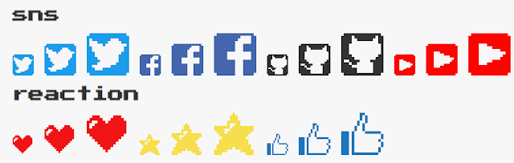

> 原文链接：[box-shadowを使ってCSSだけでドット絵を描き、アニメーションさせる](https://kuroeveryday.blogspot.com/2018/10/draw-and-animate-pixel-art-using-only-css.html)    
作者推特：[bc_rikko](https://twitter.com/bc_rikko)    
作者的推特里面有不少例子，有能力的同学可以看一下      
译文原址：https://segmentfault.com/a/1190000017190802

这篇文章将会介绍只用 CSS 就能制作像素画·像素动画的方法。虽说纯 CSS 就能做到，但是为了更高的可维护性，也会顺便介绍使用 Sass 的制作方法。




上面的马里奥和 Minecraft 方块都没有使用 JavaScript，单纯使用 CSS 动画制作。

## 关于 box-shadow 属性
绘制像素点可以借助 box-shadow 属性。    
原本 box-shadow 属性用于制作阴影效果，先介绍一下基本用法。

该属性的写法有几种：
 - box-shadow: offset-x offset-y color
 - box-shadow: offset-x offset-y blur-radius color
 - box-shadow: offset-x offset-y blur-radius spread-radius color
 - box-shadow: inset offset-x offset-y color

`offset-x` 和 `offset-y` 用于指定阴影偏移位置。以元素的左上角为原点，指定 XY 轴移动的位置。
`color` 字面意思，指定阴影颜色。
`blur-radius` 指定模糊效果的半径。跟 border-radius 差不多。
`spread-raduis` 模糊范围的扩大与缩小。
`inset` 关键字可以使阴影效果显示在元素内则。

文字说明或许不够形象，我们可以直接看效果：

https://jsfiddle.net/bc_rikko/0b9cgtx8

实际效果如下，每个值会造成什么影响应该能很直观地看懂。


## 基础：描绘一个像素点
`box-shadow` 基础都明白了，就可以进入下一步：描绘一个像素点。
对一个边长 100px 的正方形使用 `box-shadow`：
```html5
<div class="container">
    <div class="box"></div>
</div>

<style>
* {
  /* 为了方便看到元素而添加的边框（不加也行） */
  box-sizing: border-box;
}
.container {
  /* 长和宽包括 box-shadow */
  width: 200px;
  height: 200px;
}

.box {
  /* 元素属性 */
  width: 100px;
  height: 100px;
  border: 2px solid #777;

  /* 在元素右下角相同大小的方块 */
  box-shadow: 100px 100px rgba(7,7,7,.3);
}
</style>
```


如图所示，使用 box-shadow 描绘了一个与元素相同大小的阴影。代码的意思是把一个 100px 的方形的影子放到 (100px, 100px) 的位置。

## 进阶：用 box-shadow 属性绘制像素画
完成预想图


这两个都是 5✖️5 的像素画，我们先从左边开始：
```html
<div class="container">
  <div class="pixel one"></div>
</div>

<style>
.container {
  /* 像素画的大小 */
  width: 100px;
  height: 100px;
}

.pixel {
  /* 使伪元素的位置可调整 */
  position: relative;
}
.pixel::before {
  content: "";

  /* 一个点的大小(例:20px x 20px) */
  width: 20px;
  height: 20px;
  /* box-shadow 着色，伪元素设为透明 */
  background-color: transparent;

  /* 调整伪元素位置，让左上角成为(0,0) */
  position: absolute;
  top: -20px;
  left: -20px;
}

.pixel.one::before {
  box-shadow:
     /* 列　行 色 */
     /* 第1列 */
     20px   20px #FB0600,
     20px   40px #FC322F,
     20px   60px #FC6663,
     20px   80px #FD9999,
     20px  100px #FECCCB, 
     /* 第2列 */
     40px   20px #60169F,
     40px   40px #7A23B0,
     40px   60px #964DC2,
     40px   80px #B681D9,
     40px  100px #D8BEED, 
     /* 第3列 */
     60px   20px #1388BC,
     60px   40px #269DC9,
     60px   60px #55B3D7,
     60px   80px #88CAE2,
     60px  100px #BFE3EF, 
     /* 第4列 */
     80px   20px #ACD902,
     80px   40px #BDE02D,
     80px   60px #CDEA5E,
     80px   80px #DBEF8E,
     80px  100px #F4FBC8, 
     /* 第5列 */
    100px  20px #FB8F02,
    100px  40px #FDA533,
    100px  60px #FDBB64,
    100px  80px #FED39A,
    100px 100px #FDE8C9;
}
</style>
```
首先，`box-shadow` 生产的影子大小不包括本体元素的大小，`container` 类的大小设为像素画完成后的大小就行。
接着，`box-shadow` 的影子大小由，`pixel` 类的大小决定，所以把 `width` 和 `height`设定为 20px。
实际的点是 before 伪元素绘制的，pixel 的 20px 正方形会在左上角留下空位，为此可以使用 `position: absolute` 调整。
最后使用 box-shadow 逐格绘制像素画。

接着实现右边的像素画。
```css
.pixel.two::before {
  box-shadow:
    20px   20px #704b16,
    40px   20px #704b16,
    60px   20px #704b16,
    80px   20px #704b16,
    100px  20px #704b16,
    20px   40px #704b16,
    40px   40px #fdb778,
    60px   40px #fdb778,
    80px   40px #fdb778,
    100px  40px #704b16,
    20px   60px #fdb778,
    40px   60px #333333,
    60px   60px #fdb778,
    80px   60px #333333,
    100px  60px #fdb778,
    20px   80px #fdb778,
    40px   80px #fdb778,
    60px   80px #fdb778,
    80px   80px #fdb778,
    100px  80px #fdb778,
    20px  100px #fdb778,
    40px  100px #c70300,
    60px  100px #c70300,
    80px  100px #c70300,
    100px 100px #fdb778;
}
```

## 应用：使用 Sass 编写可维护像素画
上面写的几个例子，至少我是没什么信心去维护好他们。5x5 的像素画要写 25 次属性值，一般的 16x16 则是多达 256 个值。
所以，我们可以使用 Sass 编写可维护像素画。
Sass 环境搭建可以参考以下文章（日语）
https://kuroeveryday.blogspot.com/2018/10/setup-sass-development-environment.html

Sass 使用 mixin（function 亦可）生成样式的方法：
```scss
@mixin pixelize($matrix, $size, $colors) {
  $ret: "";

  @for $i from 1 through length($matrix) {
    $row: nth($matrix, $i);

    @for $j from 1 through length($row) {
      $dot: nth($row, $j);

      @if $dot != 0 {
        @if $ret != "" {
          $ret: $ret + ",";
        }

        $color: nth($colors, $dot);
        $ret: $ret + ($j * $size) + " " + ($i * $size) + " " + $color;
      }
    }
  }

  box-shadow: unquote($ret + ";");
}

$heart-colors: (#333, #f11416, #831200);
$heart: (
  (0,0,0,0,0,0,0,0,0,0,0,0,0,0,0,0),
  (0,0,1,1,1,0,0,0,0,0,1,1,1,0,0,0),
  (0,1,2,2,2,1,0,0,0,1,2,2,3,1,0,0),
  (1,2,0,0,2,2,1,0,1,2,2,2,2,3,1,0),
  (1,2,0,2,2,2,2,1,2,2,2,2,2,3,1,0),
  (1,2,2,2,2,2,2,2,2,2,2,2,2,3,1,0),
  (1,2,2,2,2,2,2,2,2,2,2,2,2,3,1,0),
  (1,2,2,2,2,2,2,2,2,2,2,2,2,3,1,0),
  (0,1,2,2,2,2,2,2,2,2,2,2,3,1,0,0),
  (0,0,1,2,2,2,2,2,2,2,2,3,1,0,0,0),
  (0,0,0,1,2,2,2,2,2,2,3,1,0,0,0,0),
  (0,0,0,0,1,2,2,2,2,3,1,0,0,0,0,0),
  (0,0,0,0,0,1,2,2,3,1,0,0,0,0,0,0),
  (0,0,0,0,0,0,1,3,1,0,0,0,0,0,0,0),
  (0,0,0,0,0,0,0,1,0,0,0,0,0,0,0,0),
  (0,0,0,0,0,0,0,0,0,0,0,0,0,0,0,0)
);

.icon {
  width: 20px;
  height: 20px;
  @include pixelize($heart, 20px, $heart-colors);
}
```
定义名为 `pixelize` 的 mixin，把像素画的矩阵（`$heart`）像素点的大小（`20px`）颜色列表（`$hearts-colors`）传入其中，即可生成 box-shadow 属性。
像素画的矩阵用数字 0～N 表示，0 为透明，1～n 为颜色列表对应颜色。

如果有代码高亮的话，像素画的图案就一目了然啦。

与原生 CSS 相比，这样简单多了吧？

如果这样都觉得麻烦，可以使用 CSS 像素画生成器～

[CSSドット絵ジェネレータ](https://bcrikko.github.io/css-collection/tool/dotgen/index.html)

## 番外篇：制作像素动画
之前 `icon` 类直接使用 box-shadow 属性绘制像素画，在制作像素动画时，需要使用 CSS animation。
```css
.mario {
  width: 8px;
  height: 8px;

  animation:
    jump 1s infinite,
    sprite 1s infinite;
}

/* 跳跃动作（上下移動） */
@keyframes jump {
  from, 25%, 75%, to {
    transform: translateY(0);
  }
  50% {
    transform: translateY(calc(8px * -8));
  }
}

/* 普通状态和跳跃状态的像素画 */
@keyframes sprite {
  /* 对比 animation-timing-function: steps(n)
   * 使用百分比可以更细致的调整动画时间 
   */
  from, 24%, 76%, to {
    box-shadow: /* 普通状态的像素画 */
  }
  25%, 75% {
    box-shadow: /* 跳跃状态的像素画 */
  }
}
```
使用 CSS 动画修改 box-shadow 和元素的位置，看起来就像是跳起来一样。
详细代码可以在 github 仓库中了解
https://github.com/BcRikko/css-collection
