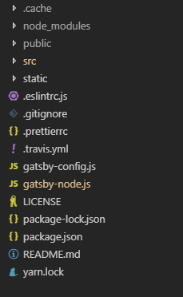

> 原文地址：https://ssshooter.com/2018-12-09-gatsby-blog-1/

<!-- > 系列导航： -->

静态博客之前也有搭建过，不过使用 Hexo 一键生成的，其实当时也有考虑过 Gatsby，不过这个框架搭建博客入门还是比较难的，前置知识点包括 react 和 graphQL。

这个系列的文章记录的就是这个博客搭建中需要注意的点。

此博客使用 [gatsby-starter-blog](https://github.com/gatsbyjs/gatsby-starter-blog) 作为框架，后续自己添加功能。

在安装 gatsby cli 后运行此指令即可以 gatsby-starter-blog 为模板创建博客。

```
gatsby new gatsby-blog https://github.com/gatsbyjs/gatsby-starter-blog
```

项目创建后文件夹结构基本如下（有区别是因为这是我搭建好的截图，也有可能是 starter 的版本升级）



其中最为重要的是 `gatsby-node.js`、`/src/templates/blog-post.js` 以及 `gatsby-config.js`。

## gatsby-node.js

页面创建逻辑大部分都在 `gatsby-node.js`，打开文件可以看到类似代码：

```javascript
// 页面创建函数
exports.createPages = ({ graphql, actions }) => {
  const { createPage } = actions

  return new Promise((resolve, reject) => {
    const blogPostTemplate = path.resolve(`src/templates/blog-post.js`)
    // 查询 md 文件构建页面
    // 此处查询使用的是 graphql，这也是 Gatsby 入门门槛较高的原因之一
    // 不过其实这是一个比 sql 更容易理解的查询语言
    resolve(
      graphql(
        `
          {
            allMarkdownRemark(limit: 1000) {
              edges {
                node {
                  frontmatter {
                    path
                  }
                }
              }
            }
          }
        `
      ).then(result => {
        if (result.errors) {
          reject(result.errors)
        }

        // 遍历查询结果生成页面
        result.data.allMarkdownRemark.edges.forEach(({ node }) => {
          const path = node.frontmatter.path
          // 生成单个页面的函数
          createPage({
            path, // 页面路径
            component: blogPostTemplate, // 页面使用的模板
            // 这是注入上下文变量，注入后可以在模板页面中使用变量
            // 变量可以使用于 graphql 查询和 jsx 编写
            context: {
              path,
            },
          })
        })
      })
    )
  })
}
```

## /src/templates/blog-post.js

此处只是一个举例，其他模板文件和页面文件的结构都类似，所以这里使用 `/src/templates/blog-post.js` 说明文件结构。（另外放在 `/src/pages/` 的 js 文件都是会转换为页面的）

这类文件两部分：

### 第一部分：export default BlogPostTemplate

这是页面视图的组件，跟普通 jsx 一样，不过上面有说到：`createPage` 函数是可以注入参数到模板文件的。

而这些参数就在 `this.props.pageContext` 中。

另外，下面将会提到的页面查询函数所得的数据在 `this.props.data`。

### 第二部分：export const pageQuery

```javascript
// 注意其中 $slug，这也是被页面创建函数注入的上下文变量，没有前缀，直接使用即可
export const pageQuery = graphql`
  query BlogPostBySlug($slug: String!) {
    site {
      siteMetadata {
        title
        author
      }
    }
    markdownRemark(fields: { slug: { eq: $slug } }) {
      id
      excerpt
      html
      frontmatter {
        title
        tags
        date(formatString: "MMMM DD, YYYY")
      }
    }
  }
`
```

查询函数大概长这样，简单来说 graphql 就是把你需要的数据填入你的请求，然后返回给你，光说不易理解，自己玩一把就能立刻明白！

更方便的是，在项目开发环境运行后，还会自带一个 graphql 查询页面：http://localhost:8000/___graphql


一定要注意右上角是**自带文档**的！遇到数据结构懵逼的时候，在文档查一下就 ok 啦（你甚至可以 ctrl 点击 query 中的字段名直接跳转到对应文档，实在方便得不能再方便了，好评！）

页面中的查询函数返回的结果会注入到 `this.props.data`，跟普通属性一样照常使用即可。

## gatsby-config.js

`gatsby-config.js` 看名字就知道这是 Gatsby 的配置文件。使用 starter 建立项目已经自带了不少插件，但在我的搭建过程中仍然有一些需要自己添加的。

[这里](https://www.gatsbyjs.org/plugins/)是 Gatsby 的插件库，遇到什么需求可以优先在此处搜索。

## 总结

结合这三个重要文件，便是 Gatsby 的应用结构：

读取设置和插件 -> 调用创建页面前查询所需资源 -> 创建页面，把查询到的参数注入到模板 -> 进行模板本身的查询 -> 填入数据 -> 成功生成一个页面

整个流程大部分都是使用循环生成所有页面。

此系列下一篇将会是分页相关的详细说明，这是我初始化之后第一个加上的功能（是的， starter 是不带分页的...）。

参考链接：  
https://www.gatsbyjs.org/docs/creating-and-modifying-pages/  
https://www.gatsbyjs.org/docs/programmatically-create-pages-from-data/
