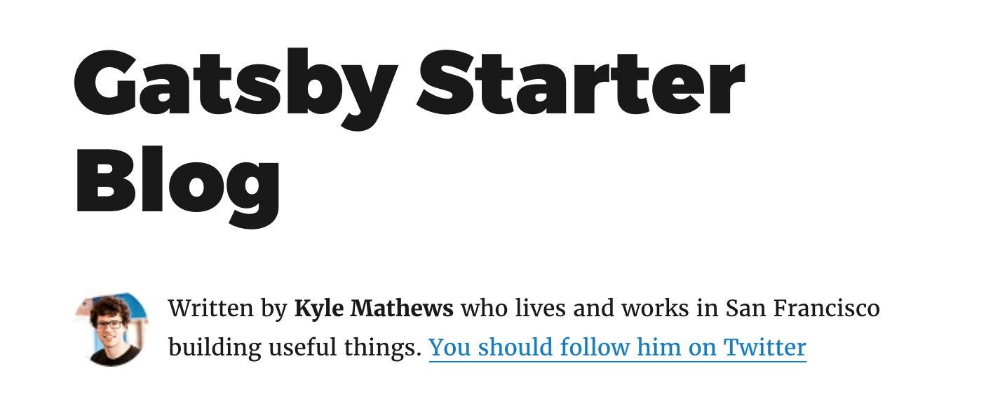
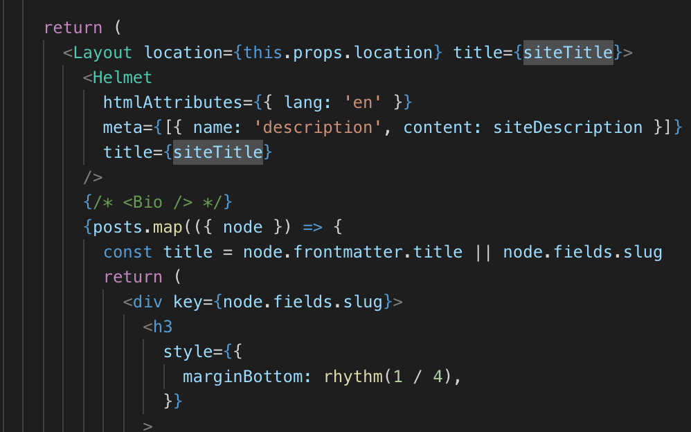

> 系列导航：
可以先复习 -> [使用 Gatsby.js 搭建静态博客 1 关键文件](/2018-12-09-gatsby-blog-1/) <-
本文将会介绍如何为初始项目添加分页功能。

## 理解页面创建原理

上一篇的 `gatsby-node.js` 介绍部分已经说明了页面生成的方法。

未修改前，首页 `index.js` 存在于 `pages` 文件夹，不需要在 `gatsby-node.js` 使用 `createPage` 函数生成，因为 `createPage` 多用于遍历数据批量生成页面。

而我们现在的需求就正好需要用到！文章的分页需要把文章列表分割为每页 N 篇文章的，M 个页面，因此需要使用 `createPage`。

## 添加分页模板

首先在 `templates` 文件夹创建 `index.js`（或者 `blog.js`，你喜欢）。

文件内容大部分都跟现有的 `index.js` 一样，但是有以下改动：

### 添加翻页按钮

```JavaScript
// 数据来源是 createPage 注入的上下文变量
const { totalPage, currentPage } = this.props.pageContext

······

<div>
  {currentPage - 1 > 0 && (
    <Link
      to={'/blog/' + (currentPage - 1 === 1 ? '' : currentPage - 1)}
      rel="prev"
    >
      ← 上一页
    </Link>
  )}
</div>
<div>
  {currentPage + 1 <= totalPage && (
    <Link to={'/blog/' + (currentPage + 1)} rel="next">
      下一页 →
    </Link>
  )}
</div>
```

## 在查询中添加分页逻辑

```JavaScript
// $skip 和 $limit 的来源也是 context
// 不过可以注意到在查询中这些变量就存在于最外层而不需要访问对象属性获取
export const pageQuery = graphql`
  query($skip: Int!, $limit: Int!) {
    site {
      siteMetadata {
        title
        description
      }
    }
    allMarkdownRemark(
      sort: { fields: [frontmatter___date], order: DESC }
      limit: $limit
      skip: $skip
    ) {
      edges {
        node {
          excerpt
          fields {
            slug
          }
          frontmatter {
            date(formatString: "YYYY-MM-DD")
            title
          }
        }
      }
    }
  }
`
```

## 在 `gatsby-node.js` 修改生成函数

这里是批量生成分页页面的逻辑，根据每页文章数 `postsPerPage` 计算生成页面总数，然后向每页注入四个变量，包括：

- 当前页数
- 总页数
- 每次获取数据的数量
- 跳过前面数据的数量

模板页面有了这些参数便可以方便查询出该页面需要渲染什么文章。

```JavaScript
//  create homepage pagination
const postsPerPage = 8
const numPages = Math.ceil(posts.length / postsPerPage)

Array.from({ length: numPages }).forEach((_, i) => {
  createPage({
    path: i === 0 ? `/blog` : `/blog/${i + 1}`,
    component: homePaginate,
    context: {
      currentPage: i+1,
      totalPage:numPages,
      limit: postsPerPage,
      skip: i * postsPerPage,
    },
  })
})
```

## 无关主题的突发情况

功能实现了，但是这里有一个突发事件：

原来的页面是这样的：



我什么都没修改怎么就变成这样了？




注释了 `<bio />` 发现这块不属于 `title`，而 `helmet` 是用于处理 html 元数据，懵逼了一段时间，终于明白是 layout 组件的问题.

layout 组件里面写法是在根目录的时候把 `title` 放大，但是添加分页之后，主页路由从根目录 `/` 变为 `/blog`,于是产生了这个诡异的问题。

不过由于本来就打算重写样式，这一块可以放心删掉！

## Next

处理完这个问题你的新博客就实现分页功能了！下一步是样式的相关调整，留到下一篇继续讲
