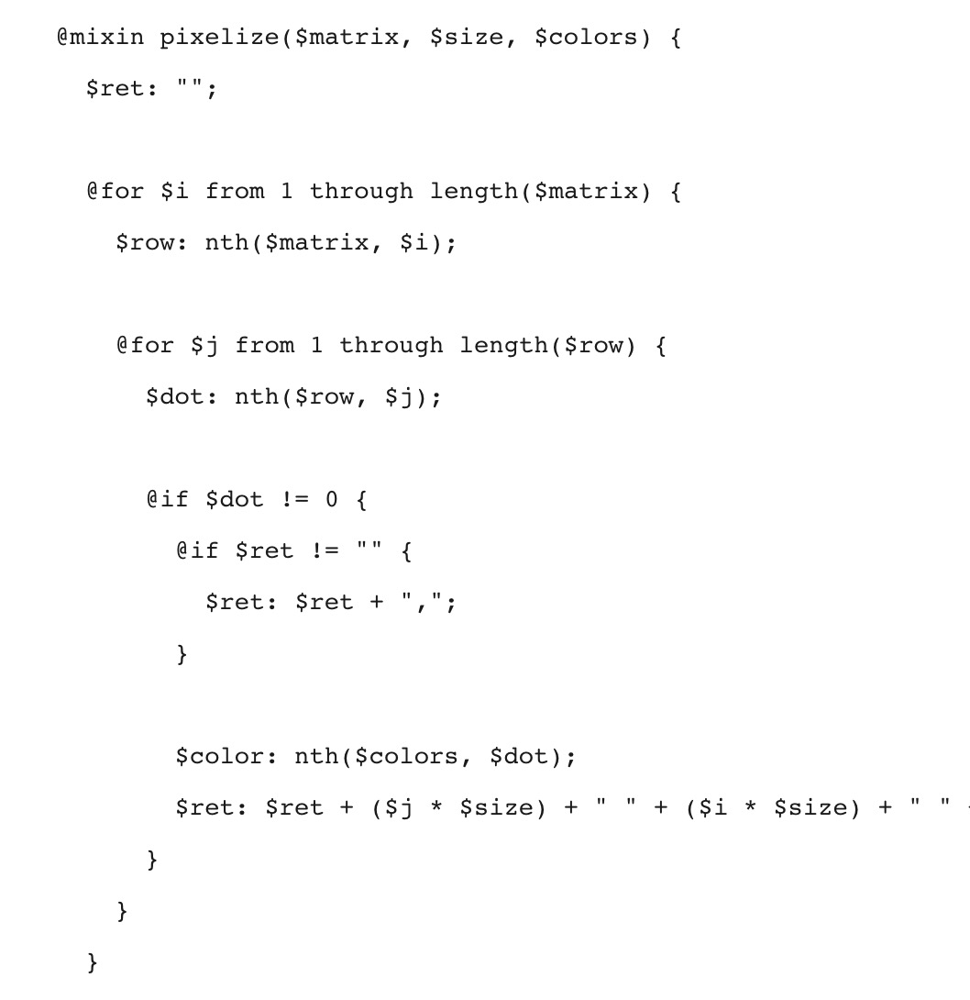
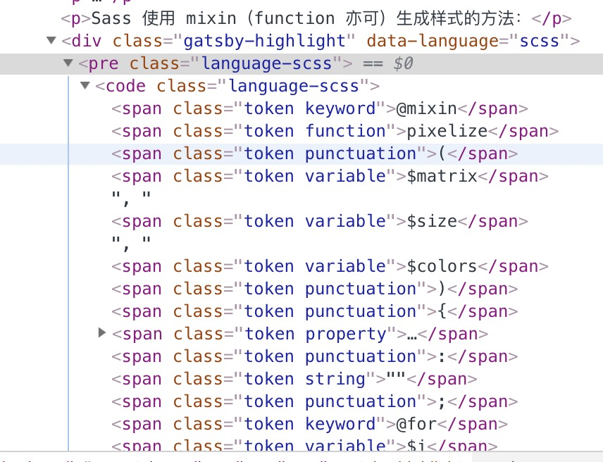
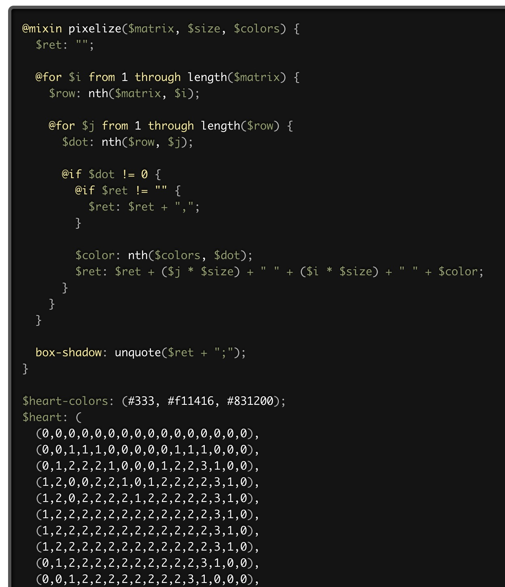

回顾：[使用 Gatsby.js 搭建静态博客 2 实现分页](https://segmentfault.com/a/1190000017329257)

## 修复代码高亮

为了测试样式，随便找一个以前的 `.md` 文件粘贴到 blog 项目中渲染看看效果：



emmm，问题大了，必备的代码高亮都没有...



但是当我审查元素时发现，这竟然是已经被分词的状态，又经过一系列的资料搜集，发现 prismjs 已经预装到项目中，那么我们要做仅仅是引入 css 文件就行了。

```javascript
import 'prismjs/themes/prism-TWILIGHT.css'
```



成功添加样式！当然，除了 TWILIGHT，prismjs 还有其他样式如 COY、OKAIDIA 等，还有其他可以看[官网](https://prismjs.com/index.html)右侧的选项。

大问题解决了然后就按照自己喜好调整样式吧～

## 全局自定义样式

### 方案 1：修改 `typography.js`

你可以通过在 `src/utils/typography.js` 中的 `overrideThemeStyles` 添加全局样式（当然，其更重要的作用是覆盖原有的主题样式）。

不过比较麻烦的是:

1. 覆盖样式需重启服务才能生效
2. 不能嵌套选择器

```javascript
// 这是一个 🌰
Wordpress2016.overrideThemeStyles = () => ({
  'a.gatsby-resp-image-link': {
    boxShadow: 'none',
  },
  'h1, h2, h3, h4, h5, h6': {
    fontWeight: 100,
  },
  h1: {},
  img: {
    background: '#fff',
    padding: '5px',
  },
  body: {
    backgroundColor: $backgroundColor,
    color: $fontColor,
    fontFamily: 'source-han-sans-simplified-c, sans-serif',
    fontWeight: 400,
    fontStyle: 'normal',
  },
})
```

### 方案 2：使用 SCSS

除了修改 `typography.js`，你还可以添加全局 CSS 文件。

因为预想到未来可能需要修改主题，方便起见应该将一些常用颜色存为变量，所以需要先安装 scss 和 gatsby 对应插件：

```bash
npm install --save node-sass gatsby-plugin-sass
```

并在插件列表添加插件 `gatsby-plugin-sass`

> 参考 https://github.com/gatsbyjs/gatsby/tree/master/packages/gatsby-plugin-sass

再次运行项目，此时已经可以正常引入 scss 文件。

```sass
$backgroundColor: #434343;
$titleColor: #E87A90;

body {
    background-color: $backgroundColor;
}

.css-title{
    color: $titleColor;
}
```

css-title 这种命名方式或许很非主流，但是，不知道大家有没有这样的经历，在全局搜索时，搜一个常用词，就比如 `title`，会搜出一大堆东西影响判断。所以我以 css-title 命名的目的是区分其他 title，在搜索 css-title 绝对不会出现在 js 中使用的变量，在特殊情况需要全选修改的时候可以轻松无坑地全选此 class。

其实实际上还是要两种方法都用上，因为有的地方需要覆盖原来的样式，这个时候最好用 js，而自定义的样式经常需要嵌套，使用 scss 更方便。

## PS1 打包后出现的问题

明明开发环境好好的，但是打包后却出现了样式不正常的问题（第一次加载全局 css 失效，刷新才出现效果）。在 github 提了个 issue，得到了热心回答，真的感人 😭。简单来说这个问题就是上面说的最好用 js 覆盖原来样式的原因。➡️[传送门](https://github.com/gatsbyjs/gatsby/issues/10324)

## PS2 选择网络字体

字体对于中文用户是永远的痛。字符量大导致字体的体积大得可怕，严重影响用户体验。使用网络字体是其中一个方法（但是本质来说体积还是没有减小的，只是提供商可以为你高速提供字体，减少用户等待）。

在线字体可以在这里找到：[adobe](https://fonts.adobe.com/) [谷歌](https://fonts.google.com/)
