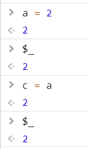
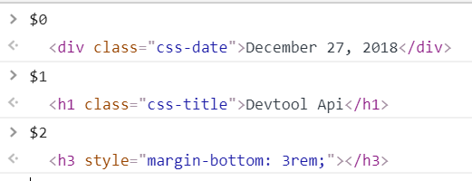
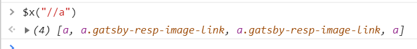
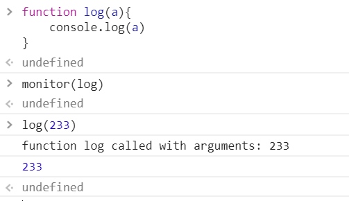
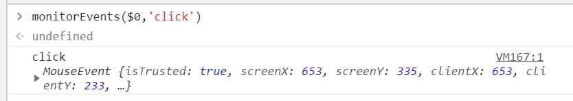

快 2019 年了，我才去看 chrome DevTools 的 api，唉，晚是晚点，总比不知道好吧？对于这些接口，不知道也不会导致你无法正常开发，但是知道了效率是能提高很多的。其实很多“常识”都因为“太常识”了，所以大家都不说，不讨论，结果知道的人反而不多。

以下是几句话的简单总结。

# 特殊变量
- `$_` 返回上一个表达式的返回值。

- `$0 ~ $4` `$0` 返回上次选中的 dom 元素（需要用审查元素或直接在开发工具点击元素，使用下面的 `$()` 不生效），`$n` 返回上 n + 1 次选择的元素。

# 特殊方法
- `$()` 等同于 `document.querySelector()`
- `$$()` 等同于 `document.querySelectorAll()` 
- `$x()` 传入 XPath 获取 dom 元素，[XPath](https://en.wikipedia.org/wiki/XPath) 相关概念可以在这里了解。

- `inspect()` 审查某元素，例如 `inspect($0)`。这里有一个不容易注意的坑，如果你的页面有一个 id 为 inspect 的元素，那么你输入 inspect 就会获得那个 dom 元素，而不是审查函数。

- `copy()` 复制一个变量。之前我一直有一个很苦恼的问题，有时候想用 js 处理一些数据，例如存放对象的数组，想在浏览器直接处理，但是当时不知道这个方法，复制不出来，只能用 node 写文件然后复制，十分蠢，其实明明一个 `copy(var)` 就完事了呀。

- `monitor(function)` 监视一个函数

- `monitorEvents(object[, events])` 监视一个元素上的事件

---------

参考链接：https://developers.google.com/web/tools/chrome-devtools/console/command-line-reference