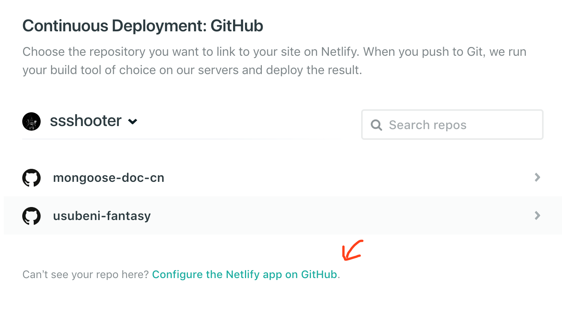

这真的是最简单的一步啦～

## 使用 netlify deploy 你的网站

[netlify](https://app.netlify.com/) 是一个可以帮助你自动部署网站的平台。你可以选择自己买服务器，运行 build 然后推送到自己服务器（或者直接使用 gh-pages），但是使用 netlify 你只需要正常推送项目到 GitHub，netlify 就会自动给你 deploy，这项服务是免费的。

推荐直接用 GitHub 登陆

netlify 获取权限



设置指令


都确定以后其实系统已经开始自动 build 你的项目了。你可以在 deploy 页面查看 build 进度。


详细设置可以在 settings 查看，可以进行构建、环境变量、hook 等相关配置。除了 deploy 功能外，netlify 还有很多其他服务，例如可以为你提供登陆系统，或是表单服务。

## 域名购买

很多人推荐在 [GoDaddy](https://sg.godaddy.com) 购买域名，但是，其实你直接看到售价是很便宜，不过续费就完全比其他网站都贵了。

稍微查了一下发现 [namesilo](https://www.namesilo.com/) 口碑貌似不错，最重要的是便宜，虽然这家网站的样式真的很老 😂

## netlify 自定义域名设置

因为我已经加了域名所以回不去了，细节步骤记得不是很清楚...

简单来说，点击那个大大的 `Set up a custom domain`，在 netlify 提交你已经购买的域名，然后 netlify 还提供了 DNS 服务，按指引操作即可。

### 关于 DNS

本来，你要访问一个网页是必须知道网页的 IP 地址，但是数字不好记，所以出现了域名。但是域名怎么跟 IP 关联呢？DNS 就像一个电话本，你可以拿着网站的域名问 DNS：这个网站的 IP 是什么？他告诉你了，便能访问了。（不负责任推测）印象中很久很久之前，改 DNS 可以访问谷歌，大概是因为那时候的墙只是破坏了域名服务这一步吧？

所以，你拥有域名了，就能在 DNS 把你的域名“关联”到某个 IP，结果，访问你的域名，就能如愿访问你的服务器了。

### 关于 TTL

TTL（Time to live）是你修改域名服务器之后旧数据保留的时间，namesilo 的最低 TTL 也得是 3600，所以不要着急，等一小时左右就 OK 了。

## 生成 sitemap

有了自己的网站，你一定会想向谷歌等搜索引擎提交网址，但是总不能一条条手输吧？这个时候就需要用到 sitemap 了。

Gatsby 当然是有生成 sitemap 的插件的——[gatsby-plugin-sitemap](https://www.gatsbyjs.org/packages/gatsby-plugin-sitemap/)

安装，然后在配置文件加上即可，sitemap 会输出在根目录。

```Javascript
// In your gatsby-config.js
siteMetadata: {
  siteUrl: `https://www.example.com`,
},
plugins: [`gatsby-plugin-sitemap`]
```

## 下一步

评论系统的实现，方法多样，任君选择。
