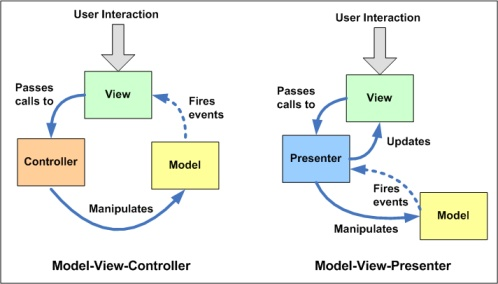
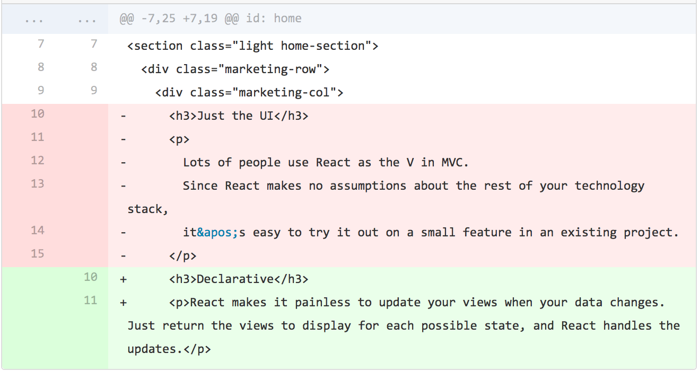

# 前言

记得四个月前有一次面试，面试官问我 MVVM 是什么，MVVM 的本质是什么。我大脑一片混乱，那时我对 MVVM 的认知就只是“双向绑定“和“Vue”，以这个关键字简单回答了几句，我反问 MVVM 的本质是什么，对方就重复一次双向绑定。我怎么觉得对方也没懂就随便这么一问呢...

其实面试完我就急着探求 MVVM 的真谛，查了资料，做了笔记，以下是我四个月前的理解：

> ViewModel 和 View 是互相绑定的，我们不直对界面进行操作，只需要修改数据。而和 MVC 的区别是：MVC 的 C，接收了数据，需要手动通过 js 修改 dom，这包含了对 V 的操作而无论是 vue 还是 react，都不需要对 dom 进行操作，view 和 viewmodel 的联系显然比 mvc 里 vc 的联系紧密多了，这就是我们常说的双向绑定。我觉得是不是没有必要把 MV* 搞得这么清楚？只要知道 MVVM 的本质是双向数据绑定就好了？

四个月前的我投降了，为了应付面试我依然只记得双向绑定，而且 MVC 和 MVVM 的概念依然不清晰，本质的区别还是没搞懂。

不过不清晰真的很正常。

因为网上关于 mvvm 和其他 mv* 结构的文章不少，按道理应该不难理解，但是很多文章对 mv* 的描述都不一致，这就导致很多本来就懵逼的小白更加混乱（没错就是我）。

> If you put ten software architects into a room and have them discuss what the Model-View-Controller pattern is, you will end up with twelve different opinions. --*[Josh Smith](https://www.codeproject.com/Articles/23241/Using-MVC-to-Unit-Test-WPF-Applications)*

# MVVM 基本信息

MVVM 是一种架构模式，也被称为 model-view-binder。它由微软架构师 Ken Cooper 和 Ted Peters 开发，通过利用 WPF（微软 .NET 图形系统）和 Silverlight（WPF 的互联网应用派生品）的特性来简化用户界面的事件驱动程序设计。微软的 WPF 和 Silverlight 架构师之一John Gossman 于 2005 年在他的博客上发表了 MVVM。

# MVVM 结构初见

MVVM 与其他两种架构的对比：

- MVVM：VM 在 UI 层之下。VM 为 view 暴露数据和方法，VM 推送数据到在它之下的 model。

- MVC：view 层在结构顶层，controller 在 view 之下。model 在 controller 之下。view 指向 controller，controller 指向 model。model 更改时 view 会得到提醒（这个情况是一个单向流）。

- MVP：controller 替换为 presenter。presenter 与 view 平起平坐。presenter 监听 view 和 model 的事件，作为中间人在他们之间调解两边的事件，辅助两边交流。

MVVM 对于 MVC 来说更容易理解，因为 MVC 经过长久的实践，产生了很多框架，这些框架的适用领域也各有不同：有后端渲染工程、原生应用工程、前后端分离后的前端工程等，在实现 MVC 模式时理所当然地会有一定区别，这就导致了 MVC 的多样性。所以对于不同的情况，对 MVC 的理解不是完全一样的。同样的情况 MVVM 也有，作为一个较新的模式，实现比 MVC 少。此文介绍的 MVVM 模式主要以 Vue 为中心理解。

# MVVM 与 MVC 的对比

认真看过 Vue 文档大概都能注意到，Vue 实例的变量名是 vm，文档中还很严谨地补充了一句 “虽然没有完全遵循 MVVM 模型，但是 Vue 的设计也受到了它的启发”。

按照上面不同的工程师眼里有不同的 MVC 结构的引言，Vue 虽然“没有完全遵循 MVVM 模型”，但是我觉得这就是一种 Vue 特化的 MVVM。

## Vue 的 MVVM

View：单文件里 `<template>` 标签的内容，展现给用户的内容，与 ViewModel 双向绑定，可以在其中插入 ViewModel 提供的数据。

ViewModel：Vue 实例整个都是 ViewModel，与 View 双向绑定，用户在 View 修改数据或发出 ajax 等指令时， ViewModel 会及时相应，接着向下修改 Model——至此可以看出 Model 和 View 是没有直接关系的。

Model：这一层或者有歧义。为了更好理解 Model 需要引入 Vuex，在有 Vuex 的情况下，Vuex 提供的数据就是 Model，这符合后端架构中 Model 包含业务逻辑的情况。但是在无 Vuex 的情况下，Model 应该就是 Vue 实例的 data 属性，也就是 JavaScript 数据对象本身。

## 前端 MVC

与之对比，MVC 的情况：

View：一样是展现给用户的部分，整个或部分 HTML 页面。

Model：JavaScript 的变量数据（可以包含 ajax 获取数据的逻辑，或是一个数据管理机制），但是在这里要额外地添加**提醒 View 更新的机制**。几个月前我还迷糊为什么 MVC 也有观察者模式，MVC 的观察者是 View，在 Model 注册为观察者就能在 Model 更新时更新。

Controller：用户操作逻辑放置点，输入是用户的操作，输出是对 Model 的修改。

那么问题来了：**MVC 和 MVVM 都用了观察者模式，两者有何不同？**

看图说话：

在理解 MVVM 和 MVC 的区别时我纠结了很久，基于 Vue 来说，感觉非常像 MVC：页面订阅数据；数据更新时页面更新，但是看了这幅图后豁然开朗。

图中对比的是 MVC 和 MVP，但是 MVP 和 MVVM 的区别基本就是 MVVM 把三者间的操作自动绑定了，不用开发者操心 V 和 P 之间的相互操作。

MVC 是由 M 通知 V，但 MVVM 是 M 通知 VM（M 和 V 没有直接关系）。

# 拓展：React 只是 MVC 的 V？

至今还广泛流传这这么一句话：React不是一个MVC框架，而是一个用于构建组件化UI的库，是一个前端界面开发工具。

这不是错的，但肯定是过时的。在 React 刚面世的时候，开发团队强调了这种新型的界面便携方法（Jsx 使用函数生成界面），强调 Virtual DOM 和 diff 算法，而后来，官网已经把相关描述修改了。

# 理解、交流

进步不能缺少交流，如果大家对三种架构模式的区别有不同见解，请一定要在评论区留言。文中若出现错误观点也请提醒，谢谢热爱编程的大家。

参考文献

https://zh.wikipedia.org/wiki/MVVM
https://russelleast.wordpress.com/2008/08/09/overview-of-the-modelview-viewmodel-mvvm-pattern-and-data-binding/
https://web.archive.org/web/20150219153055/http://joel.inpointform.net/software-development/mvvm-vs-mvp-vs-mvc-the-differences-explained/
https://medium.com/javascript-inside/what-if-react-was-really-only-the-v-in-mvc-5854fd6f601c
