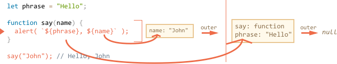

> 来源于 [现代JavaScript教程](https://github.com/iliakan/javascript-tutorial-en)
[闭包章节](https://javascript.info/closure)
[中文翻译计划](https://github.com/iliakan/javascript-tutorial-cn)
本文很清晰地解释了闭包是什么，以及闭包如何产生，相信你看完也会有所收获

**关键字**

**Closure** 闭包

**Lexical Environment** 词法环境

**Environment Record** 环境记录

**outer Lexical Environment** 外部词法环境

**global Lexical Environment** 全局语法环境

## 闭包（Closure）

JavaScript 是一个 function-oriented（直译：面向函数）的语言，这个特性为我们带来了很大的操作自由。函数只需创建一次，赋值到一个变量，或者作为参数传入另一个函数然后在一个全新的环境调用。

函数可以访问它外部的变量，是一个常用 feature。

但是当外部变量改变时会发生什么？函数会获取最新的值，还是函数创建当时的值？

还有一个问题，当函数被传入其他地方再调用……他能访问那个地方的外部变量吗？

不同语言的表现有所不同，下面我们研究一下 JavaScript 中的表现。


## 两个问题

我们先思考下面两种情况，看完这篇文章你就可以回答这两个问题，更复杂的问题也不在话下。

1. `sayHi` 函数使用了外部变量 `name`。函数运行时，会使用两个值中的哪个？

   ```javascript
   let name = "John";

   function sayHi() {
     alert("Hi, " + name);
   }

   name = "Pete";

   sayHi(); // "John" 还是 "Pete"？
   ```

   这个情况不论是浏览器端还是服务器端都很常见。函数很可能在它创建一段时间后才执行，例如等待用户操作或者网络请求。

   问题是：函数是否会选择变量最新的值呢？


2. `makeWorker` 函数创建并返回了另一个函数。这个新函数可以在任何地方调用。他会访问创建时的变量还是调用时的变量呢？

   ```javascript
   function makeWorker() {
     let name = "Pete";

     return function() {
       alert(name);
     };
   }

   let name = "John";

   // 创建函数
   let work = makeWorker();

   // 调用函数
   work(); // "Pete"（创建时）还是 "John"（调用时）？
   ```


## Lexical Environment（词法环境）

要理解里面发生了什么，必须先明白“变量”到底是什么。

在 JavaScript 里，任何运行的函数、代码块、整个 script 都会关联一个被称为 **Lexical Environment （词法环境）** 的对象。

Lexical Environment 对象包含两个部分：（译者：这里是重点）

1. **Environment Record（环境记录）**是一个以**全部局部变量**为属性的对象（以及其他如 `this` 值的信息）。
2. 对 **outer lexical environment（外部词法环境）**的引用，通常关联词法上的外面一层代码（花括号外一层）。 

所以，“变量”就是内部对象 Environment Record 的一个属性。要获取或改变一个对象，意味着获取改变 Lexical Environment 的属性。

例如在这段简单的代码中，只有一个 Lexical Environment：


这就是所谓 global Lexical Environment（全局语法环境），对应整个 script。对于浏览端，整个 `<script>` 标签共享一个全局环境。

（译者：这里是重点）
上图中，正方形代表 Environment Record（变量储存点），箭头代表一个**外部引用**。global Lexical Environment 没有外部引用，所以指向 `null`。

下图展示 `let` 变量的工作机制：


右边的正方形描述 global Lexical Environment 在执行中如何改变：

1. 脚本开始运行，Lexical Environment 为空。
2. `let phrase` 定义出现了。因为没有赋值所以储存为 `undefined` 。
3. `phrase` 被赋值。
4. `phrase` 被赋新值。

看起来很简单对不对？

总结：

- 变量是一个特殊内部对象的属性，关联于执行时的块、函数、script 。
- 对变量的操作实际上是对这个对象属性的操作。

### Function Declaration（函数声明）

Function Declaration 与 `let` 不同，并非处理于被执行的时候，而是（译者注：意思就是全局词法环境创建时处理函数声明）Lexical Environment 创建的时候。对于 global Lexical Environment，意味着 script 开始运行的时候。

这就是函数可以在定义前调用的原因。

以下代码 Lexical Environment 开始时非空。因为有 `say` 函数声明，之后又有了 `let` 声明的 `phrase`：


### Inner and outer Lexical Environment（内部词法环境和外部词法环境）

调用 `say()` 的过程中，它使用了外部变量，一起看看这里面发生了什么。

（译者：这里是重点）
函数运行时会自动创建一个新的函数 Lexical Environment。这是所有函数的通用规则。这个新的 Lexical Environment 用于当前运行函数的存放局部变量和形参。

箭头标记的是执行 `say("John")` 时的 Lexical Environment ：


函数调用过程中，可以看到两个 Lexical Environment（译者注：就是两个长方形）：里面的是函数调用产生的，外面的是全局的：

- 内层 Lexical Environment 对应当前执行的 `say`。它只有一个变量：函数实参 `name`。我们调用了 `say("John")`，所以 `name` 的值是 `"John"`。
- 外层 Lexical Environment 是 global Lexical Environment。

内层 Lexical Environment 的 `outer` 属性指向外层 Lexical Environment。

**代码要访问一个变量，首先搜索内层 Lexical Environment ，接着是外层，再外层，直到链的结束。**

如果走完整条链变量都找不到，在 strict mode 就会报错了。不使用 `use strict` 的情况下，对未定义变量的赋值，会创造一个新的全局变量。

下面一起看看变量搜索如何处理：

- `say` 里的 `alert` 想要访问 `name`，立即就能在当前函数的 Lexical Environment 找到。
- 而局部变量不存在 `phrase`，所以要循着 `outer` 在全局变量里找到。



现在我们可以回答本章开头的第一个问题了。

**函数获取外部变量当前值**

旧变量值不储存在任何地方，函数需要他们的时候，它取得来源于自身或外部 Lexical Environment 的当前值。（译者注：就是引用值）

所以第一个问题的答案是 `Pete`：

```javascript
let name = "John";

function sayHi() {
 alert("Hi, " + name);
}

name = "Pete"; // (*)

sayHi(); // Pete
```

上述代码的执行流：

1. global Lexical Environment 存在 `name: "John"` 。
2. `(*)` 行中，全局变量修改了，现在成了这样 `name: "Pete"` 。
3. `say()` 执行的时候，取外部 `name`。此时在 global Lexical Environment 中已经是 `"Pete"`。


> **一次调用，一个 Lexical Environment**
请注意，每当一个函数运行，就会创建一个新的 function Lexical Environment。
如果一个函数被多次调用，那么每次调用都会生成一个属于当前调用的全新 Lexical Environment，里面装载着当前调用的变量和实参。


> **Lexical Environment 是一个标准对象（specification object）**
"Lexical Environment" 是一个标准对象（specification object），不能直接获取或设置它，JavaScript 引擎也可能优化它，抛弃未使用的变量来节省内存或者作其他优化，但是可见行为应该如上面所述。

## 嵌套函数

在一个函数中创建另一个函数，称为“嵌套”。这在 JavaScript 很容易实现：

```javascript
function sayHiBye(firstName, lastName) {

 // helper nested function to use below
 function getFullName() {
   return firstName + " " + lastName;
 }

 alert( "Hello, " + getFullName() );
 alert( "Bye, " + getFullName() );

}
```

**嵌套函数** `getFullName()` 可以访问外部变量，帮助我们很方便地返回组合后的全名。

更有趣的是，嵌套函数可以作为一个新对象的属性或者自己本身被 return。这样它们就能在其他地方使用，无论在哪里，它都能访问同样的外部变量。

一个构造函数的例子：

```javascript
// 构造函数返回一个新对象
function User(name) {

 // 嵌套函数创造对象方法
 this.sayHi = function() {
   alert(name);
 };
}

let user = new User("John");
user.sayHi(); // 方法返回外部 "name"
```

一个 return 函数的例子：

```javascript
function makeCounter() {
 let count = 0;

 return function() {
   return count++; // has access to the outer counter
 };
}

let counter = makeCounter();

alert( counter() ); // 0
alert( counter() ); // 1
alert( counter() ); // 2
```

我们接着研究 `makeCounter`。counter 函数每调用一次就会返回下一个数。这段代码很简单，但只要稍微修改，就能具有一定的实用性，例如[伪随机数生成器](https://en.wikipedia.org/wiki/Pseudorandom_number_generator)。

counter 内部如何工作？

内部函数运行， `count++` 中的变量由内到外搜索：


1. 嵌套函数局部变量……
2. 外层函数……
3. 直到全局变量。

第 2 步我们找到了 `count`。外部变量会直接在其所在的地方被修改。所以 `count++` 检索外部变量，并在该变量自己的 Lexical Environment 进行 +1 操作。就像操作了 `let count = 1` 一样。

这里需要思考两个问题：

1. 我们能通过 `makeCounter` 以外的方法重置 `counter` 吗？
2. 如果我们可以多次调用 `makeCounter()` ，返回了很多 `counter` 函数，他们的 `count` 是独立的还是共享的？

继续阅读前可以先尝试思考一下。

...

ok ？

那我们开始揭晓谜底：

1. 没门。`counter` 是局部变量，不可能在外部直接访问。
2. 每次调用 `makeCounter()` 都会新建 Lexical Environment，每一个环境都有自己的 `counter`。所以不同 counter 里的 `count` 是独立的。

一个 demo ：

```javascript
function makeCounter() {
 let count = 0;
 return function() {
   return count++;
 };
}

let counter1 = makeCounter();
let counter2 = makeCounter();

alert( counter1() ); // 0
alert( counter1() ); // 1

alert( counter2() ); // 0 （独立）
```

现在你清楚明白了外部变量的情况，但是面对更复杂的情况仍然需要更深入地理解，让我们进入下一步吧。

## Environment 细节

对 closure（闭包）有了初步了解之后，可以开始深入细节了。

下面是 `makeCounter` 例子的动作分解，跟着看你就能理解一切了。注意，`[[Environment]]` 属性我们之前尚未介绍。

1. 脚本开始运行，此时只存在 global Lexical Environment ：

   

   这时候只有 `makeCounter` 一个函数，这是函数声明，**还未被调用**。

   所有函数都带着一个隐藏属性 `[[Environment]]` “诞生”。`[[Environment]]` 指向它们**创建者**的 Lexical Environment。是`[[Environment]]` 让函数知道它“诞生”于什么环境。

   `makeCounter` 创建于 global Lexical Environment，所以 `[[Environment]]` 指向它。

   换句话说，Lexical Environment 在函数诞生时就“铭刻”在这个函数中。`[[Environment]]` 是指向 Lexical Environment 的隐藏函数属性。

2. 代码继续执行，`makeCounter()` 登场。这是代码运行到 `makeCounter()` 瞬间的快照：

   

   `makeCounter()` 调用时，保存当前变量和实参的 Lexical Environment 已经被创建。

   Lexical Environment 储存 2 个东西：

   1. 带有局部变量的 Environment Record。例子中 `count` 是唯一的局部变量（`let count` 被执行的时候记录）。
   2. 被绑定到函数 `[[Environment]]` 的外部词法引用。例子里 `makeCounter` 的 `[[Environment]]` 指向 global Lexical Environment。

   所以这里有两个 Lexical Environment：全局，和 `makeCounter`（它的 outer 指向全局）。

3. 在 `makeCounter()` 执行的过程中，创建了一个嵌套函数。

   这无关于函数创建使用的是 Function Declaration（函数声明）还是 Function Expression（函数表达式）。所有函数都会得到一个指向他们创建时 Lexical Environment 的 `[[Environment]]` 属性。

   这个嵌套函数的 `[[Environment]]` 是 `makeCounter()`（它的诞生地）的 Lexical Environment：

   

   同样注意，这一步是函数声明而非调用。

4. 代码继续执行，`makeCounter()` 调用结束，内嵌函数被赋值到全局变量 `counter`：

   

   这个函数只有一行：`return count++`。

5. `counter()` 被调用，自动创建一个空的 Lexical Environment。此函数无局部变量，但是 `[[Environment]]` 引用了外面一层，所以它可以访问 `makeCounter()` 的变量。

   

   要访问变量，先检索自己的 Lexical Environment（空），然后是 `makeCounter()` 的，最后是全局的。例子中在外层一层 Lexical Environment `makeCounter` 中发现了 `count`。

   重点来了，内存在这里是怎么管理的？尽管 `makeCounter()` 调用结束了，它的 Lexical Environment 依然保存在内存中，这是因为嵌套函数的 `[[Environment]]` 引用了它。

   通常，Lexical Environment 对象随着使用它的函数的存在而存在。没有函数引用它的时候，它才会被清除。

6. `counter()` 函数不只是返回 `count`，还会对其 +1 操作。这个修改已经在“适当的位置”完成了。`count` 的值在它的当前环境中被修改。

   

   这一步再次调用 `count`，原理完全相同。
   
   （译者：总结一下，声明时记录环境 [[Environment]]（函数所在环境），执行时创建词法环境（局部+ outer 就是引用 [[Environment]]），而**闭包就是函数 + 它的词法环境**，所以定义上来说所有函数都是闭包，但是**之后被返回出来可以使用的闭包才是“实用意义”上的闭包**）

7. 下一个 `counter()` 调用操作同上。

本章开头第二个问题的答案现在显而易见了。

以下代码的 `work()` 函数通过外层 lexical environment 引用了它原地点的 `name` ：


所以这里的答案是 `"Pete"`。

但是如果 `makeWorker()` 没了 `let name` ，如我们所见，作用域搜索会到达外层，获取全局变量。这个情况下答案会是 `"John"` 。

> **闭包（Closure）**
开发者们都应该知道编程领域的通用名词闭包（closure）。
[闭包](https://en.wikipedia.org/wiki/Closure_(computer_programming))是一个记录并可访问外层变量的函数。在一些编程语言中是不存在的，或者要以一种特殊的方式书写以实现这个功能。但是如上面解释的，JavaScript 的所有函数都个闭包。
这就是闭包：它们使用 `[[Environment]]` 属性自动记录各自的创建地点，然后由此访问外部变量。
在前端面试中，如果面试官问你什么是闭包，正确答案应该包括闭包的定义，以及解释为何 JavaScript 的所有函数都是闭包，最好可以再简单说说里面的技术细节：`[[Environment]]` 属性和 Lexical Environments 的原理。

## 代码块、循环、 IIFE

上面的例子都着重于函数，但是 Lexical Environment 也存在于代码块 `{...}` 。

它们在代码块运行时创建，包含块局部变量。这里有一些例子。

## If

下例中，当执行到 `if` 块，会为这个块创建新的 "if-only" Lexical Environment ：


与函数同样原理，块内可以找到 `phrase`，但是块外不能使用块内的变量和函数。如果执意在 `if` 外面用 `user`，那只能得到一个报错了。

## For, while

对于循环，每一次迭代都会有自己的 Lexical Environment，在 `for` 里定义的变量，也是块的局部变量，也属于块的 Lexical Environment ：

```javascript
for (let i = 0; i < 10; i++) {
 // Each loop has its own Lexical Environment
 // {i: value}
}

alert(i); // Error, no such variable
```

`let i` 只在块内可用，每次循环都有它自己的 Lexical Environment，每次循环都会带着当前的 `i`，最后循环结束，`i` 不可用。

### 代码块

我们也可以直接用 `{…}` 把变量隔离到一个“局部作用域”（local scope）。

在浏览器中所有 script 共享全局变量，这就很容易造成变量的重名、覆盖。

为了避免这种情况我们可以使用代码块隔离自己的代码：

```javascript
{
 // do some job with local variables that should not be seen outside

 let message = "Hello";

 alert(message); // Hello
}

alert(message); // Error: message is not defined
```

代码块有自己的 Lexical Environment ，块外无法访问块内变量。

### IIFE

以前没有代码块，要实现上述效果要依靠所谓的“立即执行函数表达式”（immediately-invoked function expressions ，缩写 IIFE）：

```javascript
(function() {

 let message = "Hello";

 alert(message); // Hello

})();
```

这个函数表达式创建后立即执行，代码立即执行并有自己的私有变量。

函数表达式需要被括号包裹。JavaScript 执行时遇到 `"function"` 会理解为一个函数声明，函数声明必须有名称，没有就会报错：

```javascript
// Error: Unexpected token (
function() { // <-- JavaScript cannot find function name, meets ( and gives error

 let message = "Hello";

 alert(message); // Hello

}();
```

你可能会说：“那我给他加个名字咯”，但这依然行不通，JavaScript 不允许函数声明立刻被执行：

```javascript
// syntax error because of brackets below
function go() {

}(); // <-- can't call Function Declaration immediately
```

圆括号告诉 JavaScript 这个函数创建于其他表达式的上下文，因此这是个函数表达式。不需要名称，也可以立即执行。

也有其他方法告诉 JavaScript 我们需要的是函数表达式：

```javascript
// 创建 IIFE 的方法

(function() {
 alert("Brackets around the function");
})();

(function() {
 alert("Brackets around the whole thing");
}());

!function() {
 alert("Bitwise NOT operator starts the expression");
}();

+function() {
 alert("Unary plus starts the expression");
}();
```

## 垃圾回收

Lexical Environment 对象与普通的值的内存管理规则是一样的。

- 通常 Lexical Environment 在函数运行完毕就会被清理：

   ```js
   function f() {
     let value1 = 123;
     let value2 = 456;
   }

   f();
   ```
   
   这两个值是 Lexical Environment 的属性，但是 `f()` 执行完后，这个 Lexical Environment 无任何变量引用（unreachable），所以它会从内存删除。

- ...但是如果有内嵌函数，它的 `[[Environment]]` 会引用 `f` 的 Lexical Environment（reachable）：

   ```js
   function f() {
     let value = 123;

     function g() { alert(value); }

     return g;
   }

   let g = f(); // g is reachable, and keeps the outer lexical environment in memory
   ```

- 注意，`f()` 如果被多次调用，返回的函数都被保存，相应的 Lexical Environment 会分别保存在内存：

   ```javascript
   function f() {
     let value = Math.random();

     return function() { alert(value); };
   }

   // 3 functions in array, every one of them links to Lexical Environment
   // from the corresponding f() run
   //         LE   LE   LE
   let arr = [f(), f(), f()];
   ```

- Lexical Environment 对象在不可触及（unreachable）后被清除：无嵌套函数引用它。下例中， `g` 自身不被引用后， `value` 也会被清除：

    ```js
   function f() {
     let value = 123;

     function g() { alert(value); }

     return g;
   }

   let g = f(); // while g is alive
   // there corresponding Lexical Environment lives

   g = null; // ...and now the memory is cleaned up
   ```

### 实践中的优化

理论上，函数还在，它的所有外部变量都会被保留。

但在实践中，JavaScript 引擎可能会对此作出优化，引擎在分析变量的使用情况后，把没有使用的外部变量删除。

**在 V8 (Chrome, Opera)有个问题，这些被删除的变量不能在 debugger 观察了。**

尝试在 Chrome Developer Tools 运行以下代码：

```javascript
function f() {
 let value = Math.random();

 function g() {
   debugger; // 在 console 输入 alert( value ); 发现无此变量！
 }

 return g;
}

let g = f();
g();
```

你可以看到，这里没有保存 `value` 变量！理论上它应该是可访问的，但是引擎优化移除了这个变量。

还有一个有趣的 debug 问题。下面的代码 alert 出外面的同名变量而不是里面的：

```javascript
let value = "Surprise!";

function f() {
 let value = "the closest value";

 function g() {
   debugger; // in console: type alert( value ); Surprise!
 }

 return g;
}

let g = f();
g();
```

> **再会！**     
如果你用 Chrome/Opera 来debug ，很快就能发现这个 V8 feature。
这不是 bug 而是 V8 feature，或许将来会被修改。至于改没改，运行一下上面的例子就能判断啦。
