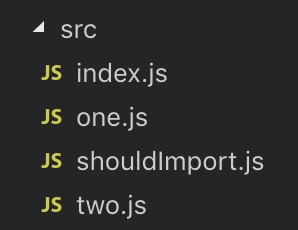
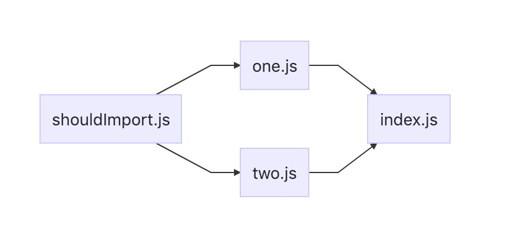

scope hoisting 是 webpack3 的新功能，直译过来就是「作用域提升」。熟悉 JavaScript 都应该知道「函数提升」和「变量提升」，JavaScript 会把函数和变量声明提升到当前作用域的顶部。「作用域提升」也类似于此，webpack 会把引入的 js 文件“提升到”它的引入者顶部。

接下来尝试在 webpack4 使用这个功能，对比启用前后的打包区别，相信你一定能很快理解他的作用。

## 启用插件

在 webpack4 中使用 scope hoisting，需要添加 `ModuleConcatenationPlugin`（模块关联）插件：

```javascript
// webpack.config.js
const webpack = require('webpack')

module.exports = mode => {
  if (mode === 'production') {
    return {}
  }

  return {
    devtool: 'source-map',
    plugins: [new webpack.optimize.ModuleConcatenationPlugin()],
  }
}
```

## 文件准备

现在已经在开发环境添加上 scope hoisting。但是因为我们希望测试文件引入效果的不同，所以需要添加 4 个文件。



```javascript
// shouldImport.js
export let sth = 'something you need'

export default {
  others: '',
}
```

```javascript
// one.js two.js 皆为此代码
import other from './shouldImport'
let a = other
export default a
```

```javascript
// index.js
import one from './one'
import two from './two'

let test = 'this is a variable'

export default {
  one,
  two,
  test,
}
```

文件间的引用关系是这样的：



文件都准备好了，立即运行 `node_modules/.bin/webpack --mode development` 打包文件。

## 这就是 scope hoisting

这是打包文件的入口模块部分：

```javascript
{
    './src/index.js': function(
      module,
      __webpack_exports__,
      __webpack_require__
    ) {
      'use strict'
      __webpack_require__.r(__webpack_exports__)

      // 关联 ./src/shouldImport.js 模块
      let sth = 'something you need'
      /* es6 默认引入 */ var shouldImport = {
        others: ''
      }

      // 关联 ./src/one.js 模块
      let a = shouldImport
      /* es6 默认引入 */ var one = a

      // 关联 ./src/two.js 模块
      let two_a = shouldImport
      /* es6 默认引入 */ var two = two_a

      // 关联 ./src/index.js 模块
      let test = 'this is a variable'
      /* es6 默认引入 */ var src = (__webpack_exports__['default'] = {
        one: one,
        two: two,
        test
      })
    }
  }
```

正常来说 webpack 的引入都是把各个模块分开，通过 `__webpack_require__` 导入导出模块（对原理不熟悉的话可以看[这里](/2019-02-19-webpack-bootstrap/)），但是使用 scope hoisting 后会把需要导入的文件直接移入导入者顶部，这就是所谓的 hoisting。

可以看出，这么优化后：

- 代码量明显减少
- 减少多个函数后内存占用减少
- 不用多次使用 `__webpack_require__` 调用模块，运行速度也会得到提升

当然几时你开启了 scope hoisting，webpack 也不会一股脑地把所有东西都堆砌到一个模块。[官网](https://webpack.js.org/plugins/module-concatenation-plugin/#optimization-bailouts)对这个问题也清楚地说明了，这里举个例子，在你**使用非 ES6 模块或使用异步 import()** 时，不会应用作用域提升，模块依然会拆分开，不过具体代码会跟正常的引入有一点差异。