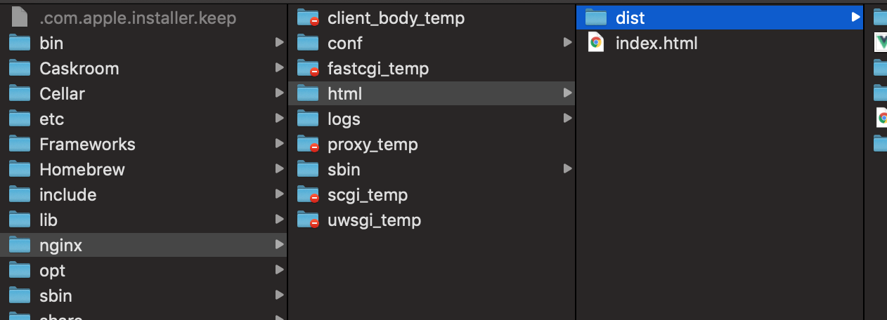

其实标题应该是「vue-router history 模式非根目录部署处理」但是不想太长，就改成现在的了。

## 为什么要这么做

> `vue-router` 默认 hash 模式 —— 使用 URL 的 hash 来模拟一个完整的 URL，于是当 URL 改变时，页面不会重新加载。
> 如果不想要很丑的 hash，我们可以用路由的 **history 模式**，这种模式充分利用 `history.pushState` API 来完成 URL 跳转而无须重新加载页面。

官网如是写 ⬆ ️

然后这边部署的时候要考虑到根目录已经部署了应用的情况，所以不能使用根目录，于是有了这个需求。

我觉得正在看这篇文章的初学者应该 mark 一下，感觉是挺常见的需求，求前后端协作，还有点坑，马着或许会用到呢？

要部署在非根目录对我来说还有点挑战性的...因为我对 nginx 是一脸懵逼的...看资料看了挺久才能理解 ——

下面是步骤：

## 在 vue 的操作

改为 history 模式，添加 base：

```javascript
new Router({
  mode: 'history',
  base: '/dist',
  routes: [
    {
      path: '/',
      name: 'home',
      component: Home,
    },
    {
      path: '/about',
      name: 'about',
      // route level code-splitting
      // this generates a separate chunk (about.[hash].js) for this route
      // which is lazy-loaded when the route is visited.
      component: () =>
        import(/* webpackChunkName: "about" */ './views/About.vue'),
    },
  ],
})
```

### mode

history 与 hash 的不同点在于：hash 模式通过地址 # 后的记录跳转到对应的路由，这是无刷新的；

history 使用 history API 修改地址，同样是无刷新的，这是一个新接口，还有小部分不常用浏览器不支持。

history 最大的问题在于刷新时无法应用前端路由。此话怎讲？

浏览器不回管你 # 后面是什么，在 hash 模式下：www.biadu.com/istrash/#/true，地址本体就是 /istrash，后面是哈希值 /true，服务器只需要带你进 /istrash，后面就不管了，但是——

history 模式下 www.biadu.com/istrash/true 服务器要负责匹配你的路径 /istrash/true，问题就来了，这是前端定的东西，后端根本没配置嘛...不过好消息是，这个问题后面会解决。

### base

hash 模式不必须在这里指明 `base`（写了不会出错）；

但是如果 history 模式不指明的话，可以打开页面没有任何报错，但是画面一片空白，这就很明显是匹配不到路由了。

我**推测** history 需要 `base` 的原因是：vue router 处理在 hash 模式时只管 # 后面的部分，所以跟你服务器配置的 base 没任何关系（例如 www.biadu.com/istrash/#/true 拿到的是 /true）；

而 history 模式打开时拿到的地址是带“base”的（例如 www.biadu.com/istrash/true 拿到的是 /istrash/true），所以处理地址的时候要通过配置 `base` 去除它，防止干扰匹配路由。

## 设置打包资源位置

```javascript
module.exports = {
  publicPath: process.env.NODE_ENV === 'production' ? '/dist/' : '/',
}
```

这部分就仅仅是解决 webpack 打包时文件路径的问题。

接着就打包，放到 nginx 的服务位置：

```sh
npm run build
sudo cp -r ./dist/* /usr/local/nginx/html
```

## nginx 配置

nginx 配置：

```nginx
location / {
    root html;
    index index.html;
}

location /dist/ {
    root html;
    index index.html;
    try_files $uri $uri/ /dist/index.html;
}
```

这里站在初学者的角度解释一下这个 nginx 配置 ——

location 在匹配到一个块后会**继续匹配**，当后面不能匹配时，就会使用当前块；

`location /`：匹配 / 的情况下，默认给你发送（作为 root 的）html 文件夹里的 index.html；

`location /dist/`：地址 /dist/ 匹配到了 /，也匹配到了 /dist/，使用最后匹配到的 /dist/，所以！（**重点来了**）

服务器会给你发送（作为 root 的）html 文件夹里的 /dist/index.html ⬅️ 曾经让我很懵逼的地方，location 匹配的东西会加到 index 前面去

而后面的 try_files 却用回了相对 html 的地址 ⬅️ 曾经让我很懵逼的地方+1

使用 try_files 后经过 /dist/ 的路径会交由 /dist/index.html 处理，这就能正确进入前端路由了。

我的目录结构 ⬇️ ️



另外，我在网上看到一种**应该是**错的配置...

如果你根目录没有其他服务可以直接把静态文件放到根目录，然后只作如下配置（但是这么做路径多一层有什么意义啊...而且 try_files 直接就干扰到其他地址的匹配了吧）

如果这是可行的话请在评论区指出

```nginx
location / {
    try_files $uri $uri/ /index.html;
}
```

## 总结

之前都用 node.js 的 serve 搭建简单访问，第一次接触 nginx，有点新鲜。这对前端来说也不算跨界，感觉也是需要理解一下的，不然跟后端沟通起来可能会有代沟...

另外，这个实践是为了给一个前后端耦合的项目做渐进式分离的一步，这个就到后面再说吧。

参考链接：

[nginx 配置](https://www.linode.com/docs/web-servers/nginx/how-to-configure-nginx/)

[vue router 后端配置例子](https://router.vuejs.org/zh/guide/essentials/history-mode.html#%E5%90%8E%E7%AB%AF%E9%85%8D%E7%BD%AE%E4%BE%8B%E5%AD%90)

[history API](https://developer.mozilla.org/zh-CN/docs/Web/API/History_API)
