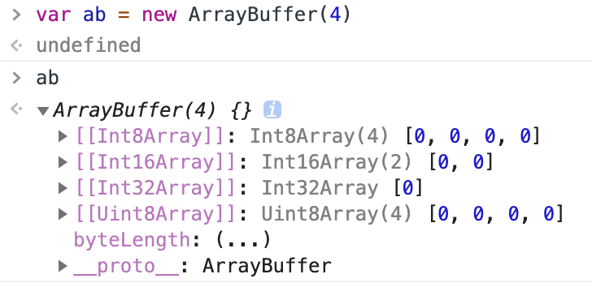
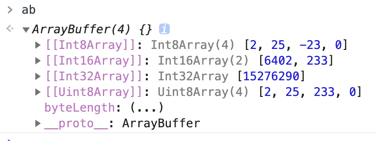

之前做了个图片 canvas 修改接触到几个格式，今天打算整理一下他们的关系

## blob

使用 input 获取文件时，你拿到的就是 file 对象，而 file 继承于 blob，所以直接讲比较陌生的 blob 吧。

BLOB (binary large object)，二进制大对象，是一个可以存储二进制文件的“容器”。

任何文件都是 blob（这个是我猜的）

blob 可以用 slice 将部分数据切出来
Blob.slice([start,[ end ,[contentType]]])

## 从 Blob 中提取数据

在控制台打出 blob 你根本不知道里面是啥，那么怎么读取 blob 呢？

就需要借助 FileReader 了.

> FileReader 对象允许 Web 应用程序异步读取存储在用户计算机上的文件（或原始数据缓冲区）的内容，使用 File 或 Blob 对象指定要读取的文件或数据。

计算机读文件那少得了 buffer 呢！

```javascript
var reader = new FileReader()
reader.addEventListener('loadend', function() {
  // reader.result 包含转化为类型数组的blob
})
reader.readAsArrayBuffer(blob)
```

## arraybuffer

arraybuffer 类似数组，每一格可以放入 1byte 数据，也就是 8bit 的 0 或 1，所以换成十进制一格最大是 255.

例如



**ArrayBuffer 不能直接操作**，而是要通过类型数组对象（下面列出来的）或 DataView 对象来操作，它们会将缓冲区中的数据表示为特定的格式，并通过这些格式来读写缓冲区的内容。

- Int8Array：8 位有符号整数，长度 1 个字节。
- Uint8Array：8 位无符号整数，长度 1 个字节。
- Uint8ClampedArray：8 位无符号整数，长度 1 个字节，溢出处理不同。
- Int16Array：16 位有符号整数，长度 2 个字节。
- Uint16Array：16 位无符号整数，长度 2 个字节。
- Int32Array：32 位有符号整数，长度 4 个字节。
- Uint32Array：32 位无符号整数，长度 4 个字节。
- Float32Array：32 位浮点数，长度 4 个字节。
- Float64Array：64 位浮点数，长度 8 个字节。

对应视图的转换还很神奇的，ArrayBuffer 是一个格子 8 位，也就是跟 xx8Array 是一样的，自然不用转换，而 16 之后的都是把 n 个格子合成一个

```javascript
// 创建 buffer
ab = new ArrayBuffer(4)
// 创建视图
a = new Uint8Array(ab)
// 通过视图操作 buffer
a[0] = 2
a[1] = 25
a[2] = 31
a[2] = 233
```

打印 ab 会输出：



为了方便理解如何转换，我把他换成 2 进制

```javascript
// Int16Array
;['1100100000010', '11101001']
// Int32Array
;['111010010001100100000010']
// Uint8Array
;['10', '11001', '11101001', '0']
```

再在前面补 0

```javascript
// Int16Array
;['0001100100000010', '0000000011101001']
// Int32Array
;['00000000111010010001100100000010']
// Uint8Array
;['00000010', '00011001', '11101001', '00000000']
```

这就很明显能看出要转换就要在分组之后把同一组数据从又到左拼接。

在转换时需要从后到前反转排列，然后转换为二进制

不过这种二进制数据操作我这样的菜鸡是望而却步了

parseInt(x,n)
用 parseInt 把输入 x 看作 n 进制返回为十进制

### canvas 与 buffer

canvas 可以通过 ctx.createImageData() 得到 `ImageData`

`ImageData.data` 而是一个 `Uint8ClampedArray`，里面顺序放着图片每一个像素的 rgba 值。你可以对这个 `Uint8ClampedArray` 进行一系列操作，再用 `canvas.toBlob` 这个 buffer 变回 Blob，就完成了图片编辑的操作。

这样就可以完成类似这个[简单的卷积核图片修改器](https://github.com/ssshooter/canvas-img-process)的功能。

http://var.blog.jp/archives/62330155.html

## DataURI

Data Url 是一个前缀为 `data:` 的**协议**，你可以借助这个协议在文档中嵌入一些小文件，数据格式如下：

```javascript
data:[<mediatype>][;base64],<data>
```

几个例子：

普通文字：`data:,Hello%2C%20World!`

base64 处理的文字：`data:text/plain;base64,SGVsbG8sIFdvcmxkIQ%3D%3D`

html 文档：`data:text/html,%3Ch1%3EHello%2C%20World!%3C%2Fh1%3E`

执行 script 的 html 文档：`data:text/html,<script>alert('hi');</script>`

用每 6 位表示一个字符，标准 base64 只有 64 个字符
base64（datauri）

url = URL.createObjectURL(blob);

参考

[mdn Blob](https://developer.mozilla.org/zh-CN/docs/Web/API/Blob)

[mdn FileReader](https://developer.mozilla.org/zh-CN/docs/Web/API/FileReader)

[mdn HTMLCanvasElement](https://developer.mozilla.org/zh-CN/docs/Web/API/HTMLCanvasElement)

[阮一峰 ES6 arraybuffer](http://es6.ruanyifeng.com/#docs/arraybuffer)

[进阶 FileAPI 实现标准](https://www.w3.org/TR/2018/WD-FileAPI-20181106/#readOperation)

## 附录

### 其他进制数的表示方法

```javascript
// 10
var a = 10
// 8
var b = 0o1234567
// 或直接在前面加0，如果后面数字都小于8就自动变成8进制
var c = 01234567
// 2
var d = 0b1010101110101
// 16
var e = 0xe87a90
```
