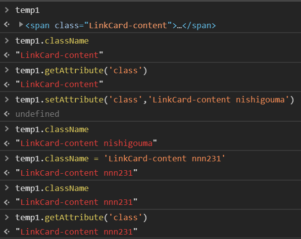

很想水点什么，再不水的话我怕我会忘掉更新 blog 这件事了，于是就水一个超入门的内容😂

今天水的是 **property** 和 **attribute**

刚学前端的时候可能很容易搞混这两个东西，因为中文都是属性...

我曾想用英文来区分这两个词，于是在剑桥词典查了一下：

> property [ C ] a quality in a substance or material, especially one that means that it can be used in a particular way

> attribute [ C ] a quality or characteristic that someone or something has

结果...不靠谱，没有明显的区别，也就是说，要是一开始老外给你把属性命名为“quality”，你也得照用...

这是既成事实，你只要记住就行了——

重点就是 **property 属于 JavaScript 对象**，

而 **attribute 属于 HTML 元素**。

看多了英文文章就会习惯地把 property 归类到编程语言了，也不需要死记。

不过你仍想用某种方法记住的话，按英文的解释，property 强调可以以某种方式使用，那就偏向于需要操作的 JS，另一边 attribute 只是一个特性，就偏向于只用来看的 HTML。

（不过当然实际上这两者都是可以**被操作**，也是互通的，不过操作方法不同而已，下面是随便打几行例子，详情这个[教程](https://javascript.info/dom-attributes-and-properties)解释得很清楚啦）

