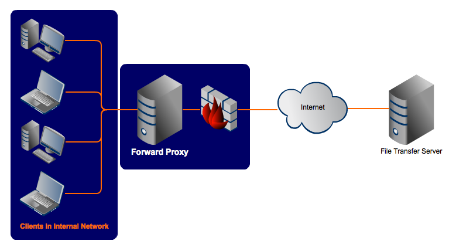
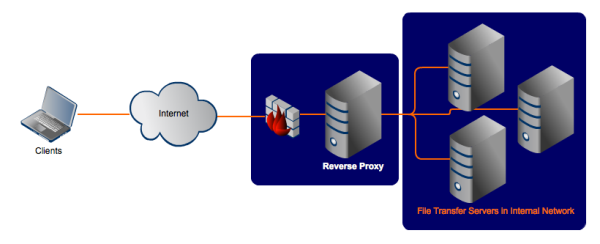

## 反向代理是什么

放两个神图，图片来自[这里](https://www.jscape.com/blog/bid/87783/Forward-Proxy-vs-Reverse-Proxy)。



这是正向代理



这是反向代理

- 正向代理是你发出请求的时候先经过代理服务器，所以实际上**发出请求的是代理服务器**。
- 反向代理是**“代理你的目标服务器”**，请求目标服务器的代理，做一些处理后再真正请求。

在这篇文章里，**反向代理用于处理跨域问题**。

## 测试环境的跨域

```javascript
module.exports = {
  publicPath: '/',
  devServer: {
    proxy: {
      '/wiki': {
        target: 'http://xxx.com.cn', // 代理到的目标地址
        pathRewrite: { '^/wiki': '' }, // 重写部分路径
        ws: true, // 是否代理 websockets
        changeOrigin: true,
      },
    },
  },
}
```

我们神奇的 webpack 有一个可以帮你实现测试跨域的插件，相信大家都比较熟悉，本质上这个插件的功能来自 [http-proxy-middleware](https://github.com/chimurai/http-proxy-middleware)。

\* 关于 changeOrigin：这个选项的作用真的看不懂（下面是源码），看代码貌似是改变 headers 的 host 字段，但是实际上我修改成 true 和 false 测试，请求头好像并没有变化。但是以前的一个项目中有一个情况是必须把这个选项设定为 true 才能正常跨域，所以保险起见设 true。这个问题先放下吧，或者大家知道的话在评论区留言指导一下 OTL。

```javascript
// 附源码
if (options.changeOrigin) {
  outgoing.headers.host =
    required(outgoing.port, options[forward || 'target'].protocol) &&
    !hasPort(outgoing.host)
      ? outgoing.host + ':' + outgoing.port
      : outgoing.host
}
```

按照上面的配置启动测试环境之后，直接在浏览器输入 `http://localhost/wiki/rest/api/2/user/picker` 就等于访问 `http://xxx.com.cn/rest/api/2/user/picker`。

## 在 nginx 配置

联动一下[之前的](/2019-04-02-vue-router-history/#nginx-%E9%85%8D%E7%BD%AE)普通地址配置。

在这次要做的配置甚至没有上次相对位置的理解难，写法都跟 node 的配置差不多，只需要两句：

```nginx
location /wiki/ {
    rewrite ^/wiki/(.*)$ /$1 break;
    proxy_pass http://xxx.com.cn;
}
```

rewrite 的语法是（来自[文档](http://nginx.org/en/docs/http/ngx_http_rewrite_module.html#rewrite)）：rewrite regex replacement [flag];

所以上面的效果是匹配 `^/wiki/(.*)$` 然后替换为 `/` 加匹配到的后面括号后的分块。

按照上面的配置，重启 nginx `./nginx -s reload`，直接在浏览器输入 `http://localhost/wiki/rest/api/2/user/picker` 就等于访问 `http://xxx.com.cn/rest/api/2/user/picker` 啦。

## 附加的正则小知识

其实 `$1` 在 JavaScript 的正则里也能使用：

```javascript
let reg = /^\/wiki\/(.*)$/
'/wiki/2111edqd'.replace(reg, '$1')
// => 2111edqd
```

在这里，**括号的作用就是用于匹配一个分块**。作为对比再举一个例子：

```javascript
let reg = /^\/wiki\/(.*)$/
let reg2 = /^\/wiki\/.*$/
// 其实不用括号也完全可以匹配你需要的字符串
// 但是在 match 的时候你就能看到区别
'/wiki/2111edqd'.match(reg)
// 输出 ["/wiki/2111edqd", "2111edqd", index: 0, input: "/wiki/2111edqd", groups: undefined]
'/wiki/2111edqd'.match(reg2)
// 输出 ["/wiki/2111edqd", index: 0, input: "/wiki/2111edqd", groups: undefined]
```

reg 输出的数组的第二个参数就是所谓的 `$1`，如果后面还有其他括号分组就会有 `$2`、`$3`，但是不加括号就不存在这个东西。

## 再会
