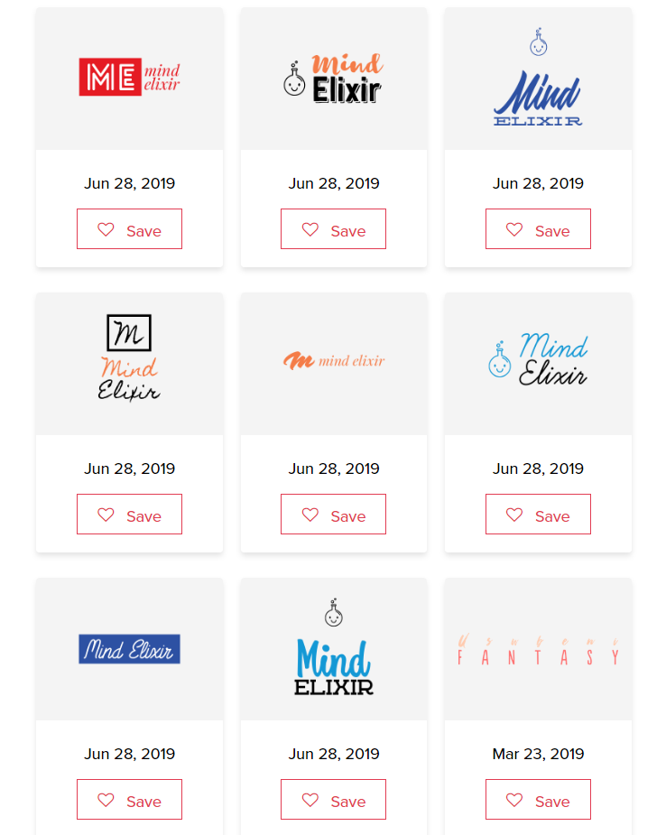
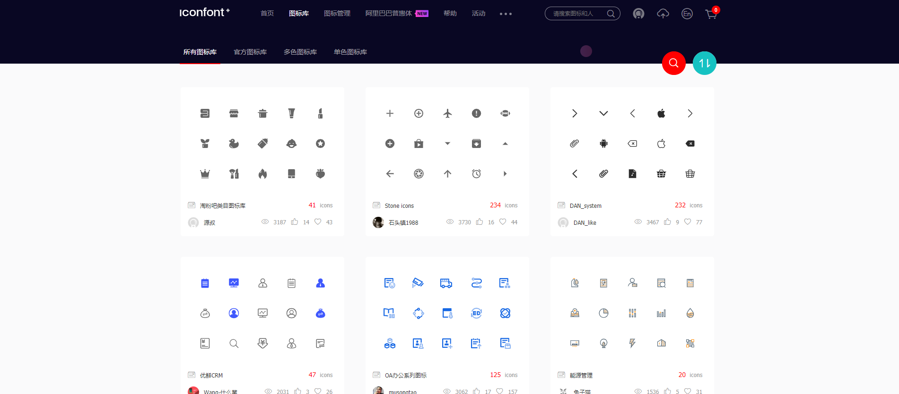
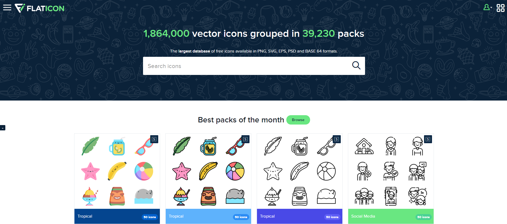
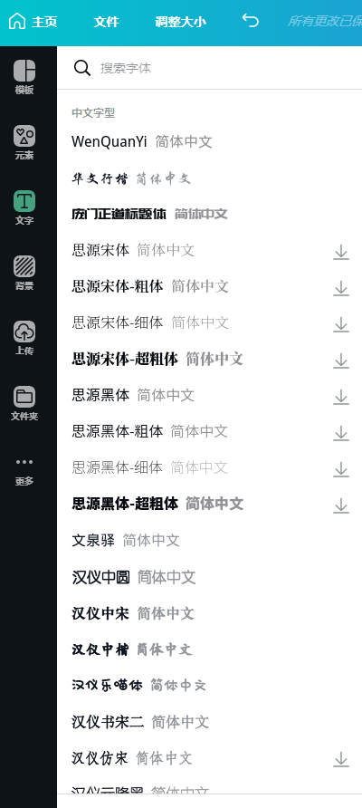
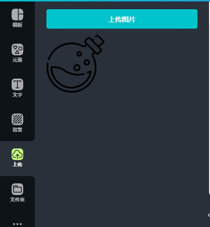
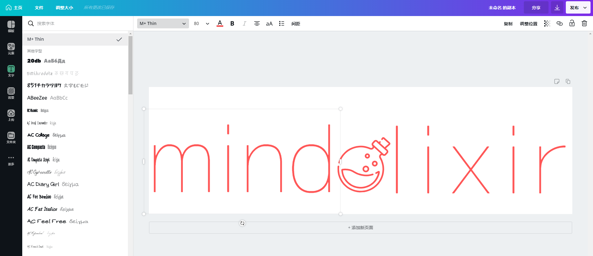

完全没有设计经验，怎么想做个 logo 还有真不容易...一开始就知道有各种 logo 制作网站，全都号称免费，但是做好了，想要下载的时候却总是要你付费。

花了不少时间找到并试用了好几家同类网站，只有 [www.launchaco.com](https://www.launchaco.com/) 是真免费，懒的话确实可以一用。

同时我明白了这些制作网站基本都是用一到两种字体加一个 icon 用几种固定方式组合在一起（不过不可否然还是挺好看的就是了），例如我想为一个名为 mind elixir 的产品做一个 logo，下面是 tailorbrands 给我的方案：

我为什么不试试自己找 icon 和字体组合到一起呢？😂

这个过程重点有两个，第一是：

## icon 哪里来

（最理想还是拿到 svg 文件啦）

首推当然是前端惯用网站 [iconfont](https://www.iconfont.cn/)，但是 iconfont 的图标都倾向于业务型，想找些其他类型的图案可能比较少。

然后就是 [flaticon](https://www.flaticon.com)，虽然有很多付费图标，但是也至少有一小半是免费的，也提供了 svg 格式。

找到喜欢的图标后，下一步是

## 把喜欢的图标和产品名称组合在一起

（不得不说，设计力在这一步还是很重要，像我就很菜😭）

要完成这一步最重要的工具是超赞的 [canva](https://www.canva.cn/)。当然你可以用 canva 国际版，但是会缺少很多中文字体。

找到你爱的字体后上传你的图标，然后发挥想象力组合吧！

然后我做出来的第一版是这样的🐷

