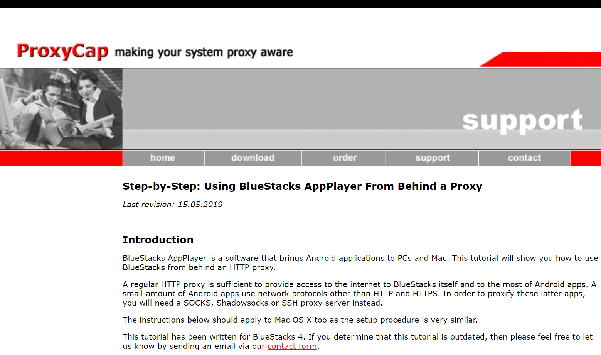
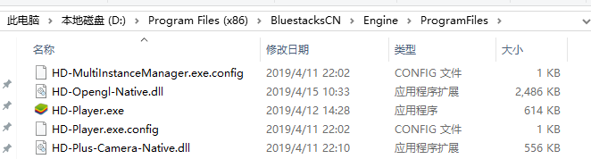
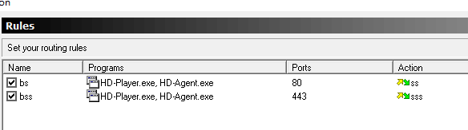
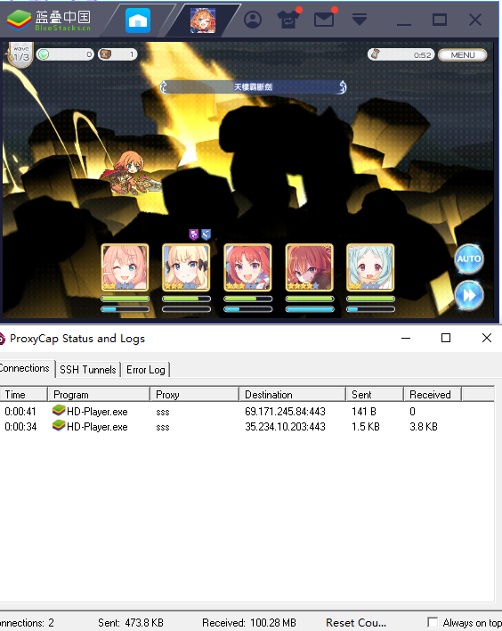

**注意：proxycap 还是依赖 SS 的，如果不知道 SS 是什么的话，请另外搜索 😂**

众所周知很多模拟器都可以在 wifi 设定里设置代理科学游戏（相对于科学上网），但是 Bluestacks，也就是蓝叠模拟器作为一个模拟器先驱直到现在都还没有这个功能。

我本来以为这个功能被藏起来了，谷歌搜索了一下确实误解，还在一个几年前的帖子里看到官方说：

> 在做了（当然是英文的）

这么多年过去了...还是不抱希望了。

之后又尝试了 proxifier，结论：不行。proxifier 的网络检测里面根本看不到 Bluestacks。之后又谷歌各种相关关键词才找到了 proxycap。

官网还自带[教程](http://www.proxycap.com/bluestacks.html)，天啊不要太良心了！（不过看这个网站设计要不是看到 Last revision: 15.05.2019 这行字我还以为这地方已经废弃十几年了...）

配置过程没有什么难点，基本跟着官网做即可。需要注意的地方是国内的蓝叠会把 HD-player 藏得比较深，看下图：

还有就是官网教程里面提到的 BlueStacks.exe 我这边没找到也没加进去，但是结果依然是可行的！

好的，水完了，以上是一个 2019 年 7 月 20 日绝对可行的 Bluestacks（蓝叠模拟器）代理工具。

