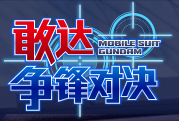

玩手游也玩几年了，现在才第一次玩到真正的氪金游戏，也算是开了眼界。

没错，说的就是 —— “敢达·氪金对决”了。

那么这个游戏为什么是说是真正的氪金游戏呢？

因为你不氪金真的**玩不下去**，下面来稍微分析一下：（虽然说这个现象貌似在国产游戏很盛行啦，但那些游戏我都没怎么接触）

最主要原因是：作为一个**主打对战**的游戏，竞技场基本是按机体强度匹配，这还算正常吧，反正大佬课得多，肯定能打赢我，心服口服，但这里有一个问题，打竞技场的奖励是胜场奖励，也就是说每天要打赢 N 场才能拿满奖励。 —— 有钱有技术的人站在真正的顶端，那么靠前的有钱又比较菜的人就很尴尬了，他们可能会比较难拿到胜场奖励，所以解决方案是什么？那就是掉分，掉分一来会害到认真上分的队友，而更重要的是，会严重损害下层玩家的体验。本来我的位置是不可能跟大佬同台竞技啦，但是这个沙雕的机制真的为我创造了无数挑战大佬的机会 —— 我打一套磨血皮，对面一套我死了，算了还是不挑战了，躺了吧...然后我又掉分了，然后进而影响我的下层体验（虽然我觉得我下层应该只有电脑了哭哭）

说完竞技场了，竞技场环境不好，那我打匹配呗...

我告诉你，那更惨，低等级经常没人，匹配到电脑，虐电脑不能说不爽，但是没有那种蜜汁自豪感，后来我满级了...

整个游戏体验就完全没有了。这游戏按等级匹配，满级 30 级，开服玩到现在 30 级，我刚升到 30 级也是 30 级，他就这么一匹配 —— 哦豁，完蛋。这差距不用说也能感受到吧？这个情况就会导致氪金少的人连匹配都不想打了...然后整个匹配就变成了 95%的大佬和 5%刚上 30 级的懵懂新人...然后其中的微课懵懂新人估计也是会慢慢选择不打...

再说说匹配最后的良心：巅峰对决，所有机体被降到同等级竞技。不得不说这已经是最良心的了，但是没有限定机体依然是当沙包的份，并且限定开启时间不能一直打。

当然当然，还是有聊胜于无的好几个单机模式，但是部分模式不氪金难度依然很高，还有故事模式过短的问题。另外培养机体需要的素材也不容易获得，总玩几台机，总是会厌的，但是培养其他机体的资源又不够了...所以即使抽到喜欢的机体还是不一定能让他上场。全当“玩具”，是真的玩两局就晾起来了。

综上所述这游戏玩的人少是真的不要太正常，留下的都是给足钱的壕，那么即使有刚进来的萌新，也早晚被打跑。反正我现在能做的就只有打打单机收收菜了...（再不济出坑卖号？）

现在来看果然是后悔玩这游戏了，只能说，[万代的烂胶宣传片](/2019-05-09-gundam-battle-mobile/)，强！

PS：我猜人少也是导致这个游戏匹配机制沙雕的原因，要是这游戏有王者农药几分之一的玩家，我猜匹配机制让傻子写也不会写成这样...

PPS：然后我想了想为什么我玩这么久手游都没遇到过真氪金游戏...因为我几乎都是在玩日系单机抽卡培养游戏和各种音乐游戏...这么看来一个游戏如果不是主打对战的话其实很难成为一个“不氪金玩不下去的游戏”。不过当然，主打对战依然不用氪金的就有例如农药和吃鸡，可能这就是他们火的原因之一吧。