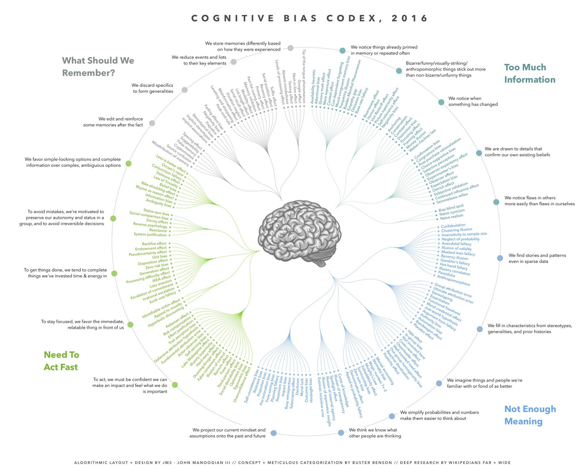

> 明明认真看了这么多书，上了这么多课，怎么感觉我没半分长进？

之前看了一篇名为[「我坚持一年把别人喝咖啡的时间用在学习上，然后崩溃了」](https://mp.weixin.qq.com/s/i2SEEX9CDFyLOkBklVWS6A)的文章，又双叒引发了我对学习的思考。

平时我总会胡思乱想很多东西，这个问题也不是第一次想到了，但是我觉得为了总结并尝试让这些想法更“实用”，是时候自己总结一下。

---

我自觉大部分前端都“很热爱学习”，每次出来什么新东西，大家总说学不动。

学不动是真的，诚如大家所知现在互联网的知识更新和传播速度十分快，再加上前端这个被成为娱乐圈的领域，新知识更是层出不穷。一个前端也没办法精通所有“前端知识”，前端的知识范围已经越来越大了。

以前“前端”就是做一个展示用的网页，现在更偏向于应用类，各种办公应用、效率应用和游戏等复杂应用都有网页版，其中涵盖的知识领域是非常宽广的。

我在今天之前也每天都在“学习”，但是我希望以后可以作出改变，因为我确定我在对“学习”的理解上确实出现了偏差。

结合上面提到的文章，我尝试分析下我自己的问题 ——

## 学习已经成为逃避现实最高尚的借口

仿佛万箭穿心，这句话说的就是我。

之前的工作工资太低，我就想着：这份工作还算闲，我有时间学习，我先学习吧。这正是一种回避现实的表现。

**想清楚当前的情况是否真的只是“需要学习”，而不是进一步推进你的人生进程。**以上面的例子说，我在换工作之前总之一直在拖，我是真的没有准备好换工作吗？我真的没有实力吗？我看未必。

因此，不要以学习为借口，努力踏出下一步很重要，当时是幸好有人推了我一把。

## 学习内容错误

每天上 知乎，每天上 得到，这算是学习吗？

我想学金融经济！我想学乐器！我想学画画！我想学唱歌！我想学德语！我还想精通某些游戏！

> 你什么都想学。 —— 教练

上面的这些都不是开玩笑说的，上面说的我是真的都想学，但是以我的能力，大概真的不能同时学这么多东西。

回到第一个问题，现在的互联网让各种知识充斥在我们眼前，让我们觉得什么都可以学。换做以前，得先找师傅，得报学习班，学的东西少了，可能更有利于精通。

所以我每天上各种“学习类网站”有空就看各种知识，或者说杂学，其实我觉得根本上学习的内容就错了，这使学习的意义大打折扣。

学以致用是对的，但不能为了学而用。你可能每天都学了很多新知识，但是没地方可用，这些知识就很快随着时间过去而忘却。

之前也在 medium 看到一篇文章[「While Everyone Is Distracted By Social Media, Successful People Double Down On An Underrated Skill」](https://medium.com/the-mission/while-everyone-is-distracted-by-social-media-successful-people-double-down-on-a-totally-underrated-5a86701e9a27)，说得就是互联网信息太大的应对方式，也给我带来很多启示。

前端为例，背 API 是最没有意义的，因为无论何时你都能在 mdn 搜到 API 的使用方法，相反，学习设计模式会更具有适用性，即使你更换了编程语言，设计模式大部分可以通用。而上一层是整个职业规划相关的学习，更上一层是对人生的认知。

除去实用知识和非专业知识，学习性价比最高的是一些思维方式。这些思维方式一般能给我们的生活带来“突破性的”变化，同样效果的还有学习哲学，哲学是一种思考方式，一种逻辑，对人对世界的认知很有指导意义。

## 学习方法错误

**把知识放到收藏夹，知识就是我的吗？**

我安装 chrome 的掘金插件很久了，每天打开都看到一大堆的推荐文章。但是很多东西觉得挺有意思，但是**看完就忘了**，举个例，JavaScript 很多有趣的冷门 API，看完觉得妙，但是日常根本用不上，然后就逐渐忘记这回事了。

更有甚者只是加进收藏夹（这里还包括知乎、微信等收藏功能）还没看完，甚至只看过标题，内容只字未看。

我觉得，**整理收藏夹真的很重要**，最近一个月我已经把收藏夹删了一半。

不要小看一个众人皆知却很有用的方法 —— **做笔记**。对于你真正需要学习的东西，最好把精华抽出来作为自己的笔记，并常常翻看，这样才能**学以致用**，不然就是学了就忘。例如很多技术小短文的核心都是介绍一个接口或者一种技巧，其中用于举例的内容颇多，其实理解后再总结成几句话就很方便以后复习翻看。

而且不要看到什么都收藏，有趣的，真的不一定能用上，不要徒增自己大脑内存。**请不要害怕错过有趣的内容，因为如果有必要，你很大概率会再次与他们相遇，因为当你真正用到的时候，你仍然能找到他们。**

## 所以真的需要逼这么紧吗

我们真的需要不间断地学习吗？我会赶不上别人吗？

这个问题我也真的很犹豫。上网看到各种贩卖焦虑的玩意，实际上我们需不需要这么焦虑，真是个没有答案的问题，这完全因人而异，甚至可以跟人生目标扯上关系。

但是可以肯定的是，我们追求的应该是懂得学习，高效学习；同时，人类需要休息和娱乐（甚至你可以把在休息和娱乐中学习），才能不崩溃地继续坚持学习。

感谢看到最后的各位，感谢袁隆平让我吃饱饭有空想这个！

另外，这篇文章并不会在这里结束，随着成长（或者说老去），一定会有更多的经验，下回见！
