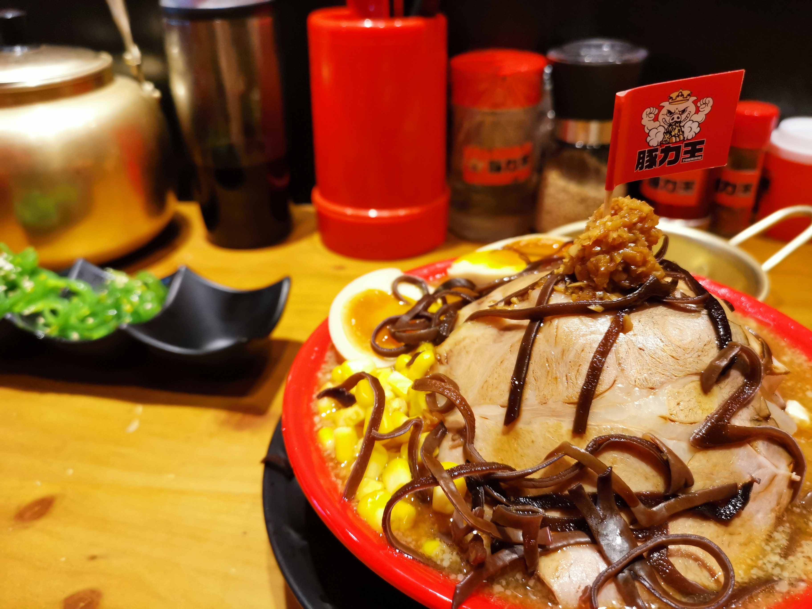
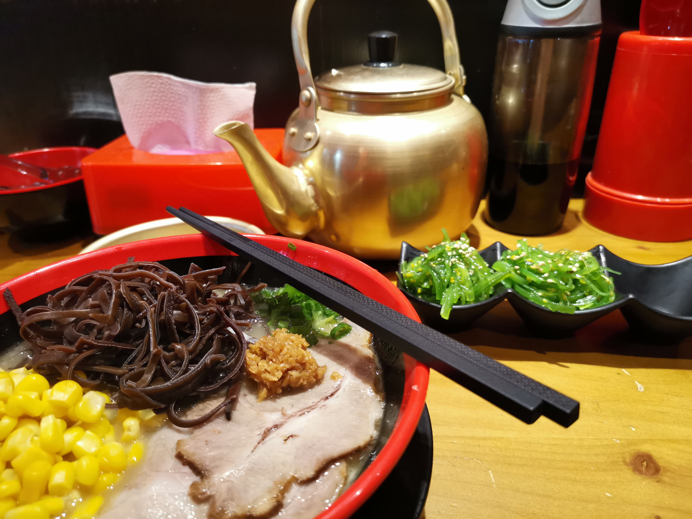

上星期天开始加班，然后上星期**整个星期都在加班**。应该是换工作后第二次加班，体验其实也不算很差吧，有饭吃，有调休，也就加到九点半，可以接受。

然后我就想到，现在确实觉得可以接受，反正现在还没结婚，更没有孩子，除了有时候做做个人项目，下班回家也就看看视频就睡觉了，加班倒是有种**迷之充实感**。

（但是可以想象，有孩子想要安心加班就真的不容易了...）

当然我并不是为 996 辩护，只是在个人接受范围内多干点活还行（反正管饭有调休，当然这个是看公司看领导的策略了），而且加班有时候会有比较有趣的聊天内容，这也是让我接受加班的原因之一吧。

因为加班这个星期什么都没写出来，回家就累得不行了，但是晚上还不一定睡得好才是最致命的，**例如晚上做梦都想到业务流程之类的** 😂

好消息是进度还算乐观，这个星期的双休保住了，下星期二上线，看什么情况了（主要是看产品和老板会不会突然加需求还不分迭代了）

最后是治愈疲惫的周末奖励👇

↑ 看着分量很大，其实是堆满了芽菜，不过整个口感还不错，就是非常的咸...我真第一次吃这么咸的拉面（

↑ 简单的清汤拉面，没有特别评价啦（
