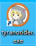

[ティラノスクリプト(TyranoScript）](https://tyrano.jp/)是一个 AVG 引擎，借助 HTML5 支持多平台。在谷歌百度都找不到什么教程的情况下，我决定自己总结一下一些简单的用法和魔改的方法。

## 开发工具

### 启动器



[tyranorider](https://tyrano.jp/usage/tech/rider) 完全免费，是最常用的项目生成器 + 启动器。这个教程主要会使用这个工具。


[tyranobuilder](https://b.tyrano.jp/) 有免费版，但完整功能需要付费，steam 已上架。这个工具主打可视化编辑，适合无编程经验的同学使用。

### 编辑器

不使用可视化编辑或需要魔改程序的话必然需要一个代码编辑器，推荐 vscode 或 sublime。（sublime 很久没用了不知道，但是 vscode 有 .ks 文件着色插件，看着舒服很多）


## 项目初始化

方式有三种，上面提到的 tyranorider 和 tyranobuilder 都可以生成初始项目，另外你可以通过 clone（下载也没差）[官方 GitHub 仓库](https://github.com/ShikemokuMK/tyranoscript)得到初始化项目，并且我推荐这种方式，最具学习意义。

因为 GitHub 仓库中带有 cg 页和设置页的例子，用生成器生成的却没有...没有...没有...

## 文件结构

动手的第一步，首先需要了解生成好的初始项目里面有些什么。

先重点关注 **data** 文件夹，tyrano 文件夹在以后魔改教程中会说到。

- bgimage 放置 background image
- bgm 放置 BGM
- fgimage 放置立绘（fg 应该是 figure 吧）
- image 放置其他按钮或素材图
- others 放置泛用素材（找不到文件夹放的东西就塞这里的意思）
- scenario **重点关注对象**，放置剧本文件。（**很神奇的是，一些页面也是用“剧本”的方式书写**）
- sound 放置音效文件
- system 放置系统配置文件
- video 放置视频文件

## 剧本的构成

剧本指的是 `.ks` 文件，**这类文件通过各种 tag 构成**。

所有 tag 可以参考[这里（英文版）](https://tyranobuilder.com/tyranoscript-tags-reference/)或者[这里（日文版）](https://tyrano.jp/tag/)。

`.ks` 文件对编程不熟悉的用户来说基本是用于剧本录入，就像下面这段：

```
*start

[wait time=200]

吾輩わがはいは猫である。名前はまだ無い。[l][r]

どこで生れたかとんと見当けんとうがつかぬ。[l][cm]

何でも薄暗いじめじめした所でニャーニャー泣いていた事だけは記憶している。[l]

吾輩はここで始めて人間というものを見た。[l][r]
```

但是 title 页面、CG 页面、config 页面在官方示例中都是用 `.ks` 而不是 html 文件书写...以至于我也不太习惯这种编程思路（当然魔改后是可以用 html 写这些页面的，但是感觉也会变得很怪...因为各种实践混在一起有时候会忘了哪里写在哪里 😂）。以下是 cg.ks 的部分代码：

```
;=========================================
; CG モード　画面作成
;=========================================

@layopt layer=message0 visible=false

@clearfix
[hidemenubutton]
[cm]

[bg storage="../../tyrano/images/system/bg_base.png" time=100]
[layopt layer=1 visible=true]

[image layer=1 left=0 top=0 storage="config/label_cg.png" folder="image" ]

[iscript]

    tf.page = 0;
    tf.selected_cg_image = ""; //選択されたCGを一時的に保管

[endscript]


*cgpage
[layopt layer=1 visible=true]

[cm]
[button graphic="config/menu_button_close.png" enterimg="config/menu_button_close2.png"  target="*backtitle" x=820 y=20 ]

[iscript]
    tf.tmp_index = 0;
    tf.cg_index = 12 * tf.page;
    tf.top = 100;
    tf.left = 60;

[endscript]

[iscript]
	tf.target_page = "page_"+tf.page;
[endscript]

*cgview
@jump target=&tf.target_page
```

这种做法是用 tag 穿插 js 功能，并通过按钮和 `*` 标签实现跳转。

## 下回预告

打算先把 layer 相关的基础写了，这样一些 tag 解释起来会比较更简单~
