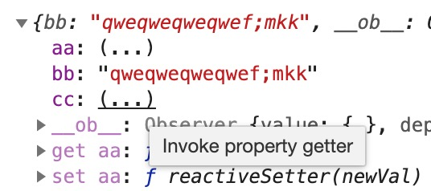

此文用到的例子在[这里](https://codesandbox.io/embed/vue-template-9hx3h)

## 提出问题

```javascript
<input v-model="sth" />
<input :value="sth" @input="sth = $event.target.value" />
```

### 动态添加对象属性

> 向响应式对象中添加一个属性，并确保这个新属性同样是响应式的，且触发视图更新。它必须用于向响应式对象上添加新属性，因为 Vue 无法探测普通的新增属性 (比如 this.myObject.newProperty = 'hi')

### Vue 单向绑定？！

```
@input="sth = $event.target.value"
```

实现了，但是 sth 的监听却失败了，也就是 sth 更新时并不会触发页面渲染。

这里需要重新研究 vue 的绑定机制。

`this.inputvalue.bb = "qweqweqweqwe";` 会导致不能绑定，但是不写反而可以。

这应该是因为整个对象本来都出于可监听状态，手动加入inputvalue.bb会导致以后都不再监听这个属性。

如果先显示bb输入框，然后输入一些东西触发依赖收集，然后再赋值就正常了。



## 应对方法

### 在 data 配好模版

### 使用 set 方法

### forceUpdate

## 循环呢？

## v-model 的实现

参考链接：https://cn.vuejs.org/v2/api/#Vue-set