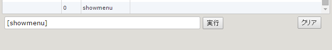

TyranoScript 中的 tag 只作用于某些层，并且我们有必要搞清楚层级关系，谁高谁低，因此在此介绍

## base 层

**只有一个 base 层，且必定在所有图层之下。**此图层用于显示背景，指定图层时使用 `layer="base"`。

隐藏背景图使用 `[freeimage layer="base"]`。

## 前景层

**用于显示角色立绘**，默认三层，使用 `layer="0" layer="1"` 指定图层。

## 文字层

**文字信息显示层**，使用 `[current layer="message0"] [current layer="message1"]` 指定图层。

## 自由层

**用于放置按钮和可点击元素**，默认不显示，当有按钮存在时显示在最上层，同时剧本停止。

注意：并不存在 **layer="free"** 这种写法。

使用 `[cm]` tag 可以隐藏自由层并清空内部元素。所以使用 `jump` 后需要先 `[cm]` 才能继续运行后面的剧本。

## fix 层

通过 `layer=fix` 指定，用于放置一直存在于画面上的元素，只能使用 `[clearfix]` 清除。

## 相关源码

关于层级的代码位于 tyrano\plugins\kag\kag.layer.js。

**初始化项目的 kag 代码都是压缩了空格和回车的，不过变量名没有被混淆，只要简单地格式化即可。**

格式化之后顺着看下来，除了上面提到的层，还有些神奇的地方了 ——

```javascript
var layer_menu = $(
  "<div class='layer layer_menu' style='z-index:1000000000;display:none'  align='center'></div>"
)
layer_menu
  .css('width', this.kag.config.scWidth)
  .css('height', this.kag.config.scHeight)
  .css('position', 'absolute')
```

突然就冒出个 menu 层，这就很尴尬了，官网完全没有说明。之前说过，这个项目有的页面会用 .ks 文件写，但是有的页面又会用 html 写，并且牵连到 js 写的核心，**这真的令我很凌乱。**

这个 menu 其实是右下角齿轮的菜单，并且**load 页面使用的也是这个层**。

TIPS: 运行下面的指令就能看到菜单冒出来



后面魔改也需要添加自己的 title layer，所以先把 layer 说了！下期见！