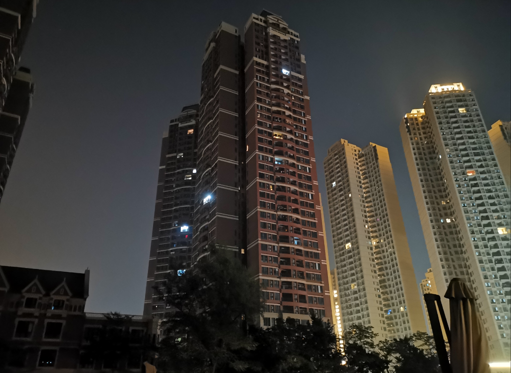
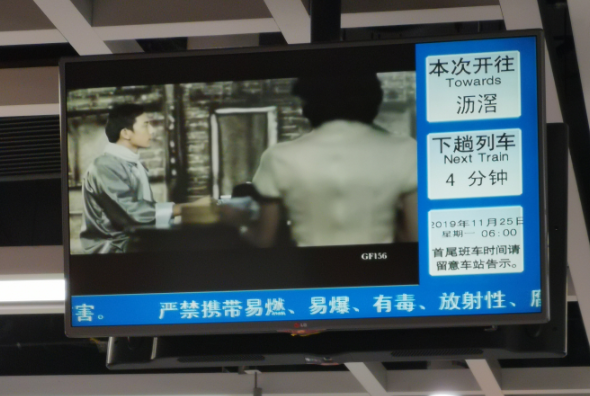
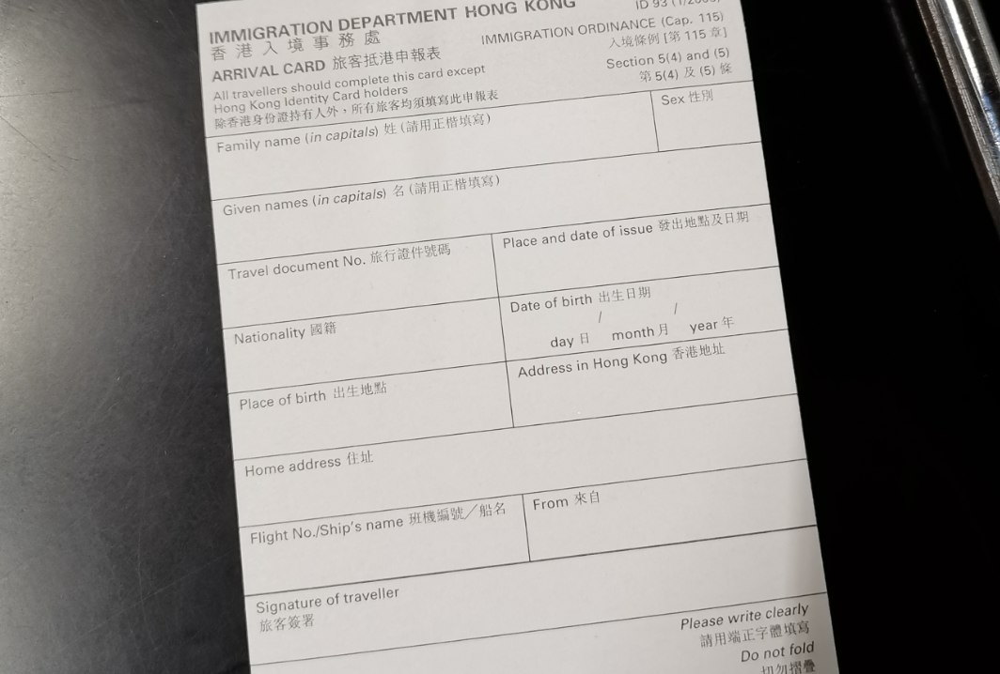
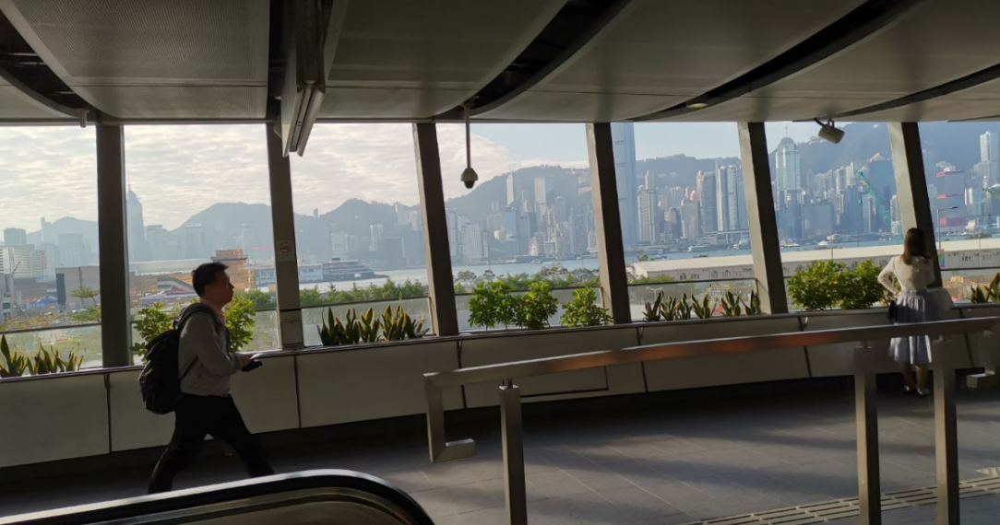
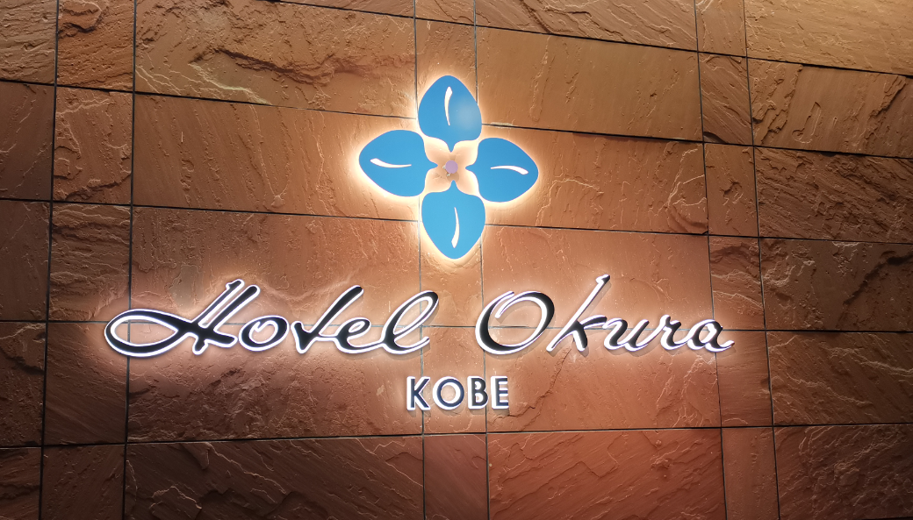
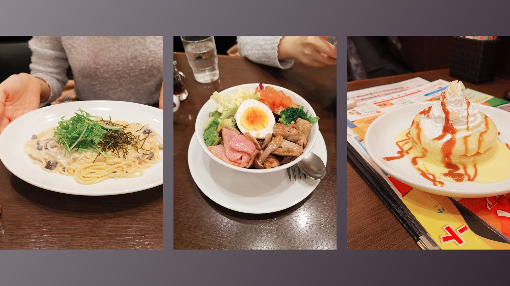
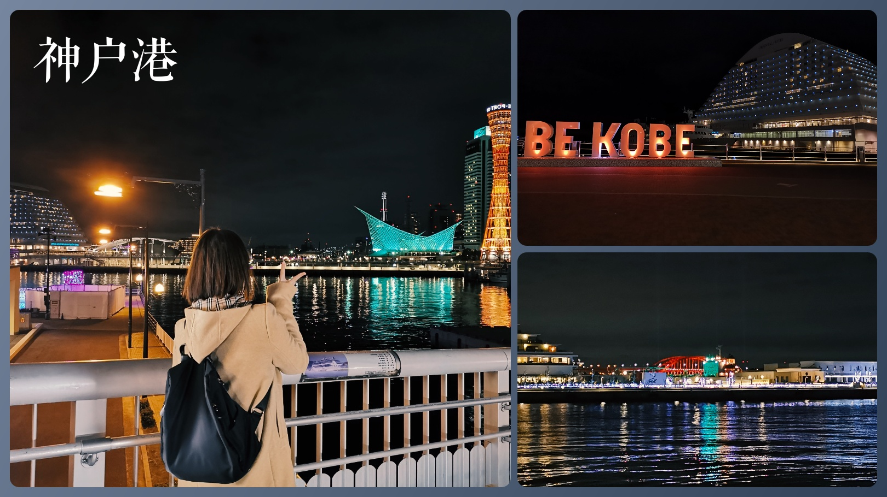

## 先说两句

回来到家 11 点，洗洗立刻睡了，之前同事说睡不着只是因为不够累，现在觉得，确实（

第二天，也就是今天回公司可以说一片狼藉，这事有空另外吐槽，反正就感觉落差十分大 😥

回家吃完饭休息一下之后，终于能总结一下这次旅行。总结必须做得快，不然要不忘了，要不干脆就鸽了...

时间倒流回 11.25...

## 一大早的奔波

大清早 5:30 起的床，洗漱花的时间意外地少，45 分就出门了，外面还是一片漆黑，我慢悠悠地走向地铁。

意料之内地赶上第一班地铁，当时地铁站内的人还是比想象中的多一点。

按照前一天的预演（其实就是提早一天去拿车票，到香港的高铁似乎不能直接嘀身份证过机），**在最方便换乘的车门上地铁**，换乘十分顺利，大概 6:35 就到了南站。

到香港的高铁是 7:23 分，再次慢悠悠地安检，等车，顺便吃个早餐。

—————— 然后是一段不短的高铁 time，8:30 到香港 ——————

过关直接用护照，过机直接把护照拍到感应器就好了。另外用护照过关要填**抵港申请表**，如果你能提前拿到表的话可以事先填好（**回程还要填一张，所以可以直接填两张回来用**）。之前纠结了一下香港地址怎么填，其实可以不填，写错的地方甚至可以直接划掉改正，所以写错了其实也不必重写一张（

下一步是机场快线，顺带一提机场快线可以直接在网上购买进站二维码，还能用支付宝，挺方便的。

去之前做了一下功课，大家都说西九龙到九龙挺容易的，但是**感觉**我出站的时候绕了商场一圈才走到通往另一个商场的天桥，心里想，是我蠢还是路牌把我水了 😂

在天桥上看到风平浪静的香港，没想到还有点感慨，为什么某些智障忍心破坏这番风景呢。

然后到了机场快线，我还走错了方向，再次蠢了一次，还好时间充足 😂

确定是去往机场方向，上车，30 分钟不到就抵达机场，顺利和领导汇合！（因为女朋友三个字太长了，所以用领导两个字代替【滑稽】）

然后然后！在机场上上网（有免费电脑可以用）、充充电，11:50 分终于启程前往关西机场（KIX）啦！

## 关西你好

KIX 下机，气温估计不是很冷，但是风那个大。接着过境、过海关，花的时间不算多。

我们日本的第一站是神户，KIX 可以直接坐船到神户机场，而且船票外国人有打折，耗时不长，就选坐船了。

不过这船真的快要把我坐 🤮 吐了，前面说过风很大，上船前也有提示说船会很晃，我们当然不以为意.....

直到坐接驳巴士到达港口，**那船左右 30° 地在我眼前摇晃**，为什么大阪的风可以这么鬼大。

那晚我终于知道什么叫晕船，上船船没开，单纯地左右晃动，还混杂着不知道是柴油还是汽油的味道，没个两分钟立马晕了。还好我闭眼塞着耳朵听歌才逃过一劫，隔壁老哥就不那么好运了，刚开船没多久就忍不住慌张地起来找洗手间。

度过了翻滚的 30 分钟，下船那踏实感着实让人感动。刚上船领导还笑我晕船，结果她自己倒是下了船还在晕 😜

胜利在望了，下船坐接驳巴士到神户机场，然后坐一台好像是无人驾驶的小“地上铁”，到达三宫站，再然后乘坐酒店巴士到酒店。

奔波的一天可以算是在到达酒店的一刻结束！

我 终 于 开 始 旅 行 了 ！

总结一下我 11.25 的行程

5:30 → 家 → 地铁 → 高铁 → 机场快线 → 飞机 → 接驳车 → 快速船 → 接驳车 → 无人车 → 接驳车 → 酒店 → 8:18

我真是太难了。

从酒店 okura 走到神户港不远，但是美利坚酒店更近！当时领导也不知道为什么选的 okura 而不是美利坚 😵

神户港夜景不错~ 在马赛克广场逛一下（虽然店都关了一大半），吃了在日本的第一餐！治愈一天疲惫的晚餐！

顺便买了一瓶自动贩卖机热饮，温暖人心！**自动贩卖机真是日本的灵魂之一** 😆

不过有一点遗憾是已经没时间去看**神户大桥**了，只能远远地望一眼 😂，不过明天还有月球巡礼就是了 😆

## PS

我现在才明白游记真的难写...要回忆，想到一点补充一下，还要处理图片...结果我花了两个晚上两三个小时才龟速摸完了第一天...

不过还好，后面都是图片居多了（大概 😭
