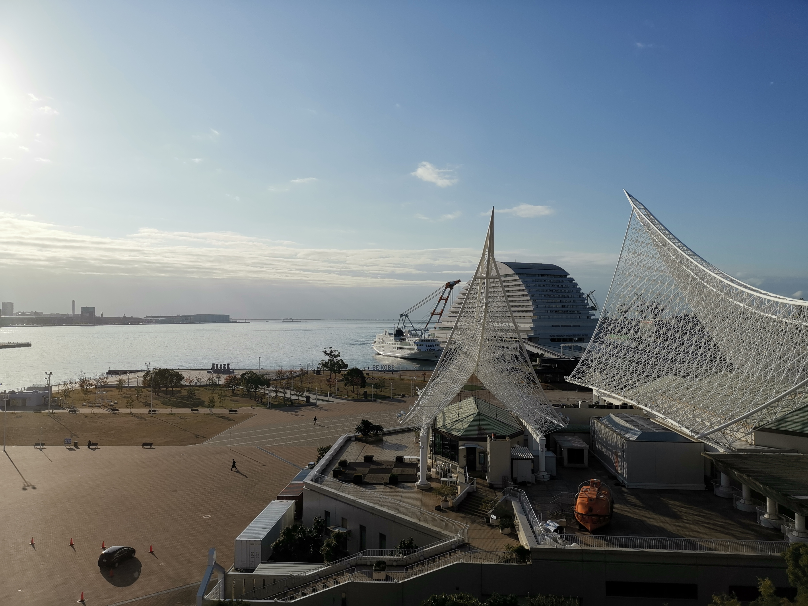
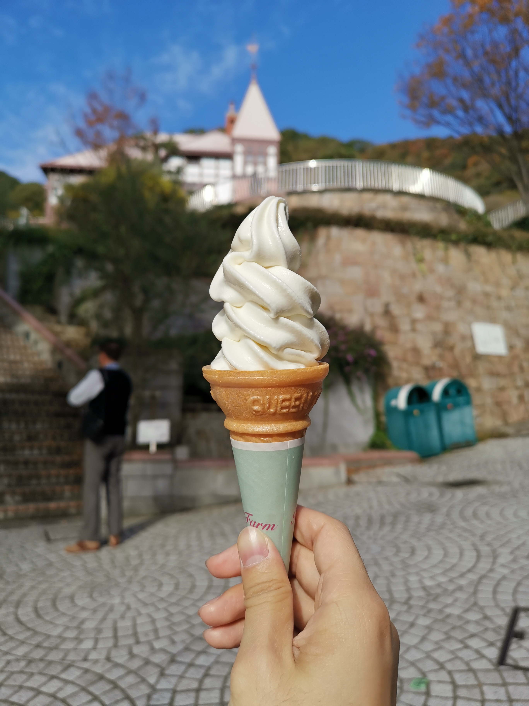
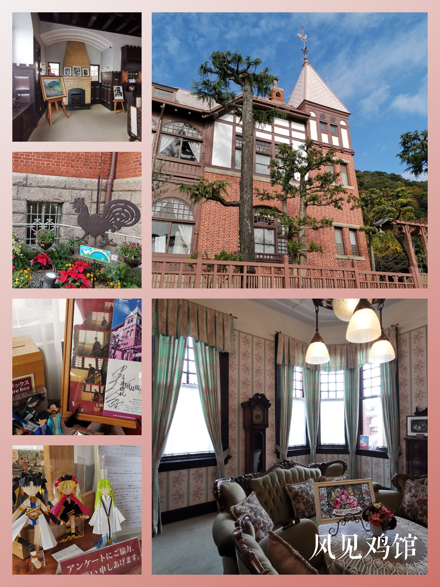
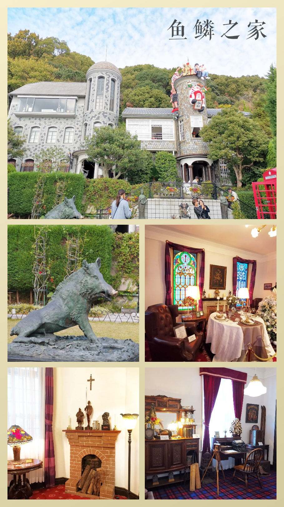
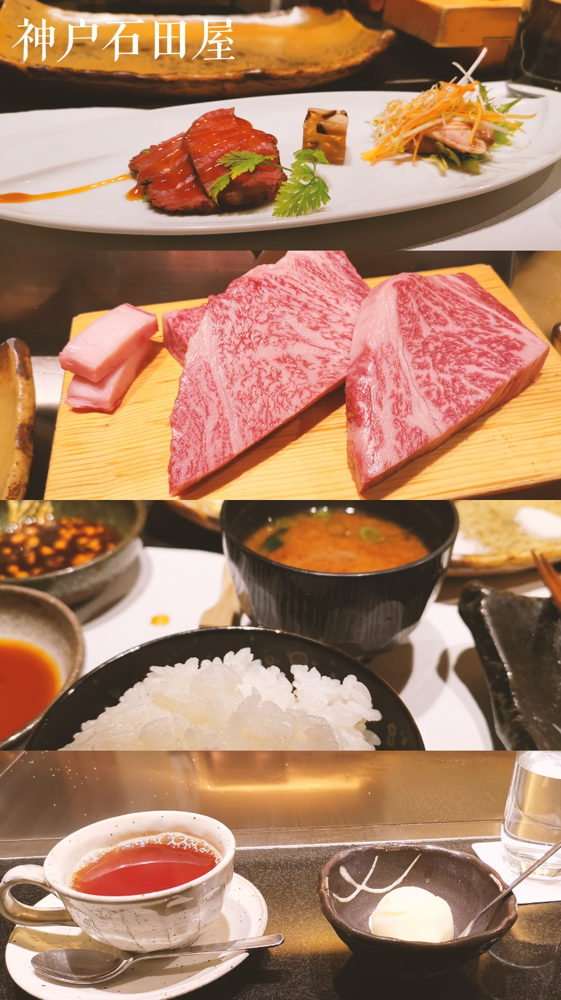
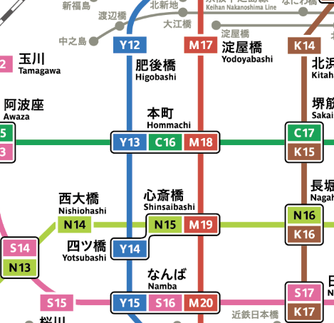
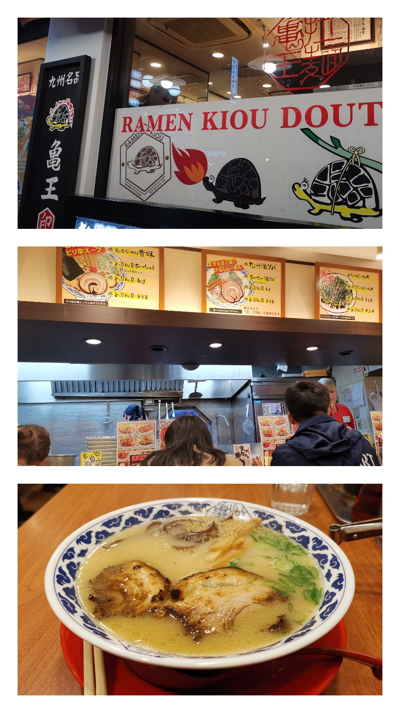
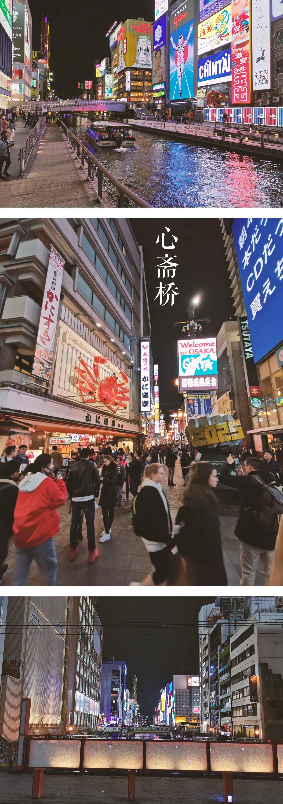
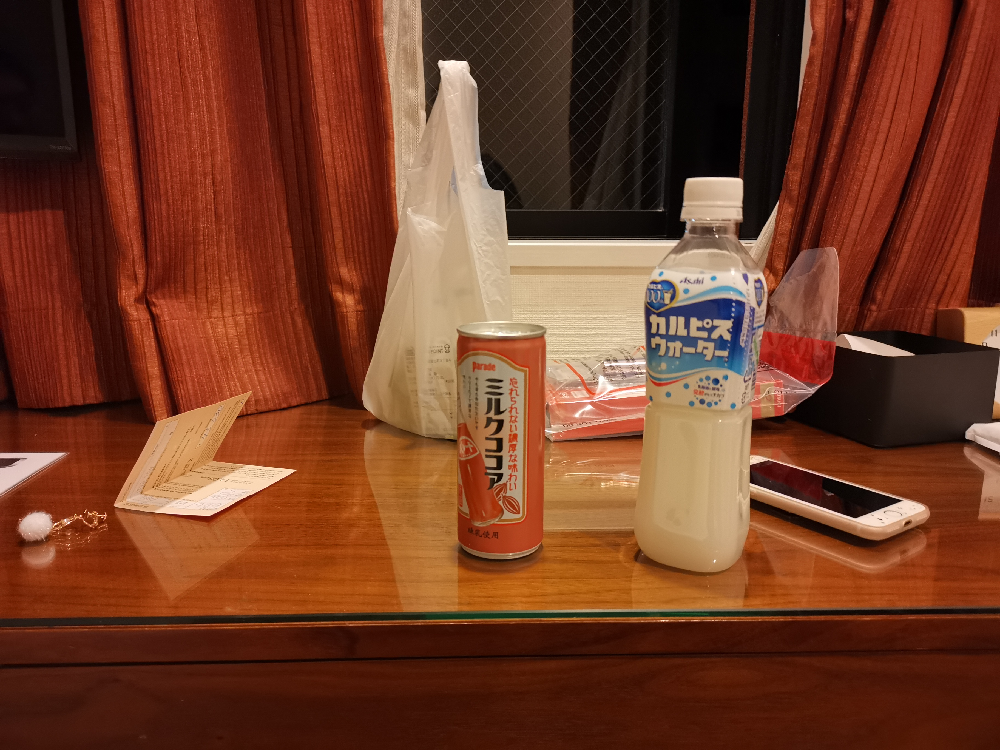
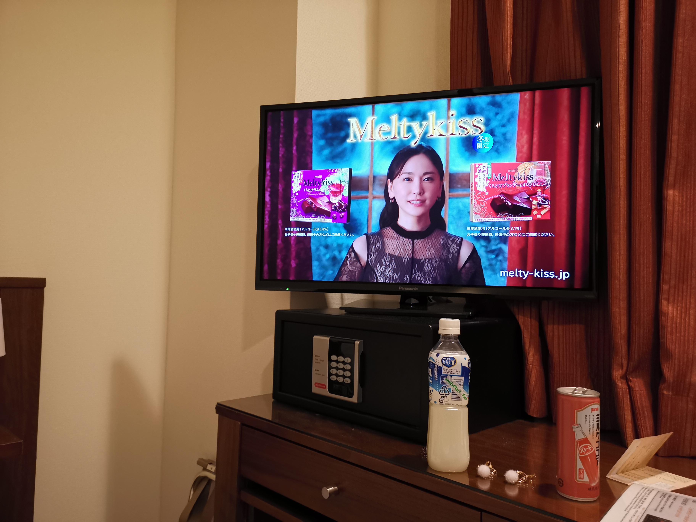

起床窗外的神户港

## 圣地巡礼

领导是个月球人，到神户当然是少不了去一趟远坂宅和间桐宅。

我们是从三宫走路（去旅游要看人文风景嘛，多走走一些小巷，感觉挺舒服的）到北野异人馆街，并不是很远，但是北野坂是真的坂，爬了好长的坡才到区域的入口，中间会路过传说中的日本第一家星巴克。

然而事实上这家星巴克是 2009 年开的，只是这栋建筑建于 1907 年，95 年被地震破坏，2001 年重建。

上来先吃个雪糕补充能量 🐷

视线范围内已经出现**风见鸡馆**了，也就是远坂宅的原型。

## 午餐上限

可能是我这辈子最贵的午餐（1673 RMB🤣） —— 神户牛肉

领导选的这家店 —— 神户牛排 Ishida.，[官网在这](https://www.kobe-ishidaya.com/)

> 闻名世界的名牌牛「神户牛」是有机会来到神户任谁都想品嚐的绝世美味。Ishida.是神户三宫的神户牛专门名店，这裡所提供的神户牛都由神户牛鑑识达人的 Ishida.社长亲自精挑细选出的高品质神户牛。尽可能希望让来店的每位顾客能品嚐到当天最棒最美味的部位，除了每天严选状态最好的肉质以外，严格的品质控管也是 Ishida.绝对秉持的理念。神户牛肉质非常柔嫩，入口即化的口感以及甜美不油腻肉汁是最大特徵。

官网如是写...我吃完的感觉是，入口即溶是真的，真得甚至觉得自己不在吃牛肉...而是比较粘稠的牛油。好吃是好吃，但是预感吃多了挺腻（毕竟我吃得肯定不多）😏

除了两块牛肉（一块 A4 一块 A5）还带 前菜 ×1+汤 ×1+饭 ×1+一些配菜+雪糕 ×1+红茶 ×1 吃得还挺饱的~

## 转移阵地

吃完牛肉直接回酒店拿东西然后转移到大阪的酒店，放下东西之后陪领导逛 jshop。

前一天忘了说，关于交通卡的问题如果日元足够的话我觉得不必要在中国买了再过去，因为大部分地铁站都可以直接在购票机买卡（ICOCA），很方便的。

神户到大阪坐的是 JR 的车，到大阪之后基本都是坐**大阪 metro**

大阪住的酒店 Arietta Hotel Osaka 位于本町，可以随意坐三条线，而且离心斋桥只有十几分钟路程，对于买买党会十分方便（强调一下我并不是）。

这个酒店房间不大，房间比起在神户住的五星级就显得有点寒碜（实际上是日本酒店正常水平吧），想起未来要住 5 天，领导进门立即表现出嫌弃（

不过其实住下来觉得不错，进大门会有种让人安心的气味（香薰）。早餐是自助餐，不过，主食都是面包，基本没有肉（有肉的那天是肠仔包 😂），其他还有牛奶麦片、蔬菜汁、半熟鸡蛋、酸奶、沙拉等。意外地，我吃了 5 天都不觉得厌，那里的面包有点意思，鸡蛋也很好吃，总之这种早餐是挺适合我。

说回移动，直接在乘换案内或者谷歌地图搜索找到路线然后按着**线路颜色**找车就完事了，不会很难找。

晚餐是龟王拉面

吃完之后顺路在格力高招牌打个卡~日本的店大多八九点关门，行人也逐渐稀少，但是**心斋桥**（听了几天的报站器：shinsaibashi，shinsaibashi 的，听成心塞桥😂）连同隔壁的美食天堂**道顿堀**，夜里依然热闹，这番景象似乎很大程度上都是异国人撑起来的 🤣

之后的故事就是一直从心斋桥几乎是最远离酒店的那一端一路暴走到酒店，那天步数爆表、双腿残废 😭

那个天气喝冰可尔必斯，简直酸爽

顺便电视看到老婆 😍