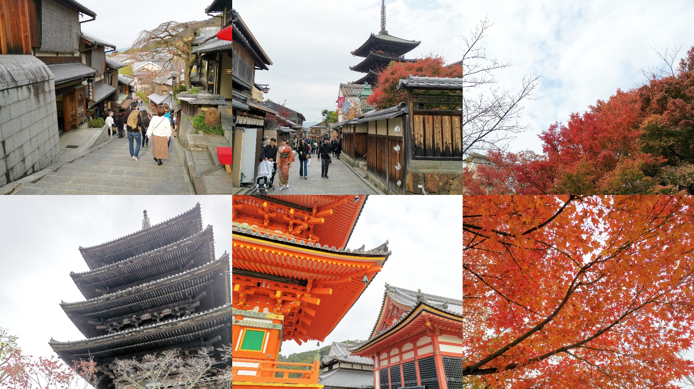
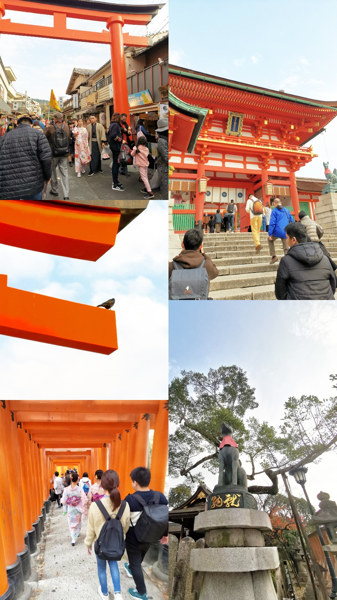
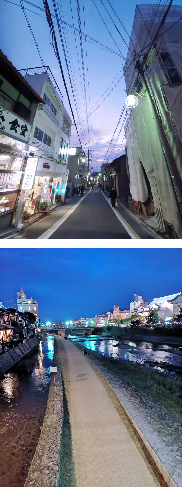
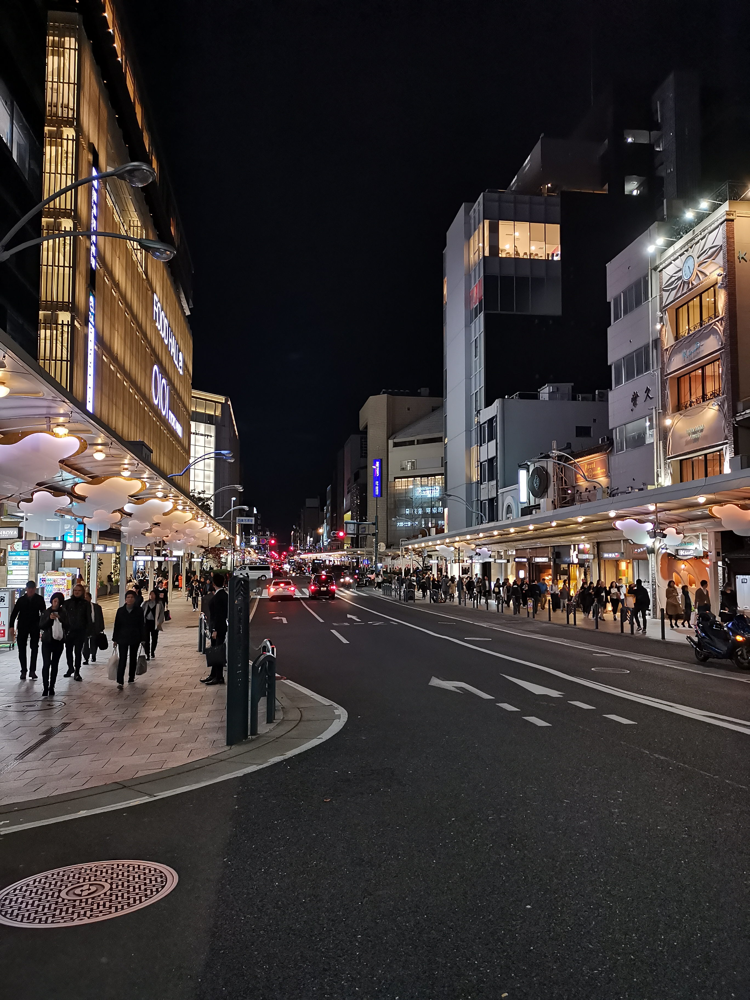
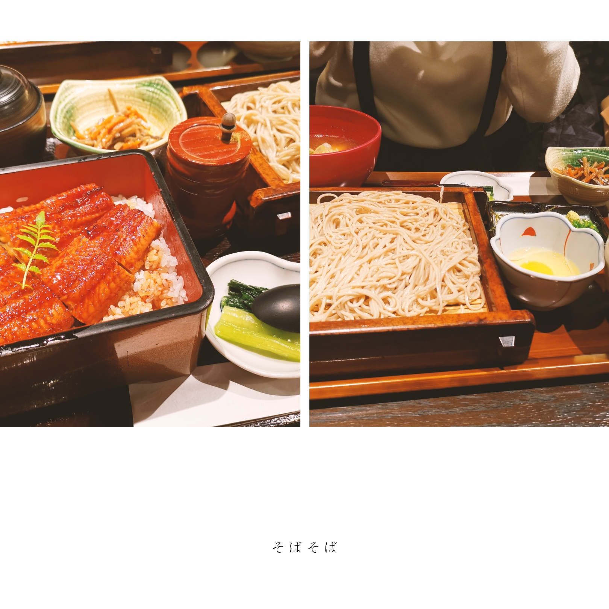

第 3 天是忙碌的一天，计划是京都一日游，大阪到京都选择**京阪本线**（京阪电气铁道）

先去清水寺那一块，然后去伏见稻荷。

领导租了和服，但是本人不会拍照，回来被批评，所以虽然这天人本应是主角，但是下面图片就不放人了！ 😂

同时意识到果然是术业有专攻，去到日本拿起手机真的觉得很难找角度，这种对角度的 sense 应该要花很多时间培养吧 🤔

从这天开始，我们就沉迷上了章鱼烧，几乎每次捡到章鱼烧都会买一份（因为那天领导的装束不方便吃午餐），而且一档卖得比一挡便宜，可能是因为我们从景区一直往外走吧 😂

但是具体价格忘记了，最低好像是 300 日元 8 粒（这个是在第 4 天在奈良吃的）

为了赶着和服归还时间前往返伏见稻荷，从祗园打车（领导真的很喜欢打车）到伏见稻荷，一千多日元。

伏见稻荷和我 3 年前来的样子还一样，不过感觉门前的车站好像更新了。进到大门依然人超多，跟祗园一样不愧是热门经典。两边都能见到旅行的日本学生，稍稍感受到青春的感觉。

在伏见稻荷回祗园换完衣服后，我们计划回梅田吃晚餐。导航把我们导到河原町坐车，从祗园离开像是从古都回到上世纪末的日本，而走到河原町一个拐角，发现我们从近代返回现代大都市。

路过上面这个岸边就想起风儿有点喧嚣的梗（可惜晚上没那气氛了）

迫于满眼霓虹灯，改变计划直接吃饭顺便逛逛商场就算了（

河原町也有一家 bookoff（前面也是忘了说，我在心斋桥已经找了两家 bookoff），进去逛了一下，发现依然没有**健身环**，就仿佛这个游戏没有存在过。领导在日亚一搜，怪不得，直接连日亚都脱销了。

你是我唯一想要的游戏.jpg

我这次去日本唯一的购物愿望就这样被事实冲击到粉碎，不死心的我想在奈良宇治那样乡下一点的地方找找，然后路上完全没有店，算了算了，没有缘分，随他去吧。

京都的晚餐是鳗鱼饭+荞麦面，不得不说我真的很喜欢冷的 soba + 芥末，清爽的口感带有芥末特有的香味还不冲鼻，美妙 👍

由于饭已经吃了，就不去梅田直接回北滨，原路返回酒店，结束今天的京都之旅。

总的来说吧感觉不够充实，因为游客实在太多（即使是淡季非周末），不好拍照，就是走走过场，没有好好感受京都作为古都的魅力 😭

