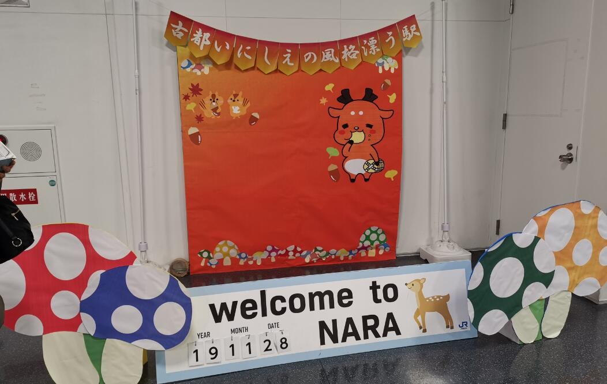
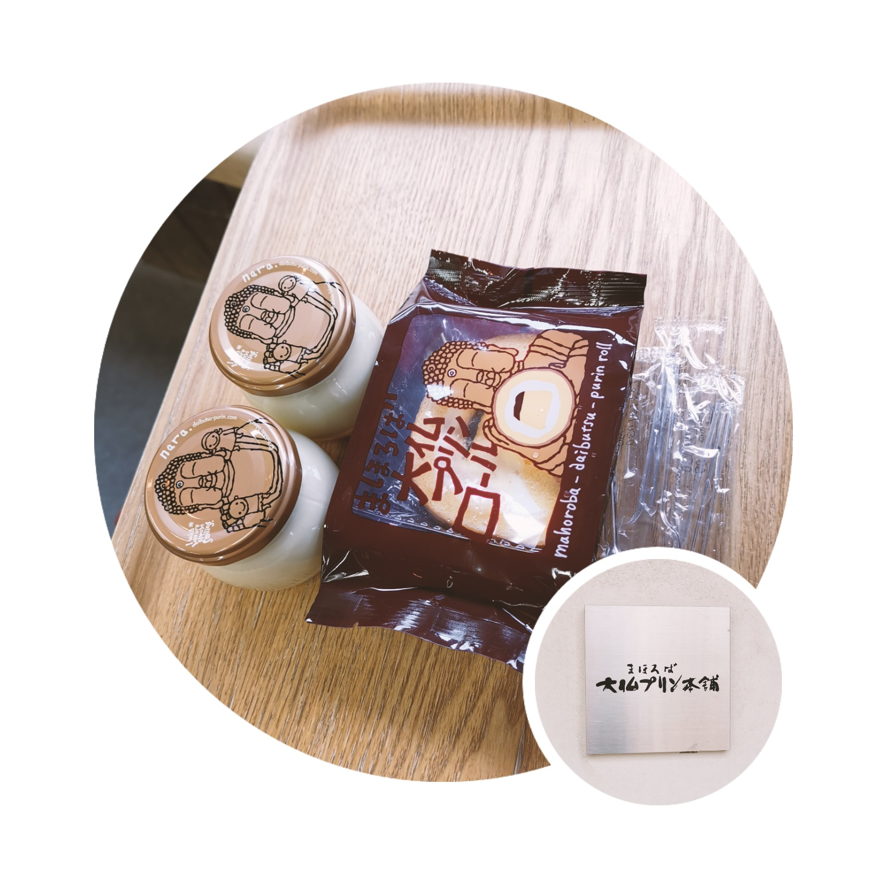
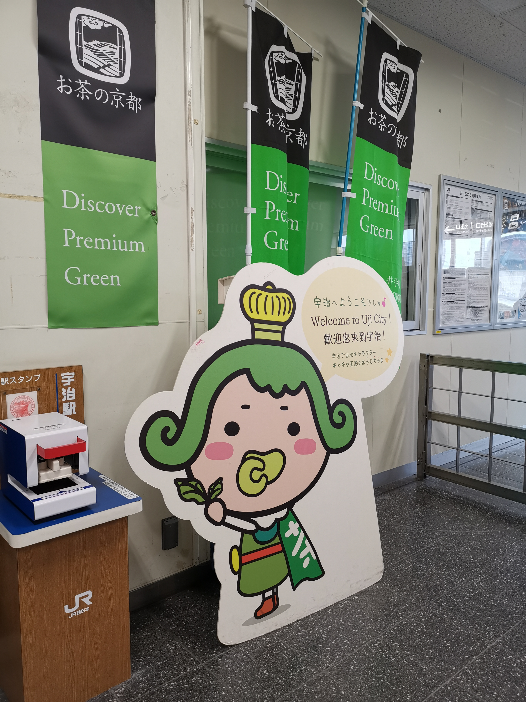
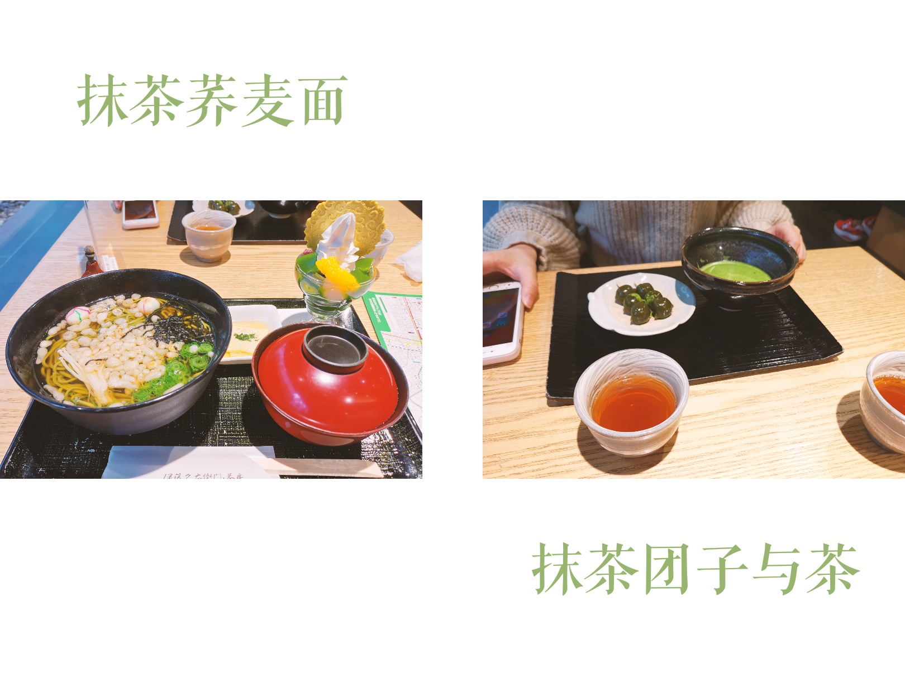
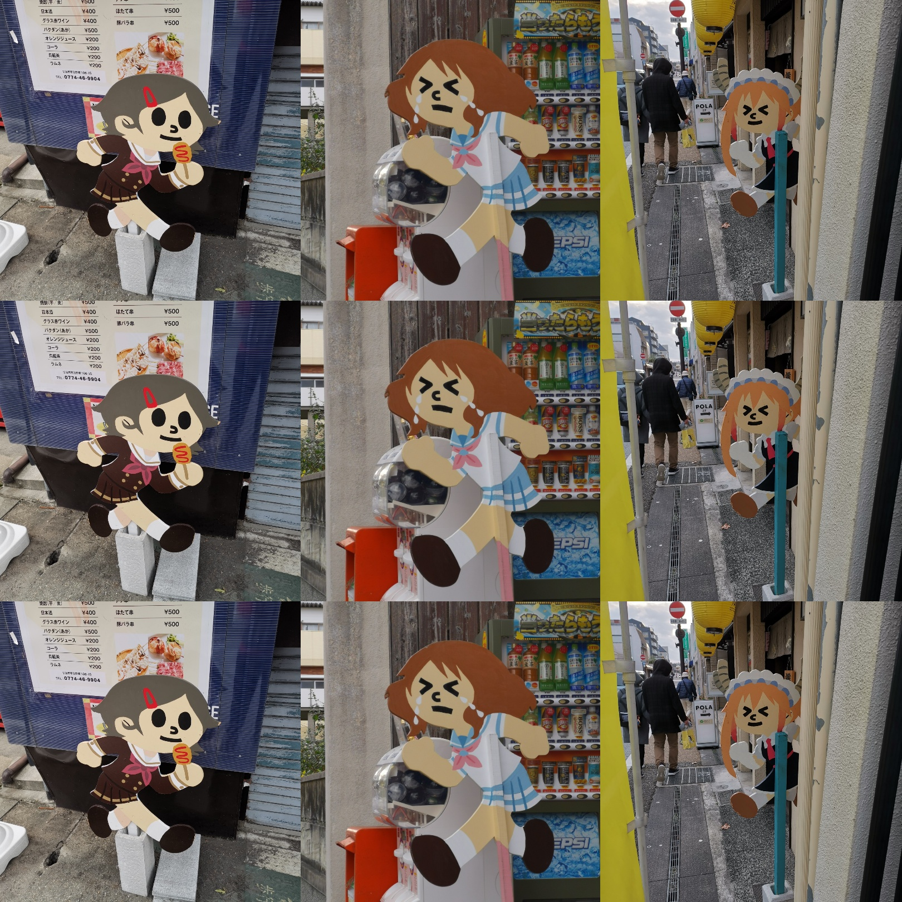
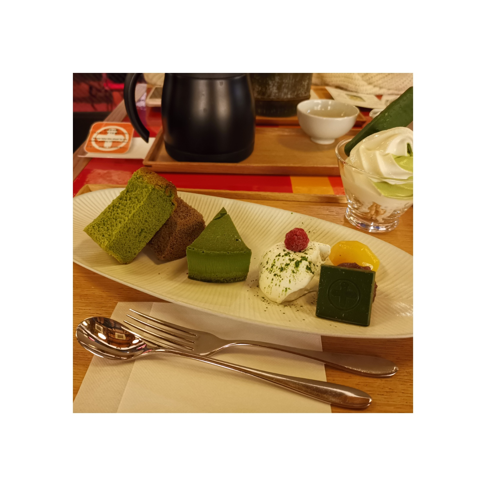
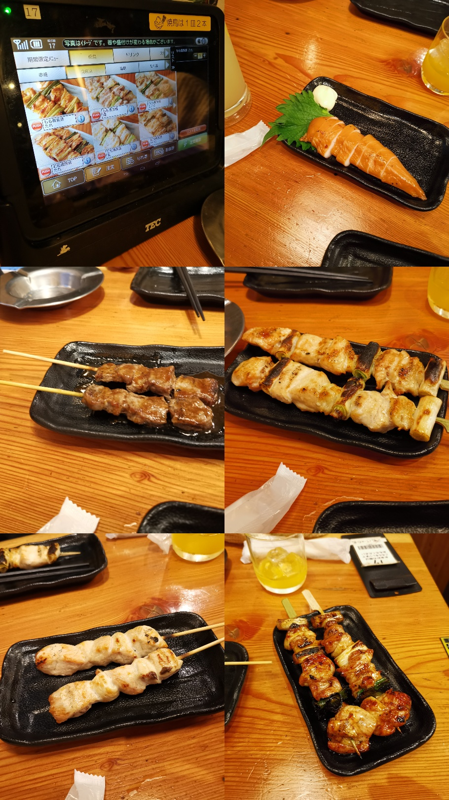
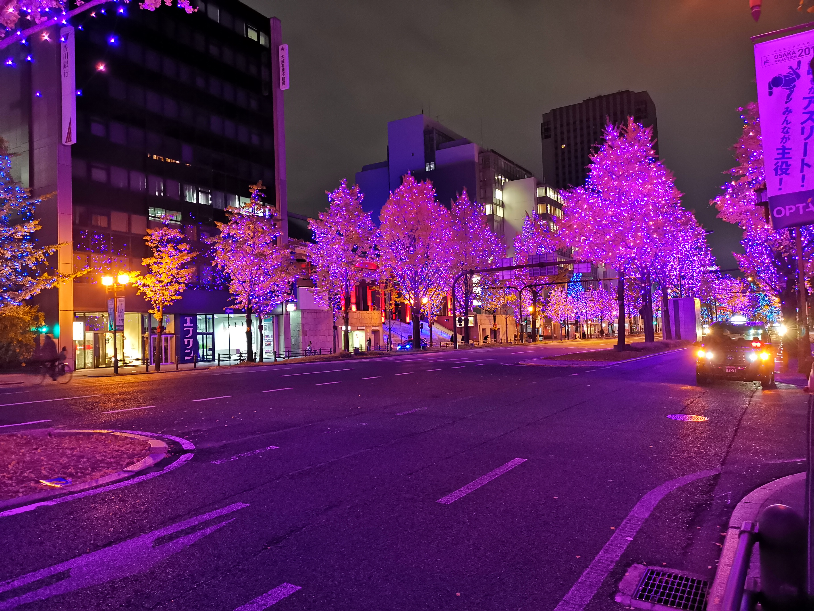

接着 Day4 是奈良+宇治

行程都很简单（可能简单到浪费，不建议抄作业 😂），直接在奈良站和宇治站周边自由行动。

## 奈良

首先是奈良 JR 下车走到奈良公园。路上的店挺丰富的，有游戏机室，然而没有时间打机啦；甚至还有一家猫头鹰咖啡店，也挺有兴趣的，但是走的时候才看到，也是没时间 😢

到公园的重头戏就肯定是喂鹿啦！由于我比较害怕动物，所以这个任务就交给领导了（

但是在我不断重复我怕被鹿咬之后领导也跟着怕了起来，站在卖鹿仙贝的档口踌躇着。

在奈良公园转一圈发现还是鬼佬（广东称白人为鬼佬 😂）好玩，去程看到前面的鬼佬一家买了几包仙贝一边走一边喂，一边拍视频一边一遍喊“我没啦我没啦（指仙贝）”，但是仍然被几只鹿追了一路，十分欢乐；回程也看到一个外国旅游团组队喂鹿，尖叫声不断 😂

出了奈良公园前往附近的观光指引区，和 🍮 布丁爱好者领导吃了**大佛布丁**，不过我觉得这个布丁真是甜得受不了。

吃完转头领导说不怕了，必须要去喂鹿，毕竟这是去奈良的目标之一。结果是，她如愿了，但是我借她穿的羽绒被鹿舔了一口 😂

## 宇治

（旁边就有盖章机~再次强调去日本一定要带小本子盖章）

如愿喂鹿之后回奈良 JR 坐到宇治 JR，整个宇治之旅都是吃～吃～吃～

出 JR 就能看到的**伊藤久右卫门**直接成为我们午餐的选择，进店是卖手信的区域，喜欢抹茶的大家可以看看。

直走就能点餐吃东西，我们点了抹茶荞麦面和抹茶团子：

有一说一，这餐体验真不太行。抹茶荞麦面感觉抹茶味比较淡，而且面很软；抹茶团子也不出彩；可能唯一就剩那杯茶可以品一品（然而我并不会喝茶 😂），如果不贵我肯定没意见，关键是这餐还真不便宜，还吃不饱...所以来一趟日本我觉得日本饮食花费的下限挺高的。**一己之见，不推荐在伊藤久右卫门吃东西**。

小小吃一餐后有能量继续前行，一路走到平等院（没进去）那边然后折返，路上见到几个有趣的牌子，不愧是京吹圣地。

原路返回后，领导执意要把**中村藤吉**也吃了，原计划是去京都动画那边看看，不过查出来刚好星期四休息，攻略没做好失策失策，既然时间多出来了，那就再吃个下午茶吧（尽管那时候已经开始天黑了）

这个拼盘就比那个抹茶荞麦面有意思多了，不过这么大量的热量吃起来很有负罪感...领导点的也是个什锦类的，外形是个竹筒，里面装着各种抹茶制品。

不知道是不是吃的东西不同的原因吧，价格差不多，中村藤吉这餐的体验比伊藤久右卫门好 🤔 吃完买点手信便回大阪了。

（各种茶）

## 鸟贵族

尽管回到大阪看着天都黑了，但是由于冬季日本 4 点就开始天黑，事实上时间还是挺早的。

我和领导分头行动，她去买她的 live 周边，而还不死心地找游戏店，从惠美须町站一直走到日本桥站，一路上看到好多（你懂的）DVD 店 😂

逛完我也被冷得有点头晕，在日本桥和领导汇合后本想回酒店直接睡觉，但是想想，今天貌似还真没吃晚餐耶（

于是就被领导带去鸟贵族了。

鸟贵族是什么呢，就是一个吃串串的地方，在这里我们吃了今天的第 4 餐：

我还点了一杯酸得眼睛都睁不开的蜂蜜柠檬汁，而领导直接上鸡尾酒（之前自己写东西的时候查了一下居酒屋吃什么，其中饮料就有 highball 这个东西，来到这发现还真的是，饮料栏巨量各式各样的 high），酒量不及领导，惭愧惭愧。

一开始不知道这家店是整个菜单都是统一定价，早知道就不点什么鸡胸肉了，鸡胸不愧是鸡胸，即使是做成串串也保留着那干柴的口感，**鸡腿万岁！**。另外就是**照烧**比盐味好吃，吃起会比较多汁，缺点就是太甜吧。

两天跨度比较大的旅行结束啦，之后都三天都只在大阪内移动了，最后吐槽一句：**穿梭大阪京都奈良的这两天经常忘记要靠左走还是靠右走** 😂

（似乎是大阪灯光节，几天晚上树上都挂着灯，看宣传说整条街都会亮起星星，不同路段颜色不同）