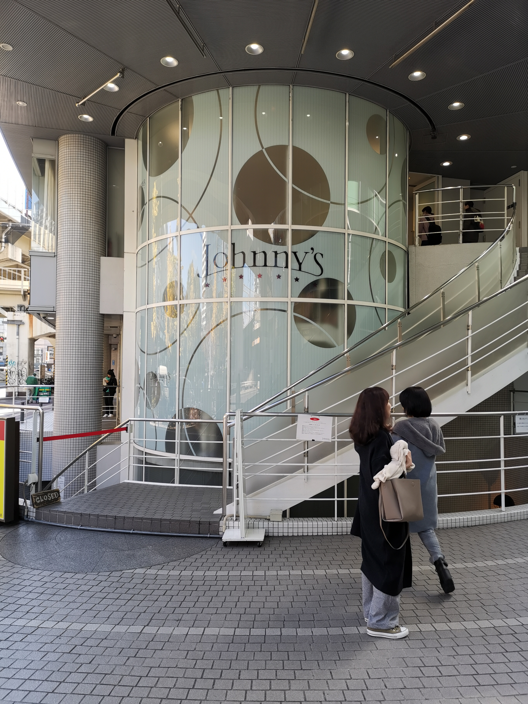
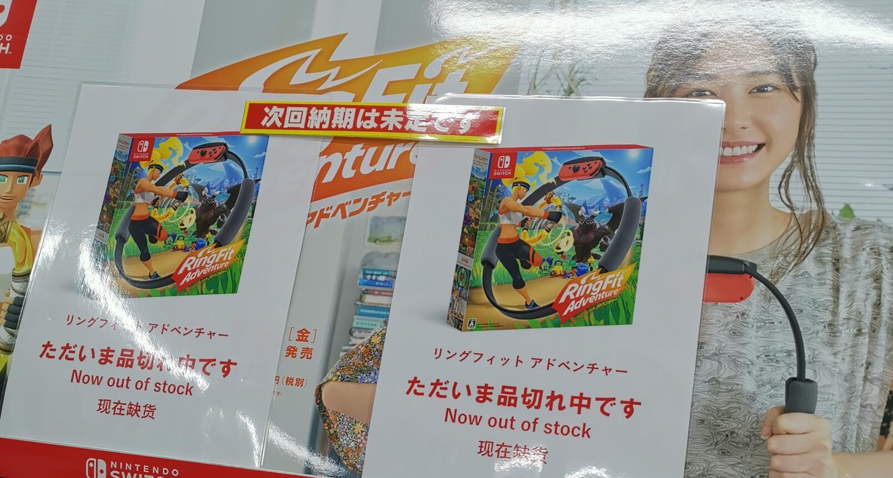
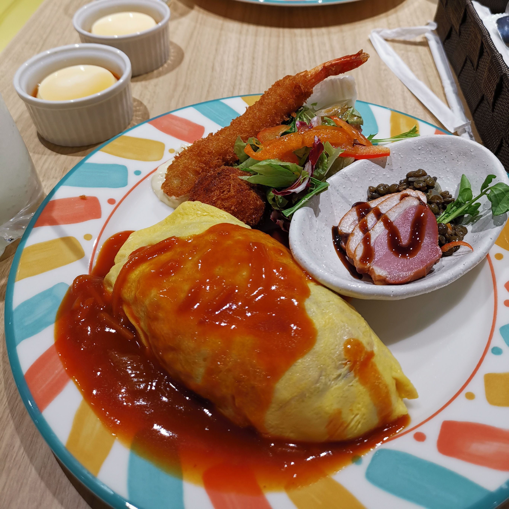
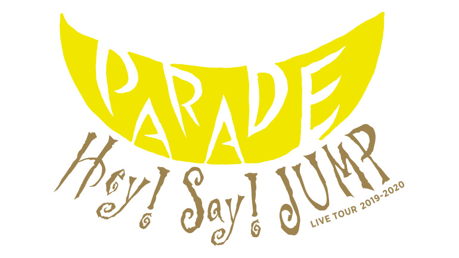
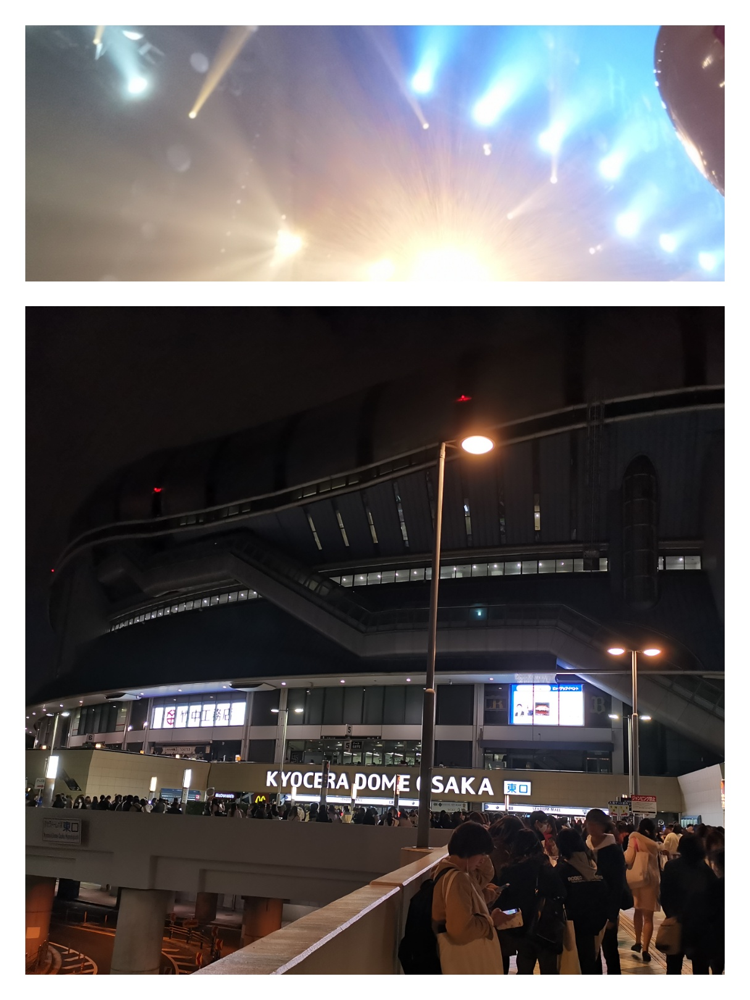
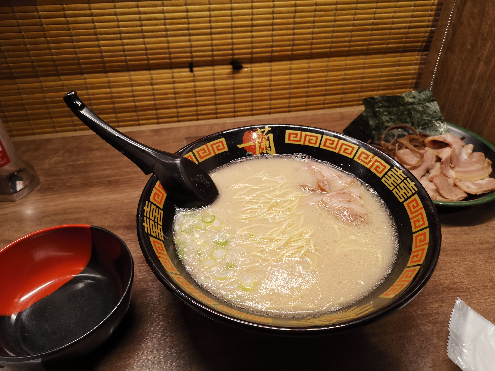
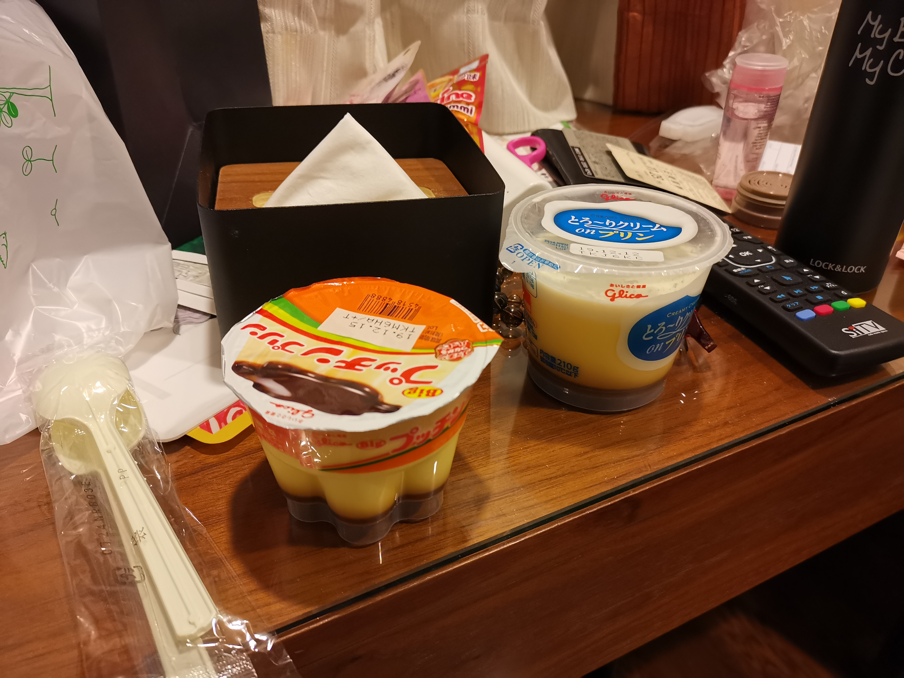

第 5 天是还算轻松的一天，最重要的任务是陪领导看 Live。由于全天大阪移动，直接购买**大阪 metro 一日票**。

趁没什么内容的一天插一些日本交通介绍吧 😏

大阪 metro 似乎是固定时间到达的（对比广州的每隔多久一班车），站内会有到达时间表。所以换乘软件都能比较精确地告诉你到达时间。

之前去京都和在神户回来的长途车都会有几个上车队列，有的队列是跳过中间站直达其他城市的，所以有必要注意一下，不过大阪 metro 到候车区后都是左右两个方向，怎么上都是同一条线。我有一次就在车门前犹豫了很久会不会坐错车然后车就走了 😂

关于[大阪 metro 的路线颜色](http://okiraku-news.net/train/osakatikatetsu/)也很有趣：例如御堂筋线的红色（深红、臙脂色）象征着大阪的动脉；谷町线紫色象征着高贵的袈裟；四つ橋线蓝色代表近海，等等。不同的路线车厢设计不同，车厢的主色调和线路颜色相似。

---

（据说领导进去之后钱包迷迷糊糊少了几万块 ← 指日元）

说回正题，早上睡到自然醒（假的），领导再去一次 jshop 把新纸片买了，接着去日本桥逛逛。

到卖游戏的那层看到预料中令人心塞的提示语：

不由得发出灵魂的拷问，到底我来日本可以买些什么...

日本桥作为大阪秋叶原，A 店虎穴骏河屋应有尽有，但是我的购买欲完全提不起来...

当我在日本桥 A 店拿起碧蓝幻想偶像皮 cd 看到横穿整家店的队伍...我又默默地放下了，感觉现在已经二不起来了 😢

当然，去到日本桥也顺道进了一下成人店，感受：不过如此（（

遗憾有一点可能是没进女仆咖啡店吧 🤔

中午吃的是蛋包饭，日本经典美食+1

吃完还能回酒店休息一下再去 Live

这场 live 用门票兑换券到现场扫码开座位，也就是可能坐到山顶，可能坐到台前，而这次我们很幸运地坐到了台前第四排。

作为一个路人觉得这场 live 是不错，舞台效果酷炫，HSJ 各位成员输出也很稳定。

但是一个佛系路人在一堆狂热粉丝中间无所适从，叫喊声震耳欲聋，而且粉丝文化也让我有点小尴尬，不是粉丝确实放不开呀...

结果最后领导没拿到饭撒没抢到彩带（是的明明在前排却抢不到，因为彩带都在我们坐的那一块两边喷出，几乎没有飘到中间的）很不开心，我也很无奈。

**所以吧，还是在这建议不是粉丝不要去演唱会 😂**。当然如果是外向，可以立即融入粉丝群体一起欢呼的话，体验会很不错哦（但我偏偏是内向佛系路人 😥）

接着离开会场前往心塞桥，晚餐是一兰拉面（中国也有店，但是我没去过所以没办法对比）：

座位是一个人一个格子的那种，社交废大欢喜（误）。说回拉面本身，我明明点了超硬的拉面为什么感觉吃起来还是有点软...这该不是偷工减料吧 😂

不过套餐里的半熟鸡蛋很美味，比酒店早餐的好吃多了。其他就是叉烧（指日式）啦木耳啦，不出彩，正常那味道，这东西要做得难吃还是比较难（

回酒店继续每天一个布丁，今天这个我感觉踩雷了，还是全家的布丁好吃，格力高你还是乖乖卖饼干啦 🐷