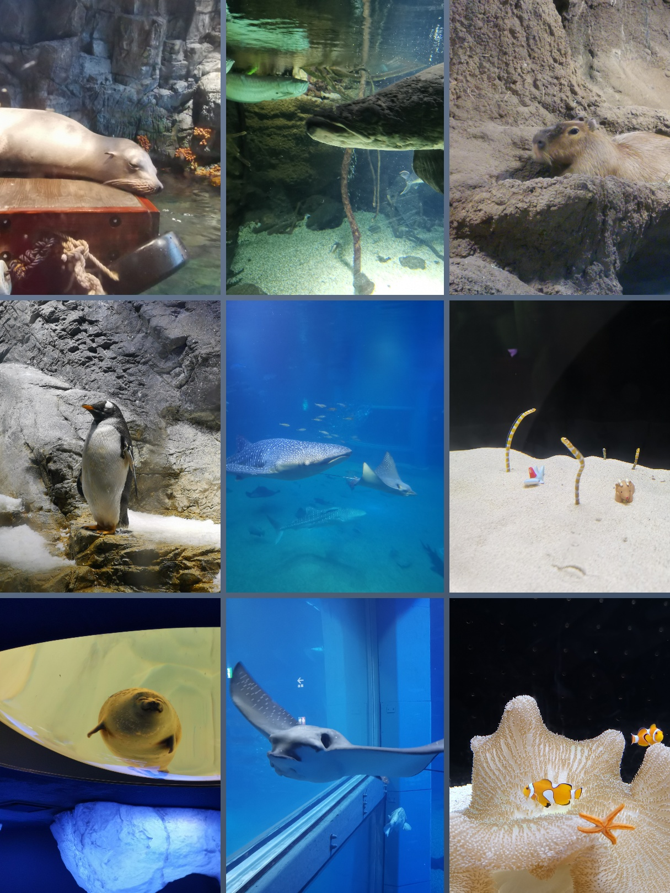
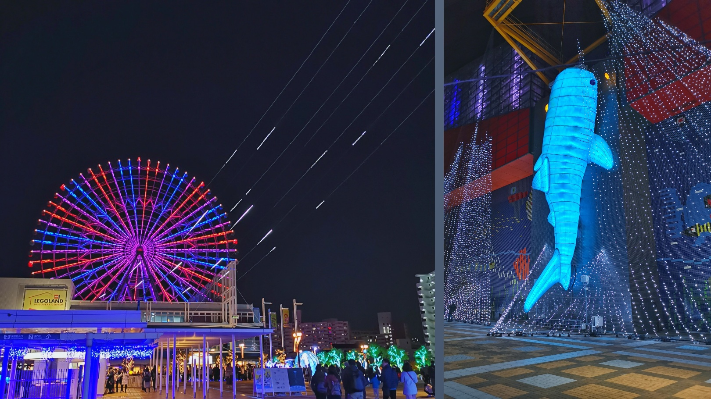

周末来了，终于有时间一气呵成地连写到第 6 天：上午逛街，下午大阪海游馆+天保山摩天轮。全天也是大阪活动，不过因为去海游馆所以买大阪海游票 2600 日元，正常海游馆票价是 2300，就等于 300 日元买了地铁一日票。

---

早上得逛街目的地是日本桥，先逛的电器店。本想在日本买个加湿器，但是做功课发现超声波雾化会增加室内 pm2.5，瞬间拔草了。

之后到死宅天堂走一趟，然而依然没有购买欲。

路上还见到很多卡店，TCG 在日本果然是蓬勃发展，卡片集换连同着博彩机制（稀有度相关）深入人心，也就是在这个环境才能孕育出现在的抽卡手游吧...

中午吃大阪烧，领导找到一家店排了半小时队，然后讪讪地告诉我，其实她想去的是隔壁那家店（她指了指隔壁店的店名），我笑出声了 hhhh

不过当时排的刚好是一家米其林推荐店，那就算了，排了这么久队没必要换店，就在这吃了。

不过吃起来还是挺失望的，为了减少每桌客人占用时间，这里会提前煎大阪烧，进去之后直接推到面前就可以开始吃了。

但是因为烫所以吃得慢，但是它还放在铁板上烧，结果吃到后面焦了...不过也不知道是真焦还是干了的照烧汁。

大概是因为我们没有研究过怎么吃吧 😂 要是**提早铲起来放到碗里**可能口感会不错。

右图左边那块的绿粉是芥末粉，也是只有芥末味不冲鼻，吃着很过瘾。所以为什么国内的寿司店都是用那种吃了飙泪的芥末呢 🤔

（在去海游馆路上看到商店橱窗的可爱猫猫）

（海游馆本体，但是入口其实在右边）

（喂海豚的姐姐真好看 😊）

大概走到路程的一半会有一个**小餐厅**，领导不会放弃任何吃甜品的机会，进去买了个雪糕。雪糕蓝色的部分味道酸酸的有点像某种汽水的味道，白色是正常雪糕的口味（

（这个时候餐厅的窗口外正是大阪港的夕阳）

（水母馆的剪影）

走完大概两个小时，我们是慢慢看的那种。果然到外面天全黑了，海风吹来好冷。

溜进隔壁商场吃了个刺身饭，两个普通的饭，就是把生鱼片铺到上面而已。去那家店的原因是领导觉得去日本没吃刺身像少了什么，确实。

从坐下到快吃完，那家小店都没有其他客人，就在我们快走的时候才进来了一个人...好吧，其实整个商场都听空荡的。

那天是星期六，一个景点隔壁居然能这么冷清，实在有点费解，同时像当了一回没落景点的见证者。

下一目标天保山摩天轮就在隔壁，摩天轮入场券 800 日元，有海游票可以减 100。正如下面商场没有人，摩天轮也没人排队。不过因为这个摩天轮分透明箱和普通箱两种，因为透明的隔几个普通才有一个，所以选择透明箱需要排队。我们对透不透明没要求，就直接进普通箱了。

上摩天轮前还给你拍个照，反正就是要钱买的那种，国内景点也很常见，意外的是下摩天轮的时候居然直接打印了丢出来 😂，正常不是要才打印的吗，不要打印出来浪费干嘛哦。

回到本町领导还要去便利店当代购顺便买关东煮，逛了好多家便利店，又累又冷（

这时我们在一家罗森出来，刚打开门就听到机车引擎的声音，源源不断，眼前暴走族一排一排经过。共鸣的引擎声和摩托车尾气的气味交融在一起，啊，原来我们见到了真正的**暴走族**，去这趟便利店真不亏啊，长见识了 🤔

就这样，6 天行程就结束了，因为第 7 天就是去机场而已，所以等于这次关西之旅到这里也结束了。在那个 moment，肯定是会有不舍和失落，尤其是在群里看到繁重的工作，汲取了这次经验**下次去旅游一定要屏蔽工作群**才行...

虽然是流水账，居然写了 6 天，因为工作日实在太忙了，晚上时间不多，终于等到今天周六一天补完。

最后，如果有人看完了我的流水账，谢谢你 🤣

