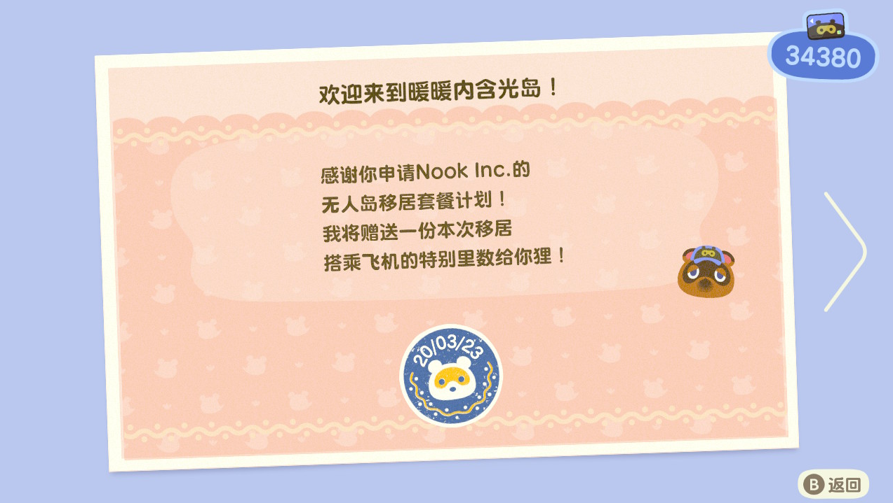

自从 NS 动森发售，这个游戏都高频出现在身边各种群，直到现在各种系列新玩家蜂拥登岛，甚至微博上各种官方号都发布动森相关内容，毫无疑问这个游戏可以算是现象级游戏了。

而我就是众多动森系列新玩家之一，旧作完全没有接触过，买的原因自然是身边玩的人多，而且风评不错。

于是在 20 年 3 月 23 日，在多灾多难的 2020 年，我逃到了一个无人岛上。

然后我终于认识到了大家口中的奸商，虽然不告诉我登岛要钱完事才追债，虽然一些跟我没关系的事情莫名其妙要我给钱，但其实这三只狸猫还挺可爱的，至少，他不会收利息【狗头】。其他小动物虽然有的确实不好看，但肯定很可爱，所以后来知道初始动物可以刷初始我也没去刷，嗯，都是命运的选择。

玩了两个星期，暂时不会觉得无聊，晚上抓狼蛛不亦乐乎。甚至真正要玩的内容还没开始，各种基建都还没完成。这个游戏只要呆在岛上就会觉得很治愈，花丛散步、钓鱼、看日出日落、看流星许愿，现实世界时间同步这个设定让我觉得自己多了一个世界。

最近各种游戏媒体都有谈过动森氪金的问题。如何在一个没有氪金内容的游戏里氪金呢？万能淘宝，就跟当年宝可梦一样。

对于**正常的氪金**我不持反对意见，这不过是以物换物的升级版，用人民币买一些必要素材、里程券或者很难得到的道具。有人认为：你就不应该在这个游戏氪金，这游戏不是这么玩的。别人怎么玩，有别人的想法，只要那不是错的，别人都管不了。

虽然我本人没有去氪金，但是作为一个程序员，我最讨厌的就是重复劳动，程序员常常会说 `Don't Repeat Yourself`（DRY），也正因为他们这么想，现在才会有这么完善的各种实用类库。

伐木、采石、除草这些就是最低能的重复劳动，不过任天堂将他们包装得比较有趣，但是本质还是重复劳动。

也会有人说享受过程，这些伐木除草都是可以享受的，这我也同意，但不是所有人都这么享受除草的过程——他们更享受的大概是构建自己的岛屿、自己的小小世界以及画好看的衣服，在无人岛上当一回专业设计师。

上面是我对**正常的氪金**的看法，看似不反对氪金，但是我反对淘宝氪金，因为实际上基本不存在上面说的氪金。那么问题是什么？

问题是这些用以出售物品是怎么来的？是通过**非正常途径获得的**，也就是修改存档，金手指。

假如伐木一星期，库存几百组木头，拿去交换其他物品，没问题，有劳动有所得，甚至有人用真是的钱跟你换木头，也没问题。任天堂大概没有禁止这种事吧（

但是**修改存档并出售修改内容**就是一种很恶劣的行为，这完全是一种破坏游戏平衡的行为，这种行为完全破坏了时间的平衡。

这类比到现实就像黑卡充值，卖家买代充不给钱，不止如此，他还要你给钱把东西卖给你。怎么能凭空拿到东西呢？你说程序员付出了他的黑客知识所以能赚到钱？屁，不是什么钱都可以赚的，程序员也不是这么当的。

因此，我 99% 认为淘宝氪金是彻底的错误行为。（剩下的 1% 是怕真的有人自己伐木在淘宝卖）

不过，虽然被这么些人破坏游戏平衡，但是我相信一个热爱游戏的人是不会做这种事的，不管他们怎么玩，这毕竟不是网游，静下心来吧，每天的积累总会让你建起你独一无二的梦幻岛【没有约定，没有约定，狗头】，回过头来你会觉得这一切都是自己一砖一木搭出来，好像过了很久，但是登岛那天恍如昨日。

相反，别人也不要我觉得，他要他觉得，他就是有钱就是要买，不在乎货物什么来历。算了，买的人再买多点，我祝他早点买完然后删游戏。