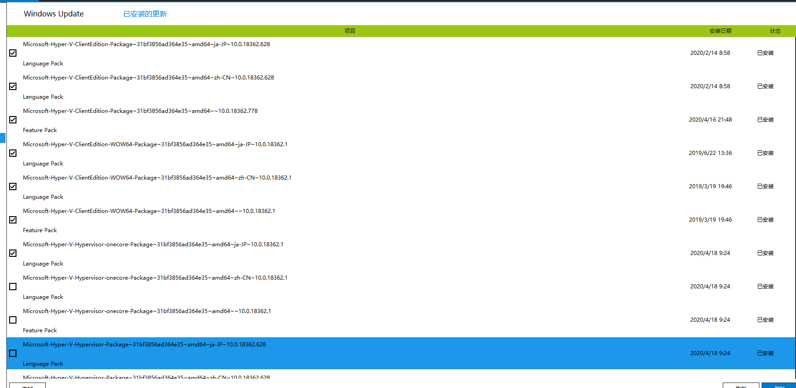

今天我本来只是想把本网站的评论系统 docker 化，结果引出一个大问题（主题就是标题的内容了），从头开始讲讲吧...

本网站的评论系统（使用 eggjs）一直很不稳定，服务开启之后会无端关闭，导致经常一两天要重启一次，非常影响使用。本来以为是免费数据库的问题，但是我现在也有一台小小的虚拟机了，总有办法解决的，所以直到昨晚，终于下定决心了结这个问题。

开始，首先要查出为什么会莫名关闭，翻看日志后发现了一些关键字：`receive signal SIGTERM, closing and exit process`

好消息是已经有人提过 [issue](https://github.com/eggjs/egg/issues/3885) 了。看完虽然原因没有找到，但是提供了一个解决问题的方向：容器化。正好 docker 一知半解缺乏实践，该借此机会修炼一下。

我曾在[这里](/2020-02-02-docker-tutorial/)表态，除非装不了（打脸），否则还是别在 docker hub 构建镜像吧，因为实在太慢了，特别是我还不是十分熟悉 docker，中间还可能需要一边改配置一边测试能不能用。

linux 和 macOS 的 docker 我都用过，但是 Windows...很久之前装过一次，后来删了，那就先在官网装一个吧。

...好吧，装上了一打开，告诉我电脑里没 hyper-V 呀，用不了 docker 哦。我顿时无语，因为之前想用虚拟机的时候见过这东西，但是因为 windows 版本问题我的系统是没有预装 hyper-V 的。不过倒是不慌，这种问题百度应该早有答案，我也没猜错：

```
pushd "%~dp0"

dir /b %SystemRoot%\servicing\Packages\*Hyper-V*.mum >hyper-v.txt

for /f %%i in ('findstr /i . hyper-v.txt 2^>nul') do dism /online /norestart /add-package:"%SystemRoot%\servicing\Packages\%%i"

del hyper-v.txt

Dism /online /enable-feature /featurename:Microsoft-Hyper-V-All /LimitAccess /ALL
```

上面这段命令**十分顺利**（这是比较意外的，因为这个方案是在 csdn 看到的，顺便黑一波 🤣）地给我装上了 hyper-V，然后重启，顺利打开 docker 一气呵成。

```Dockerfile
FROM node:12.16.2-alpine

RUN apk --update add tzdata \
    && cp /usr/share/zoneinfo/Asia/Shanghai /etc/localtime \
    && echo "Asia/Shanghai" > /etc/timezone \
    && apk del tzdata

RUN mkdir -p /usr/src/app

WORKDIR /usr/src/app

COPY package.json /usr/src/app/package.json

RUN npm i --registry=https://registry.npm.taobao.org

COPY . /usr/src/app

EXPOSE 7001

CMD npm start
```

作为一个比较成熟（大概）的 node.js 后端框架，egg.js 没有自带一个 Dockerfile 感觉有点奇怪。不过配置确实也很简单，只是傻傻的我在运行容器的时候没有暴露端口无法访问，浪费了一些时间。

我看着 EXPOSE 把这个参数和 compose 搞混了，写成了 EXPOSE 7001:7001😂，后来才记起是在创建容器的时候暴露 `docker run -p 7001:7001`

至此**容器化成功啦**！难度 1 星，过程还算顺利。这下评论系统应该不会突然被 kill 了吧！这就要待时间验证了！

然而故事还没有结束。

完事了我想打开安卓模拟器继续玩至潮至 in、大 B 站代理、大 cy 出品的公主链接，奇怪的事情发生了。

雷电模拟器打不开，提示我 vt 没开启或者是磁盘错误，我就奇了怪了，刚才都没问题，可能是安装 hyper-V 重启的时候没有正确关闭模拟器导致磁盘有问题？这么想着我去重装了一次模拟器，结果发现还是不行，这时候我意识到哪里不对了。

我接着打开夜神模拟器，直接给我蓝屏重启...这就很暴力了，不过也基本确定了，docker 或者 hyper-V 其一影响了安卓模拟器运行。重启之后我再抱着顺便的心态把蓝叠也开一遍，啊，蓝叠是真的很不错，直接让我**关闭 hyper-V 再启动模拟器**，不愧是安卓游戏模拟器的先驱。

好了，这就是**最麻烦的一步**。百度如何关闭 hyper-V：有说运行命令的、有说在控制面板-程序里删除的、有说改注册表的、有说在服务中禁用的...上面每试一次重启一次，结果都是不行的...


尤其是这个服务，我明明全都禁用了它却能莫名其妙地运行了起来。

在最后绝望的时候我打算从安装方法入手看看解决方案，关键肯定是 `Dism` 这个东西了。但是 windows 的短处就体现出来，很少人会使用 windows 命令，讲解这个东西的资源更是少，还好直接找到了一个叫 Dism++ 的工具，在模糊中摸索中，在更新一栏发现了大量 hyper-V 相关包，一顿操作全都删掉了，然后心里没底地重启一下。



打开蓝叠...终于顺利启动了，其他模拟器当然也恢复了正常，唯一问题是，刚才重装雷电里面的东西都没了 😥

今天这事的结论：

- 创建容器暴露端口的方法别忘了，这次 docker 化还是有收获的，之前都是偏向于看文档和直接复制别人的 compose，今天算走了一遍流程
- windows 用户如果想用模拟器玩手游的同时使用 docker 恐怕没这么简单了（我已经把 windows 的 docker 删了，这事还是在虚拟机里折腾吧）
- 以及，**windows 虽然好用，但是出起事来就比 linux 麻烦多了**
