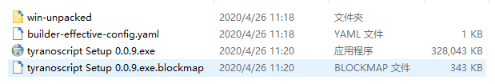
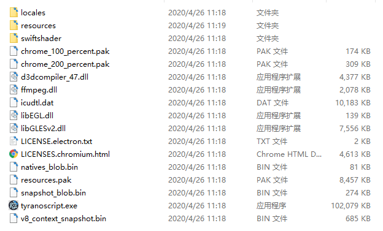

之前有说过官方启动器 tyranorider，从这里打开游戏本质上是使用 NW.js 打开 index.html。

TyranoScript 这个框架其实是很耿直的，这个框架**基本上**没有依赖启动器的功能（有极少量使用到 NW.js 的 API），全部功能基本都包含在 js 文件里，这意味着你是可以摆脱官方启动器的，事实上这个工程可以在任意基于现代浏览器内核的程序上运行（即使直接用 chrome 浏览器也是可以打开的，但是 chrome 会限制对本地文件的 ajax 请求，所以此处要做配置）。

不过有一个问题，tyranorider 启动器的 NW.js 版本是很低的，这代表内置的开发者工具也比较老旧，跟现在的 chrome 开发者工具的功能差距比较大。

那么我们可以替换这个启动器吗？

当然可以，我这里用的是现在比较靠谱的 [Electron](https://www.electronjs.org/#get-started)。我不选新版 NW.js 而选 Electron 的原因十分肤浅，单纯因为 star 更多，官网更好看😂

Electron 和 NW.js 一样，基本就等于一个浏览器，不过他会给你一些 API 让你实现正常浏览器不能做，但原生程序又比较常用的功能。然后把你的 html 文件塞进去打包，就成了一个桌面应用。

不过 Electron 和正常浏览器区别较大的是开发者要有意识区分主进程和渲染进程。更高阶的用法还有主进程和渲染器之间的交流。可以在[这里](https://www.Electronjs.org/docs/tutorial/application-architecture#main-and-renderer-processes)了解 Electron 的应用架构。

Electron 应用的构建方法这里搬运一下[官网的教程](https://www.electronjs.org/docs/tutorial/first-app#electron-development-in-a-nutshell)

首先从 npm 安装依赖：

```
npm i -D electron
```

需要注意的是 TyranoScript 的配置和 Electron 是冲突的，所以需要先**备份**原来的 `package.json` 再做修改，如果要用回官方启动器的话需要恢复原来的 `package.json`。

配置 `main` 属性和 `start` 命令：

```json
{
  "name": "your-app",
  "version": "0.1.0",
  "main": "main.js",
  "scripts": {
    "start": "electron ."
  }
}
```

环境都准备好了，接着就是编写 main.js 文件：

```javascript
const { app, BrowserWindow } = require('electron')

function createWindow() {
  // 创建浏览器窗口
  let win = new BrowserWindow({
    width: 800,
    height: 600,
    webPreferences: {
      nodeIntegration: true,
    },
  })

  // 加载index.html文件
  win.loadFile('index.html')
  // 打开开发者工具
  win.webContents.openDevTools()
}

app.whenReady().then(createWindow)
```

`win.loadFile` 指定 TyranoScript 项目里的 index.html 即可，现在运行 npm start 应该就能正常打开你的游戏。更重要的是你的开发者工具基本是最新的状态，调试效率大提升！而且你现在也可以在 TyranoScript 里使用 ES6 了！

最后说说打包的问题，假如你使用了新语法或者 Electron API，那么用回 tyranorider 打开或打包都是会出问题的。为了解决这个问题我使用 [electron-builder](https://www.electron.build/) 打包。

使用方法也不难，安装依赖，然后扩展 scripts 配置就能使用：

```
npm i -D electron-builder
```

```json
"scripts": {
  "start": "electron .",
  "pack": "electron-builder --dir",
  "dist": "electron-builder"
}
```

`npm run pack` 和 `npm run dist` 的区别是，pack 是只打包到 dist 文件夹，更适合测试，dist 会直接给你打包成各个系统的安装包。

不过**直接这么打包的话会报错**，因为代码里面用 require 的方式引用了 fs-extra 和 jquery 两个库，所以需要再下载这两个依赖再打包（感觉这里是一个可以优化的地方），还是推荐先用 pack 打包完看看有没有报错，再使用 dist。



如上所示 dist 的打包结果是一个 exe 文件，双击可安装到电脑；而 pack 的打包结果是 win-unpacked 文件夹，里面包含以下内容：



打包的资源包含在 resources 文件夹，默认设置下 electron-builder 会把所有资源打包成一个 app.asar 文件。

更换启动器和打包相关问题就到这啦，其他配置问题都可以在官网找到答案，一般来说不会太坑~

下期见！