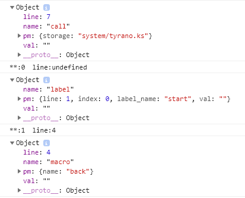

这算是真正魔改内核的第一次讲解。

## 前置知识

TyranoScript 是一种领域专用语言，但是运行在浏览器，功能肯定还是 JavaScript 实现的。要把脚本运行起来需要先把脚本“分词”，然后按规则把词组合成一组。（这个功能的代码在 `kag.parser.js` 文件里）

完事之后得到的就是默认在控制台打印的信息：



在读取这样的对象之后，框架就会根据不同的 tag 运行不同的函数，而这些函数分布在内核文件夹的 `kag.tag` 开头的文件里。

## 添加一个命令

在 `tyrano.plugin.kag.tag` 对象里的属性全都是上面说的对应的运行函数，例如 `[perform_show]` 这个指令，会运行 `tyrano.plugin.kag.tag.perform_show` 的 start 函数：

```javascript
tyrano.plugin.kag.tag.perform_show = {
  pm: {
    name: '', // 同时显示多个相同表情时作区分
    storage: '',
    width: '',
    height: '',
    left: '',
    top: '',
  },
  start: function(pm) {
    var perform = document.querySelector('#perform' + pm.name)
    if (!perform) {
      perform = document.createElement('div')
      perform.setAttribute('id', 'perform' + pm.name)
      perform.setAttribute('class', 'perform')

      document.querySelector('#tyrano_base').appendChild(perform)
      new spine.SpinePlayer('perform' + pm.name, {
        jsonUrl: 'data/fgimage/default/perform/' + pm.storage + '.json',
        atlasUrl: 'data/fgimage/default/perform/' + pm.storage + '.atlas',
        animation: pm.storage,
        showControls: false,
        premultipliedAlpha: true,
        backgroundColor: '#00000000',
        alpha: true,
      })
    }
    perform.setAttribute(
      'style',
      'width: ' +
        pm.width +
        'px;height: ' +
        pm.height +
        'px;position: absolute;left: ' +
        pm.left +
        'px;top: ' +
        pm.top +
        'px;'
    )

    this.kag.ftag.nextOrder()
  },
}
```

`this.kag.ftag.nextOrder()` 是必须要的，这是提示程序跑下一句命令的函数。

根据这个运行的原理，只要在`tyrano.plugin.kag.tag`对象里加属性就能新增自定义命令了（上面的 perform_show 就是新增的）

[perform_show name="fx" storage="fx" height="100" width="100" top="500" left="500" ]

这是一个使用示例，命令中的 name storage 等属性都会传到 pm 这个参数里。

顺便说一下例子添加的功能是为 Tyrano 集成 Spine，我们可以在 Spine 官网找到官方的 JavaScript 运行时库，但是不太友好的是这些库似乎没有文档...

http://esotericsoftware.com/spine-runtimes

https://github.com/EsotericSoftware/spine-runtimes/tree/3.8/spine-ts

## 竟然有恰饭时间？！

https://store.steampowered.com/app/1224840/_/

虚忆定格的制作已经过半啦，了解一下吗？😘
