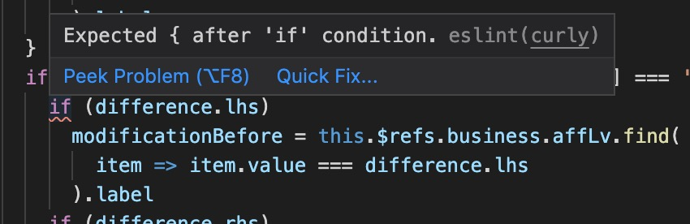

- ESLint 和 Prettier 分别是什么，有什么关系？
- 直接用脚手架生成一个带 ESLint 的项目，整天报错有没有很懵逼？
- 这些东西到底怎么配置？

读完就能解决这些疑问啦！

## ESLint

先说是什么：[ESLint](https://ESLint.org/) 是一个检查代码质量与风格的工具，配置一套[规则](https://ESLint.org/docs/rules/)，他就能检查出你代码中不符合规则的地方，部分问题支持自动修复。

使用这么一套规则有什么用呢？如果单人开发的话倒是没什么了，但是一个团队若是存在两种风格，那格式化之后处理代码冲突就真的要命了，统一的代码风格真的很重要！

（其实以前自己做一个项目的时候，公司电脑和家庭电脑的代码风格配置不一样，在家加班的时候也经常顺手格式化了，这么循环了几次不同的风格，导致 diff 极其混乱 😂）

### 如何配置

用脚手架生产的配置可能会在 package.json 里面，个人建议拆成单独的 `.eslintrc.json` 文件，另外也可以使用 js 文件 export 或者 yaml 格式。

默认 ESLint 不会有任何规则，不过你可以直接用 `"eslint:recommended"` 套用一些常用规则（包括上面 rules 页面打了勾的选项）。

我之前用 vue cli 创建的工程规则是 `"@vue/standard"`：

```json
{
  "root": true,
  "env": {
    "node": true
  },
  "extends": ["plugin:vue/essential", "@vue/standard"],
  "rules": {
    "semi": ["error", "never"],
    "quotes": ["error", "single"],
    "comma-dangle": ["error", "only-multiline"],
    "space-before-function-paren": ["error", "never"]
  },
  "parserOptions": {
    "parser": "babel-eslint"
  }
}
```

`rules` 部分是我按平时的风格自己加的，`rules` 中的定义会覆盖 `extends` 里配置组合中的设定。对于那些使用脚手架搭建的项目，遇到不符合团队或自己代码风格的地方可以另外在 `rules` 里配置。

### 实用提示



在 vscode 安装 ESLint 插件之后，鼠标悬停于错误语句，就会看到错误原因，点击链接可以直达该设定的详情页面，页面内包括：

- 对该风格的描述
- 错误与正确的使用事例
- 配置可选项

通过这些信息可以快速调整 `rules` 中的配置。

顺带一提，实例中多用数组举例，其实简单的开关配置用数字即可：

```
"off" or 0 - turn the rule off
"warn" or 1 - turn the rule on as a warning (doesn't affect exit code)
"error" or 2 - turn the rule on as an error (exit code is 1 when triggered)
```

另一个问题是 ESLint 格式化很麻烦，怎么办？

早就有人提出为什么右键格式化里面不能选 ESLint 这个[issue](https://github.com/microsoft/vscode-ESLint/issues/417)，里面有很多可选方案，我比较喜欢下面这种：

修改 `keybindings.json` 文件，绑定一个快捷键到 `eslint.executeAutofix` 即可，再也看不到那些恼人的 error 啦！

## Prettier

因为估计大部分人都不会编程式地使用 Prettier，所以下面讲的都是 vscode 的 Prettier 插件。

[Prettier](https://prettier.io/) 专注于代码排版，但不会关心你的代码质量。

说到这里，既然 ESLint 已经包含了排版相关的校验，为什么还需要 Prettier 呢？

我想到这么三个原因：一是 ESLint 安装和配置比较麻烦，而且 lint 的速度并不快；二是使用 Prettier 并不只针对 JavaScript，也就是安装 Prettier 插件，就可以格式化各种流行语言；三是配置没那么眼花缭乱。

毕竟是只管代码格式，Prettier 的选项本来就比 ESLint 少多了，而且即使只在样式上，prettier 也不倾向于乱加选项，这一点还专门在[选项的哲学](https://prettier.io/docs/en/option-philosophy.html)里说明了 Prettier 选项精简的原因。

说回配置方式，Prettier 与 ESLint 同样可用 js、json、yaml 格式，下面举例依然使用惯用的 json。

https://prettier.io/docs/en/options.html

最常用的配置也就这四项：tab 宽度、尾逗号、是否使用分号和是否使用单引号：

```json
{
  "tabWidth": 2,
  "trailingComma": "es5", // comma-dangle
  "semi": false, // semi
  "singleQuote": true // quotes
}
```

除了缩进没有管之外，另外三个选项对应的 ESLint 选项已经写在注释里。Prettier 格式化的结果和 ESLint 冲突是常有的问题，[官网 Integrating with Linters 部分](https://prettier.io/docs/en/integrating-with-linters.html)也有提供了让 Prettier 继承 ESLint 配置的方法，需要另外安装依赖。不过我看实在不必，按我的实际风格习惯自己配一下也就几分钟的事情。

关于这两个工具就先写到这了，希望大家能正确区分这两个工具啦～

## 时代的眼泪

—— 下面一些不知道有没有用的信息，可以选择不看 ——

下面两个片段都是 vscode 的 `settings.json` 文件

```json
{
  "vetur.format.defaultFormatterOptions": {
    "prettier": {
      "semi": false,
      "trailingComma": "es5",
      "singleQuote": true
    }
  }
}
```

很久以前依稀记得 vetur 需要像上面的配置一样嵌套在 vetur 里，但是现在的环境下这个配置倒是失效了，估计是终于明白在 vetur 里面还要配置一套 Prettier 实在是无用功吧。

```json
{
  "prettier.semi": true,
  "prettier.trailingComma": "es5",
  "prettier.singleQuote": true
}
```

又或者像上面的配置一样配置整个 vscode 的风格，实测在现在也是不能用的，官网现在也没有提到这种配置方法。

上面两个配置不是本文主要内容，只是突然想起来好像有这回事。而现在，可能已经成为时代眼泪吧，还记得当年用 vetur 不知道要在里面套 prettier 属性，还折腾了一些时间呢。

关于上面两点这只是猜测未考究其真实性。
