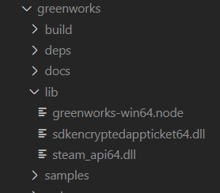

TyranoScript 接入 Steam 是怎么回事呢？TyranoScript 相信大家都很熟悉，但是 TyranoScript 接入 Steam 是怎么回事呢，下面就让小编带大家一起了解吧。TyranoScript 接入 Steam，其实就是用 greenworks 接入，大家可能会很惊讶 TyranoScript 怎么会接入 Steam 呢？但事实就是这样，小编也感到非常惊讶。这就是关于 TyranoScript 接入 Steam 的事情了，大家有什么想法呢，欢迎在评论区告诉小编一起讨论哦！

手 动 狗 头

现在做游戏嘛，最好的销售渠道大概就是 Steam 了，然而官方并没有 JavaScript 的 sdk...那用 Tyrano 做游戏想接入 Steam 成就就真的很成问题了。

一开始想着天呐，这底层的东西怎么接呢，难道真的要去研究 node 和 c++ 对接了？顿时无从入手。后来发现了 greenworks，实在感谢大佬们能让我们站在他们的肩膀上，借助 greenworks 可以让 NW.js 和 Electron 等套壳网页游戏接入 Steamworks。

下面讲一下如何使用 [greenworks](https://github.com/greenheartgames/greenworks/blob/master/docs/build-instructions-electron.md) 给 TyranoScript 极限逃课地接入 Steamworks。

说好的逃课，所以用最简单的方法接上，也就是，不 build 了，直接用现成的东西。并且下面的例子使用 64 位 windows 系统和 Electron 套壳（想了解怎么把原来的 NW.js 换成 Electron 可以看[这里](https://ssshooter.com/2020-04-25-tyrano-tutorial-3)）。

1. 拉取 greenworks 代码

```
npm install --save --ignore-scripts git+https://github.com/greenheartgames/greenworks.git
```

2. 在[这里](https://greenworks-prebuilds.armaldio.xyz/)选择合适的（注意系统和 Electron 版本）已经 build 好的 \*.node 文件，下载后解压准备使用里面的文件

3. 把 `lib/greenworks-win64.node` 放到 `node_modules/greenworks/lib`

4. 在[这里](https://partner.steamgames.com/downloads/list)下载 Steamworks SDK（我用的是 v1.41），下载后解压准备使用里面的文件

5. 把 `redistributable_bin/win64/steam_api64.dll` 放到 `node_modules/greenworks/lib`

6. 把 `public/steam/lib/win64/sdkencryptedappticket64.dll` 放到 `node_modules/greenworks/lib`

也就是这样



上面步骤完成后我遇到过版本错误的问题，不过很友好地，报错会直接告诉你当前版本，直接更换 \*.node 文件就接通啦！手残都能学会！真实逃课！

至于使用，便还是之前那一套方法：

```javascript
var greenworks = require('greenworks')
tyrano.plugin.kag.tag.greenworks_init = {
  start: function() {
    greenworks.init()
    this.kag.ftag.nextOrder()
  },
}
tyrano.plugin.kag.tag.activate_achievement = {
  pm: {
    name: '',
  },
  start: function(pm) {
    greenworks.activateAchievement(
      pm.name,
      function() {
        console.log('Activating achievement successfully')
      },
      function(err) {
        console.log(err)
      }
    )
    this.kag.ftag.nextOrder()
  },
}
```

标签加好，用就完事！
