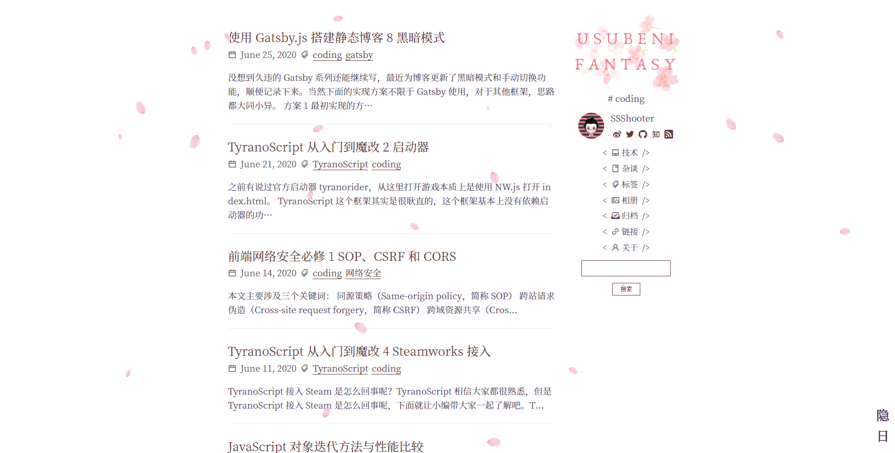
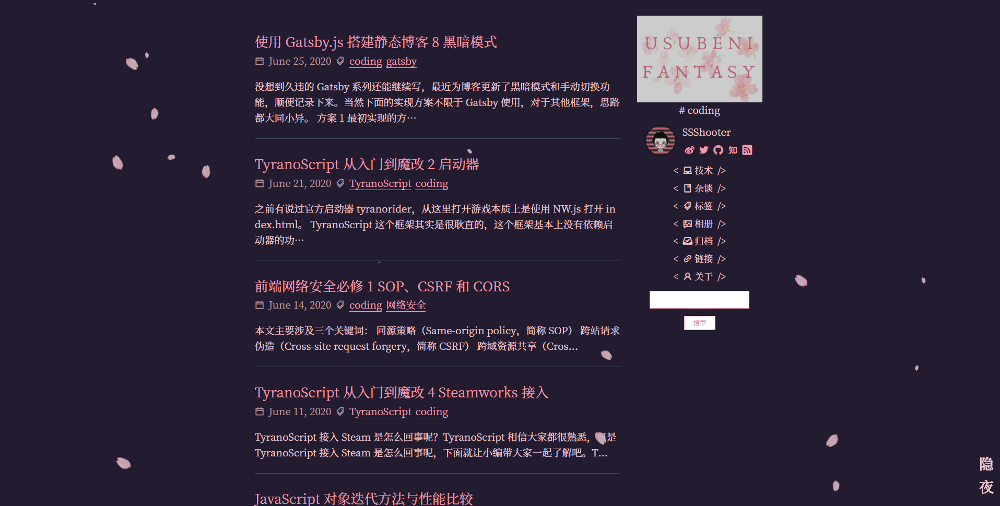

页面结构变化不大，主要是实现黑暗模式和樱花开关，当然黑暗模式的样式还有不少需要调整的地方，往后再慢慢微调吧。（黑暗模式的实现方法可看[这里](https://ssshooter.com/2020-06-25-gatsby-blog-8/)）

事实上黑暗模式就是 UI 1.0 的夜樱样式，她又回来啦！有点怀念，这么就一年多了...

另外最近的更新也是超麻烦的，一切原因归根于 node 版本更新了，Gatsby 的依赖里有需要重新 build 的地方，于是就把 node_modules 删掉了。

这一删倒好，装依赖装了一整晚都没装上，`pngquant failed to build, make sure that libpng is installed` 看了一整晚这条消息，找遍能搜到的方法都不能解决问题，也不知道到底是 libpng 的问题还是 github 依赖下载问题。

还是那句话，windows 做开发真是太难了。最后硬是把我憋成 VScode 远程开发，而且用的是 gcp 的主机（因为国内的主机 clone github 代码常年几 k 每秒）。

gcp 主要使用方法是直接网页连接，要用 ssh 连接还要攻克不少麻烦，感谢[这篇文章](https://qiita.com/igrep/items/3a3ba8e9089885c3c9f6)让我的 VScode 顺利连上 gcp 啦。

加上 GitHub 之前发布的新功能，感觉 VScode 远程开发在未来说不定是主流了。
