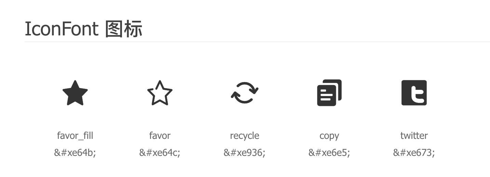
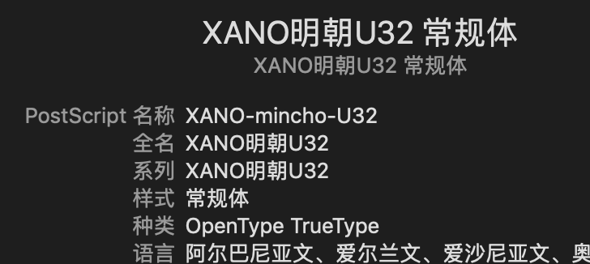

补档，原址：https://segmentfault.com/a/1190000016896623

熟悉前端开发的大家都一定知道 iconfont.cn，在网站下载图标集，会自带教程告诉你如何在网页使用 iconfont。但是在 React Native 中，跟网页使用的步骤就不同了。我最开始百度出来的文章，不少都推荐借用 `react-native-vector-icons`，但是我觉得这一步还是增加了不少无用代码。
其实使用 iconfont，本质上就是使用一种“图标形状的字体”，所以解决问题只需要三步：

1. 安装字体
2. 找到图标对应的 unicode，直接放到 `<Text>` 标签中
3. 在该标签应用你的“图标字体”

## 安装字体

这是一个把配置都交给 react-native 的一个简单方法：
首先在 `package.json` 添加代码

```
"rnpm": {
    "assets": [
	"./assets/fonts/"
    ]
},
```

然后运行
`react-native link`
你就可以在 plist 文件（iOS）或 android/app/src/main/assets/fonts（安卓）中看到对应配置
**安装后需要重启 react-native**

## 添加图标

打开在 [iconfont](http://www.iconfont.cn/) 下载的图标集会有这个文件


里面可以看到对应图标的 unicode



把你使用的图标放到标签中 `<Text>{'\ue936'}</Text>`

## 应用字体

```
<Text style={{
    fontFamily: "iconfont",
    fontSize: FONTSIZE,
    marginRight: 9
}}>{'\ue936'}</Text>
```

有一点需要注意，**写在 fontFamily 的字体名称要使用全名（而不是文件名）**



不过 iconfont 三个名字都一样就是了


## 参考文章：

https://medium.com/react-native-training/react-native-custom-fonts-ccc9aacf9e5e

http://www.ruanyifeng.com/blog/2007/10/ascii_unicode_and_utf-8.html
